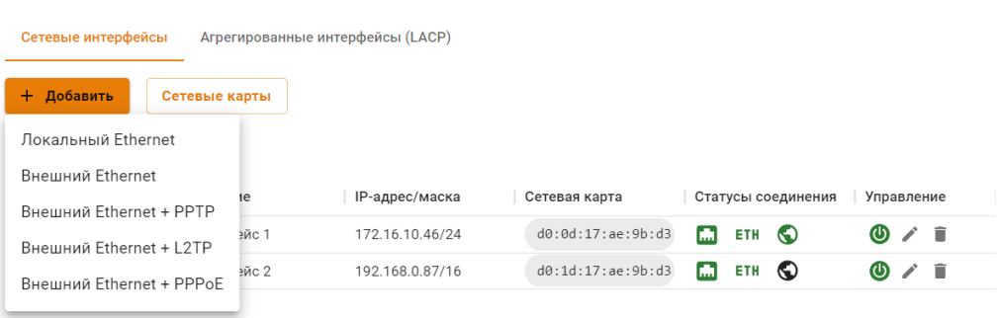
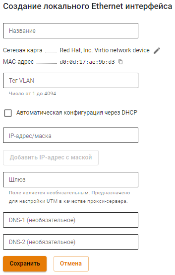
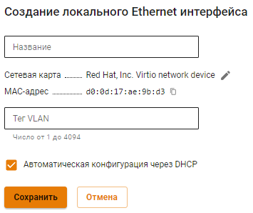

# Настройка Локального Ethernet


**Будьте внимательны!**

При выборе пункт **Локальный Ethernet** и настроите его как **Внешний Ethernet, доступ в сеть Интернет будет отсутствовать.**


## Ручная настройка

Для настройки подключения в веб-интерфейсе необходимо выполнить следующие действия:

1\. Перейдите в меню **Сервисы** -> **Сетевые интерфейсы**.

2\. Нажмите **Добавить** в левом верхнем углу окна и выберите пункт **Локальный Ethernet**. 

3\. Выберите сетевую карту.

4\. Заполните поля, указанные в таблице ниже:
   * **Название интерфейса** - Имя для идентификации интерфейса;
   * **Сетевая карта** - Сетевой адаптер, который будет использоваться для подключения к интернет-провайдеру;
   * **Тег VLAN**- VLAN ID. Такой сетевой интерфейс считается VLAN-интерфейсом. Также может быть создан один Ethernet-интерфейс без указания VLAN принадлежащий этому сегменту сети, который будет принимать нетегированный трафик. Обычные Ethernet-интерфейсы, без указания VLAN ID, создаются на физическом интерфейсе только в единичном экземпляре. Поле заполняется в том случае если сетевая карта уже используется;
   * **Автоматическая настройка через DHCP** - Используйте, если ваш интернет-провайдер поддерживает автоматическую настройку Ethernet-интерфейса с помощью протокола DHCP;
   * **IP-адрес/маска** - Можно назначить на интерфейс несколько IP-адресов. Как минимум, должен быть указан хотя бы один IP-адрес;
   * **Шлюз** - IP-адрес шлюза;
   * **DNS** - Доступно два поля для указания DNS сервера (необязательно).


Поле **Шлюз** в Локальном интерфейсе задается только если:

* Нет Внешнего интерфейса UTM;
* UTM используется только как прокси-сервер.


**Пример настройки:**

## Автоматическая настройка

Используется, если ваш интернет-провайдер поддерживает возможность автоматической настройки Ethernet-интерфейса с помощью протокола DHCP.

1. Перейдите в меню **Сервисы** -> **Сетевые интерфейсы**.
2. Нажмите **Добавить** в левом верхнем углу окна и выберите пункт **Локальный Ethernet**.
3. Выберите сетевую карту.
4. Заполните поле **Название**. Поле **Тег VLAN** заполняется только в том случае если сетевая карта уже используется.
5. Включите настройку **Автоматическая конфигурация через DHCP**.
6. Убедитесь в корректности введённых значений и нажмите на кнопку **Сохранить**.

**Пример настройки:**

