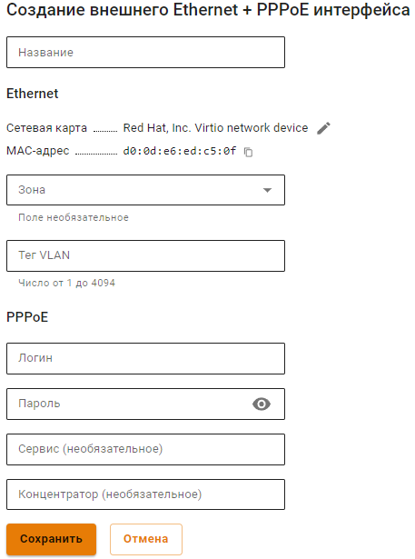
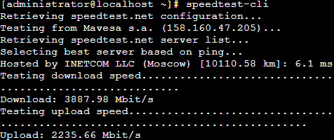

# Подключение по PPPoE

Для настройки подключения в веб-интерфейсе необходимо выполнить следующие действия:

1\. Перейдите в меню **Сервисы -> Сетевые интерфейсы**.

2\. Нажмите **Добавить** в левом верхнем углу окна и выберите пункт **Ethernet + PPPoE**.

3\. Выберите сетевую карту.

4\. Заполните поля, указанные в таблице ниже:

* **Название** - имя для идентификации интерфейса. Максимальное количество символов - 42;
* **Сетевая карта** - сетевой адаптер, который будет использоваться для подключения к интернет-провайдеру;
* **Зона** - выберите объект типа **Зона**, в состав которой будет входить создаваемый сетевой интерфейс. Максимальное количество сетевых интерфейсов в зоне - 64;
* **Тег VLAN** - VLAN ID, в котором будет присутствовать NGFW. Такой сетевой интерфейс считается VLAN-интерфейсом. Заполняется только в том случае, если сетевая карта уже используется. Стандарт VLAN 802.3ad;
* **Логин** - имя пользователя для подключения по PPPoE;
* **Пароль** - пароль для подключения по PPPoE;
* **Сервис** - идентификатор сервиса. Необязательное поле;
* **Концентратор** - идентификатор концентратора. Необязательное поле.

5\. Убедитесь в корректности введенных значений и нажмите на кнопку **Сохранить**.

**Пример настройки:**


Для проверки скорости ранее настроенного интерфейса перейдите в раздел **Управление сервером -> Терминал** и введите `speedtest-cli`. 

Пример вывода команды:


