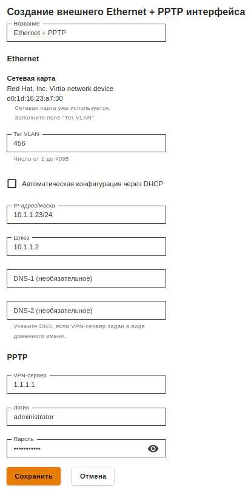

# Настройка подключения по PPTP

Для настройки такого подключения в веб-интерфейсе необходимо выполнить следующие действия:

1\. Перейдите в меню **Сервисы -> Сетевые интерфейсы**.

2\. Нажмите на иконку .png>) в правом верхнем углу окна и выберите **Ethernet + PPTP**.

3\. Выберите сетевую карту.

4\. Заполните поля, указанные в таблице ниже:

| Параметр                               | Описание                                                                                                                                                             |
| -------------------------------------- | -------------------------------------------------------------------------------------------------------------------------------------------------------------------- |
| Название                               | Имя, с помощью которого вы будете в дальнейшем идентифицировать интерфейс. Максимальное количество символов - 42                                                     |
| Сетевая карта                          | Сетевой адаптер, который будет использоваться для подключения к интернет-провайдеру                                                                                  |
| Тег VLAN                               | VLAN ID, в котором будет присутствовать UTM. Такой сетевой интерфейс считается VLAN-интерфейсом. Заполняется только в том случае если сетевая карта уже используется |
| Автоматическая конфигурация через DHCP | Используется, если ваш интернет-провайдер поддерживает возможность автоматической настройки Ethernet-интерфейса с помощью протокола DHCP                             |
| IP-адрес/маска                         | Вы можете назначить на интерфейс несколько IP-адресов. Должен быть указан хотя бы один IP-адрес                                                                      |
| Шлюз                                   | IP-адрес шлюза                                                                                                                                                       |
| DNS                                    | Доступно два поля для указания DNS сервера. Необязательные поля                                                                                                      |
| VPN-сервер                             | IP-адрес или доменное имя PPTP-сервера                                                                                                                               |
| Логин                                  | Имя пользователя для подключения по PPTP                                                                                                                             |
| Пароль                                 | Пароль для подключения по PPTP                                                                                                                                       |

5\. Убедитесь в корректности введённых значений и нажмите на кнопку **Сохранить**.

**Пример настройки подключения по PPTP:**

