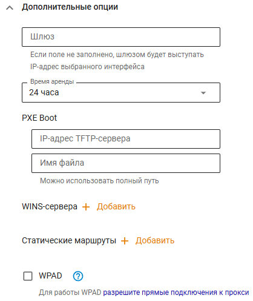
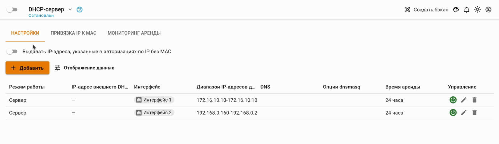
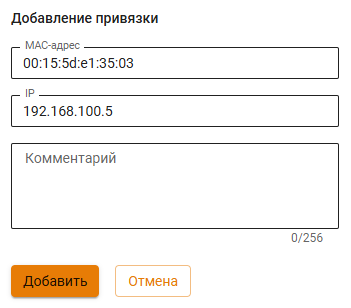
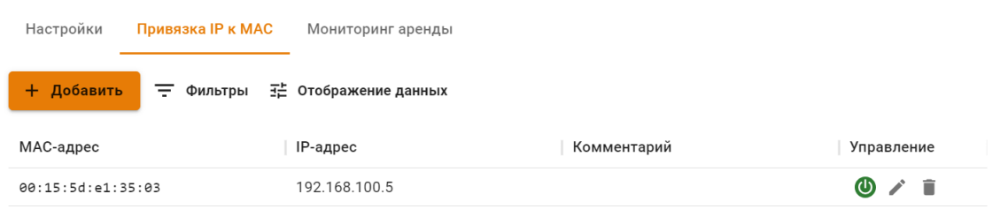
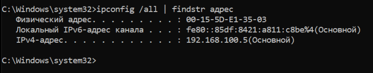
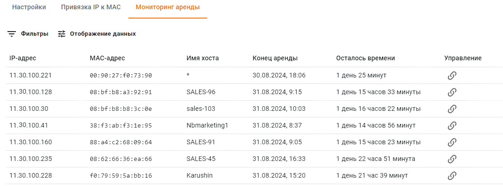

# DHCP-сервер


Имя службы раздела **DHCP**: `ideco-dnsmasq.service`. \
Список служб для других разделов, доступен по [ссылке](../server-management/terminal.md).


#### Интерфейс Ideco UTM:

* [x] Вкладка **Настройки** - позволяет настроить диапазон IP-адресов для автоматического назначения
* [x] Вкладка **Привязка IP к MAC** - позволяет сформировать статические привязки IP-адресов к MAC-адресам
* [x] Вкладка **Мониторинг аренды** - позволяет получить сведения об аренде IP-адреса для устройства

Сетевые устройства в локальной сети должны быть настроены на автоматическое получение сетевых реквизитов от DHCP-сервера. Таким образом, клиенты отправляют широковещательный запрос в сегмент локальной сети, а сервер перехватывает и отправляет на эти запросы ответы, содержащие необходимые настройки для клиента.


На локальном интерфейсе Ideco UTM, участвующем в раздаче адресов, должен быть настроен статический IP адрес.


## Настройки

Если сервер Ideco UTM является шлюзом и DNS-сервером для всех сетевых устройств локальной сети

Как правило, сервер Ideco UTM является шлюзом и DNS-сервером для всех сетевых устройств локальной сети, поэтому настройка службы ограничивается определением диапазона IP-адресов. При необходимости можно задать DNS-сервера, статические маршруты и адреса WINS-серверов. 

Если на Ideco UTM настроен [перехват DNS](dns/#perekhvat-dns-zaprosov), то резолвинг имен будет производиться при помощи сервера, указанного в настройках перехвата DNS.


При включении опции **Выдавать IP-адреса, указанные в авторизациях по IP без MAC** будут выдаваться IP-адреса (исключение - правило с IP+MAC), использованные в качестве фактора авторизации пользователя (раздел [Авторизация](../users/authorization/README.md)).


Пример настройки DHCP-сервера представлен на скриншоте ниже:


Если не задано значение в поле DNS-1 или DNS-2, то DNS-сервером будет являться Ideco UTM для всех сетевых устройств локальной сети.


Включить/выключить, редактировать или удалить правила для выдачи IP-адресов можно кнопками управления в колонке **Управление**.

Так же, при использовании DHCP-сервера, не забывайте переключите ползунок в верхней части экран, около надписи **DHCP-сервер**, в положение **Включен**.

## Привязка IP к MAC

Для настройки в DHCP-сервере привязки IP-адреса к MAC-адресу, необходимо:

1\. В разделе **Сервисы -> DHCP** выберите вкладку **Привязка IP к MAC**;

2\. Создайте правило привязки **IP к MAC**:

Пример созданного правила привязки показан ниже на скриншоте:

Для проверки созданного правила, на компьютере с указанным в правиле MAC-адресом, получите IP-адрес по DHCP и проверьте результат с помощью команды `ipconfig /all`.


Будьте внимательны при согласовании настроек клиентских устройств и DHCP-сервера на Ideco UTM:

Некоторые устройства предоставляют MAC-адрес с разделенными с помощью дефиса октетами (`01-02-03-04-05-06`). В настройках Ideco UTM октеты MAC-адреса разделяются только двоеточиями (`01:02:03:04:05:06`). 


## Мониторинг аренды

Содержит информацию об аренде IP-адресов для устройств.

