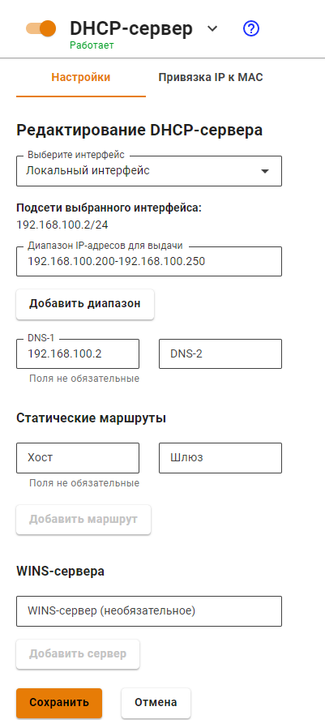
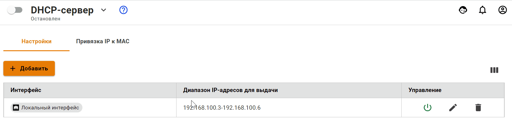
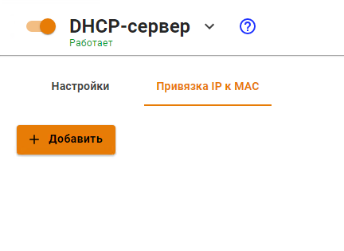
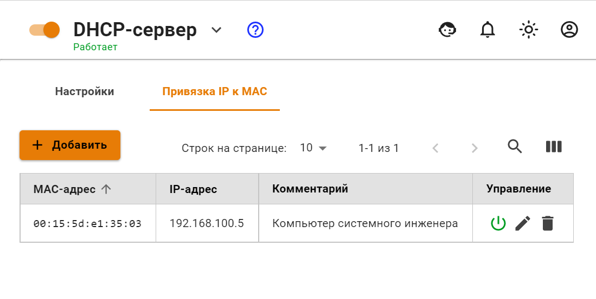
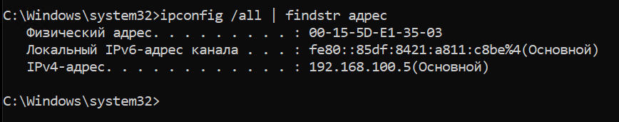

# DHCP

Интерфейс Ideco UTM позволяет настроить диапазон IP-адресов для автоматического назначения, а также сформировать статические привязки IP-адресов к MAC-адресам этих устройств. Сетевые устройства в локальной сети должны быть настроены на автоматическое получение сетевых реквизитов от DHCP-сервера. Таким образом, клиенты отправляют широковещательный запрос в сегмент локальной сети, а сервер перехватывает и отправляет на эти запросы ответы, содержащие необходимые настройки для клиента.


На локальном интерфейсе Ideco UTM, участвующем в раздаче адресов, должен быть настроен статический IP адрес.


### Настройка сервера

Для того чтобы настроить DHCP для локального интерфейса, необходимо перейти в раздел **Сервисы -> DHCP-сервер** и нажать кнопку **Добавить**.

Как правило, сервер Ideco UTM является шлюзом и DNS-сервером для всех сетевых устройств локальной сети, поэтому в большинстве случаев, настройка службы ограничивается определением диапазона IP-адресов. При необходимости можно задать DNS-сервера, статические маршруты и адреса WINS-серверов. 

\*Если на Ideco UTM настроен [перехват DNS](dns/#perekhvat-dns-zaprosov), то резолвинг имен будет производиться при помощи сервера, указанного в настройках перехвата DNS.


Если установить флаг в пункте **Выдавать IP-адреса, указанные в авторизациях по IP без MAC**, то IP-адреса (исключение - правило с IP+MAC), использованные в качестве фактора авторизации пользователя (раздел [Авторизация](../users/authorization/README.md)), будут выдаваться DHCP-сервером.


Пример настройки DHCP-сервера представлен на скриншоте ниже:


Если не задано значение в поле DNS-1 или DNS-2, то DNS-сервером будет являться Ideco UTM для всех сетевых устройств локальной сети.


Включить/выключить, редактировать или удалить правила для выдачи IP-адресов можно кнопками управления в колонке **Управление**.

Так же, при использовании DHCP-сервера, не забывайте переключите ползунок в верхней части экран, около надписи **DHCP-сервер**, в положение **Включен**.

### Настройка DHCP-сервера с привязкой IP к MAC

Для настройки в DHCP-сервере привязки IP-адреса к MAC-адресу, необходимо:

1\. В разделе **Сервисы -> DHCP** выберите вкладку **Привязка IP к MAC**

2\. Создайте правило привязки **IP к MAC** по следующему образцу:

Пример созданного правила привязки показан ниже на скриншоте:

Для проверки созданного правила, на компьютере с указанным в правиле MAC-адресом, получите IP-адрес по DHCP и проверьте результат с помощью команды `ipconfig /all`


Советы по настройке клиентов:

Некоторые устройства предоставляют MAC-адрес с разделенными с помощью дефиса октетами (`01-02-03-04-05-06`). В настройках Ideco UTM октеты MAC-адреса разделяются только двоеточиями (`01:02:03:04:05:06`). Поэтому будьте внимательны при согласовании настроек клиентских устройств и DHCP-сервера на Ideco UTM.

