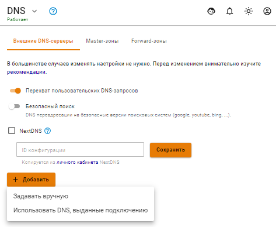
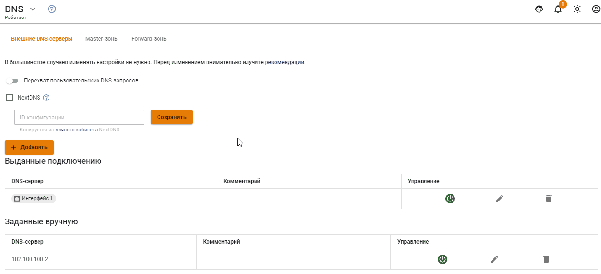

# DNS

Служба DNS на сервере Ideco UTM настраивается в разделе **Сервер -> DNS**. Служба позволяет указать DNS-серверы во внешних сетях, через которые будут разрешаться доменные имена (вкладка **Внешние DNS-серверы**), запрашиваемые из локальных сетей. Есть возможность указывать сторонние DNS-серверы (в локальных или внешних сетях относительно UTM) с указанием конкретных DNS-зон, которые эти сервера обслуживают (вкладка **Forward-зоны**). Перечисленные возможности DNS-сервера могут использоваться одновременно.\
Также во вкладке **Master-зоны** вы можете настроить полнофункциональный DNS-сервер, разрешающий имена в IP-адреса сетевых устройств в локальной сети.

## Внешние DNS-серверы <a href="#dns-external" id="dns-external"></a>

Для нормальной работы резолвинга имён в сети Интернет через Ideco UTM указывать DNS-серверы в этом разделе не требуется, однако по умолчанию указаны безопасные DNS-сервера [Яндекс.DNS](https://dns.yandex.ru). Если DNS-сервера не указаны, то сервер будет разрешать имена в сети Интернет, используя [корневые DNS-серверы](https://ru.wikipedia.org/wiki/%D0%9A%D0%BE%D1%80%D0%BD%D0%B5%D0%B2%D1%8B%D0%B5\_%D1%81%D0%B5%D1%80%D0%B2%D0%B5%D1%80%D1%8B\_DNS) в интернете. Администратор может указать DNS-серверы провайдера, выбрав в форме добавления **Использовать DNS, выданные подключению** и указав нужное подключение.

Для указания DNS-серверов вручную, выберите в форме добавления **Задать вручную** и вручную укажите IP-адрес DNS-сервера.

**Рекомендации:**

1. DNS-сервер встроенный в Ideco UTM — кеширующий. Крайне рекомендуется использовать его в качестве DNS-сервера для вашей локальной сети.
2. Не указывайте `8.8.8.8`, `1.1.1.1` или подобные без особой необходимости. Ideco UTM справится с резолвингом самостоятельно без каких-либо посредников.
3. Не указывайте DNS-сервера от вашего внутреннего сервера Active Directory, даже если он может самостоятельно резольвить доменные имена в интернете. В этом, как правило, нет смысла. При интеграции с AD Ideco UTM автоматически настроит всё необходимое (forward-зону) для работы AD и резолвинга внутренних имён вашего домена. Для резолвинга каких-то особых зон не связанных с AD создавайте forward-зону.
4. Не используйте без крайней необходимости DNS, предоставляемые вашим интернет-провайдером (не указывайте ни вручную, ни через опцию выбор интерфейса). Всё что необходимо для подключения к PPTP/L2TP через доменное имя, Ideco UTM настроит автоматически. На практике, провайдерские DNS превышают TTL, а также долго отвечают. Единственный случай когда это нужно — особые внутренние доменные зоны провайдера. В этом случае создавайте forward-зону.
5. Можно указывать DNS-сервера занимающиеся фильтрацией, если это необходимо (SkyDNS или Яндекс-DNS).
6. В случае, если все DNS-сервера отключены или удалены, DNS будет работать нормально — Ideco UTM будет резолвить имена самостоятельно.

**Форма добавления:**



## Перехват DNS-запросов

В продукте есть возможность перехватывать запросы, производимые через сторонние DNS-сервера, указанные пользователями на рабочих станциях (с целью обхода блокировок, либо из-за неверной настройки). Для этого необходимо включить опцию **Перехват пользовательских DNS-запросов** в разделе **Внешние DNS-серверы**.



Опция включается глобально для всех хостов в локальной сети, выходящих в сеть Интернет через Ideco UTM. Это позволяет избежать возможной подмены адреса ресурса при резолвинге его домена в целях обхода блокировок ресурсов. Также перехват всех DNS-запросов пользователей позволит контролировать процесс резолвинга доменных имен в Интернет исключительно средствами UTM.

Перехваченный запрос будет перенаправлен на DNS-сервер UTM, и ответ будет сформирован DNS-сервером UTM, а не исходным DNS-сервером. Перехват DNS-запросов также блокирует возможность туннелирования через DNS (DNS-tunneling).

Вы можете использовать следующие сторонние DNS-сервера, для дополнительной фильтрации трафика:

* SkyDNS `193.58.251.251`.
* Yandex DNS `77.88.8.88`, `77.88.8.2`.
* Google DNS `8.8.8.8`, `8.8.4.4`.
* Open DNS `208.67.222.222`, `208.67.220.220`, `208.67.222.220`, `208.67.220.222`.
* Cloudflare DNS `1.1.1.1`, `1.0.0.1`.

## **Управление DNS-серверами**

Вы можете выключать/включать, редактировать или удалять DNS-сервера в столбце **Управление**.

## Forward-зоны

В этом разделе можно явно задать DNS-сервер для разрешения имен конкретной DNS-зоны. Указав DNS-сервер, доступный в сети и зону, которую он обслуживает, клиенты сети Ideco UTM получают возможность обращаться к ресурсам этой зоны по именам домена, обслуживаемого ей. Например, IT-отдел предприятия предоставляет ресурсы для сотрудников в зоне `in.metacortex.com` под именами `realm1.in.metacortex.com`, `sandbox.metacortex.com` и использует для этого DNS-сервер 10.10.10.10.

Для возможности доступа к этим ресурсам по доменным именам укажите forward-зону провайдера как isp и далее задайте DNS-сервер 10.10.10.10 в форме добавления Forward-зоны.


## Master-зоны

Master-зоны с настроенными DNS-записями позволят вам использовать UTM как сервер имен внутри вашей сетевой инфраструктуры для обращения к IP-адресам хостов в сети по доменным именам.


DNS-сервер в Ideco UTM не доступен извне по соображениям безопасности. Для поддержки внешних DNS-зон мы рекомендуем использовать сторонние DNS-хостинги.


Не используйте master-зоны для блокировки доступа к сайтам, для этого есть другие [средства ](../access-rules/content-filter/)в Ideco UTM. Блокировка таким способом работает неэффективно и не позволяет селективно запрещать доступ по пользователям или подсетям. Также приводит к проблемам с излишним кешированием.

Формат записей для настройки master-зоны соответствует формату записей DNS-сервера BIND.

Описание параметров записи:

* **$TTL** - определяет время кеширования положительных ответов (ответ в виде найденного IP-адреса). Время задается я в секундах или с помощью сокращений: m — минуты, h — часы, d — дни, w — недели.
* **$ORIGIN** - определяет текущее имя домена. Текущее значение $ORIGIN заменяет символ @ в записи. Текущее значение $ ORIGIN добавляется к любому имени, которое не заканчивается на «точку». Подробнее об использовании точки в записи $ORIGIN [https://kb.wisc.edu/ddi/page.php?id=8954](https://kb.wisc.edu/ddi/page.php?id=8954)
* **$SOA** - описывает основные/начальные настройки зоны, или _определяет зону ответственности данного сервера_. Для каждой зоны должна существовать только одна запись SOA и она должна быть первая. В записи $SOA указывается primary NS для домена и e-mail контактного лица и далее в скобках:
  1. **Serial** - Серийный номер файла зоны. При изменении данных нужно менять серийный номер, при этом зона обновляется на всех серверах. Используйте следующий формат: ГГГГММДДнн (год, месяц, день, нн — порядковый номер изменения за день). Если вы уже второй раз за день вносите изменения в файл зоны, укажите "нн" равным 01, если третий — 02, и т.д.
  2. **Refresh** - указывает, как часто вторичные серверы должны опрашивать первичный, чтобы узнать, не увеличился ли серийный номер зоны.
  3. **Retry** - время ожидания после неудачной попытки опроса.
  4. **Expiry** - максимальное время, в течение которого вторичный сервер может использовать информацию о полученной зоне.
  5. **TTL** - минимальное время, в течение которого данные остаются в кэше вторичного сервера.
* **$SRV -** указывают на сервера, обеспечивающие работу тех или иных служб в данном домене (например Jabber и Active Directory).
* **$NS** - DNS-сервер, обслуживающий данный домен. Минимально их необходимо два, причем они должны находится в разных подсетях, а лучше — в географически разных местах. Первым указывайте primary сервер.
* **$PTR** - отображает IP-адрес в доменное имя.
* **$MX** - \*\*\*\* описывает почтовые шлюзы (обычно один), на которые будет доставляться вся почта этого домена. Для каждого шлюза устанавливается приоритет (по умолчанию — 10). Обычно имя домена почтового шлюза выглядит так: _mx.example.com_. Для MX хостов должны быть соответствующие A-записи.
* **$A** - отображают имя хоста (доменное имя) на адрес IPv4. Для каждого сетевого интерфейса машины должна быть сделана одна **A-запись**.
* **$AAAA** - аналогична записи A, но для IPv6.
* **$CNAME** - отображает алиас на реальное имя (для перенаправления на другое имя).

Со всеми ресурсными записями можно ознакомиться по [ссылке](https://ru.wikipedia.org/wiki/%D0%A2%D0%B8%D0%BF%D1%8B\_%D1%80%D0%B5%D1%81%D1%83%D1%80%D1%81%D0%BD%D1%8B%D1%85\_%D0%B7%D0%B0%D0%BF%D0%B8%D1%81%D0%B5%D0%B9\_DNS).

Пример записи приведен на скриншоте ниже:


Несколько примеров записей в master-зону:

1.  Имя зоны: ms

    ```
    $ORIGIN ms. 
    $TTL 600 
    @ SOA ns1.ms. administrator.ms. ( 4 7200 3600 1209600 600 ) 
    @ NS ns1.ms. 
    @ MX 10 mx10.ms. 
    @ A 192.168.0.250 
    ns1 A 192.168.0.250 
    mx10 A 192.168.0.250 
    www CNAME @
    ```
2.  Имя зоны: example.com

    ```
    $TTL 86400
     @ SOA localhost. root.localhost. ( 991079290 28800 14400 3600000 86400 )
     @ NS my-dns-server.example.com.
    my-dns-server A 1.2.3.4
    ```
