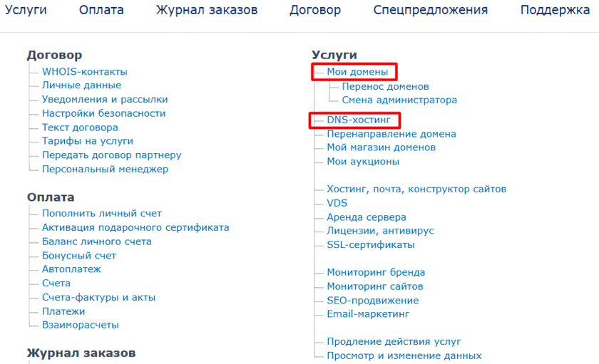
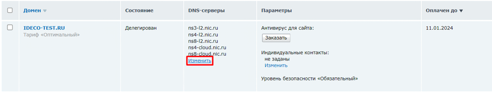
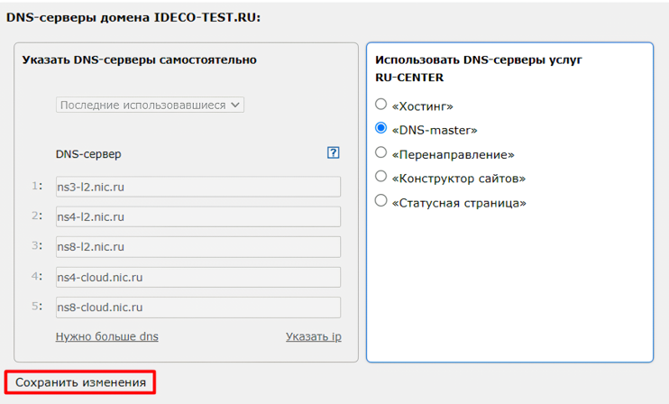
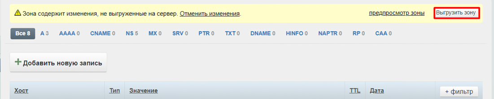
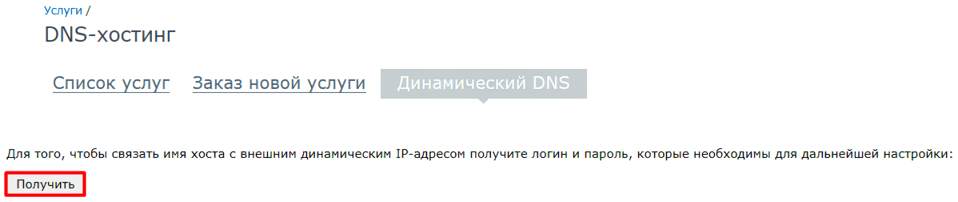

# DDNS

DDNS в Ideco NGFW реализован через интеграцию с хостингом RU-CENTER. Перед настройкой DDNS, зарегистрируйтесь на сайте [RU-CENTER](https://www.nic.ru/) и приобретите [DNS-хостинг](https://www.nic.ru/catalog/for-domain-use/dns-hosting/). \
Для решения вопросов по работе с хостингом, воспользуйтесь страницей [помощи](https://www.nic.ru/help/).

## Настройка DDNS


DDNS не будет работать: 
* если NGFW находится за NAT;
* если включена балансировка трафика.


1\. После входа в личный кабинет [RU-CENTER](https://www.nic.ru/) откроется страница [Для клиентов](https://www.nic.ru/manager/manager.cgi/). Для дальнейшей работы откройте два раздела - **Мои домены** и **DNS-хостинг**:

2\. В разделе **Мои домены** измените настройки сервера, нажав **Изменить** в столбце **DNS-серверы**:

3\. Делегируйте домен, отредактировав настройки DNS-серверов:
* **Указать DNS-серверы самостоятельно** - укажите DNS-серверы. Если домен был приобретен на хостинге RU-CENTER, поля заполнятся автоматически;
* **Использовать DNS-серверы услуг RU-CENTER** - выберите **DNS-master**.

Сохраните изменения:

Домен будет делегирован с заданным списком DNS-серверов. Это может занять несколько часов.

4\. Перейдите в раздел **DNS-хостинг** и нажмите **Управление DNS-зонами**.

5\. Выберите нужный домен или добавьте (если домен был приобретен на стороннем ресурсе), нажав соответствующую кнопку.

6\. Добавьте две записи по кнопке **Добавить новую запись**:
* Первая запись:
  * Name - укажите знак `@`;
  * Type - выберите тип `А`;
  * IP address - текущий IP-адрес Ideco NGFW (указывается в разделе *Техническая поддержка  -> Информация для технической поддержки*);
  * TTL - оставьте не заполненным.
* Вторая запись:
  * Name - укажите `www`;
  * Type - выберите тип `А`;
  * IP address - текущий IP-адрес Ideco NGFW;
  * TTL - оставьте не заполненным.

7\. Нажмите кнопку **Выгрузить зону**:

8\. Перейдите в раздел **DDNS** в Ideco NGFW и заполните поля:
* **Домен на DNS-хостинге nic.ru** - укажите приобретенный домен;
* **Логин от API** и **Пароль от API** - для получения логина и пароля перейдите по ссылке [Динамический DNS](https://www.nic.ru/manager/services.cgi?step=srv.my_dns.dyn) и нажмите **Получить**:

9\. Сохраните настройки в Ideco NGFW, нажав соответствующую кнопку.