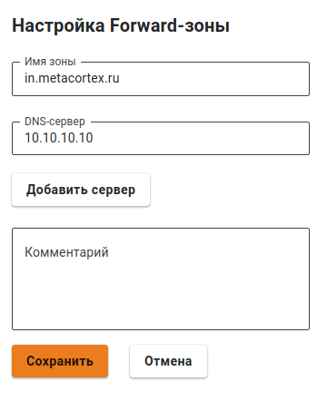

# Forward-зоны

Позволяет задать DNS-сервер для разрешения имен конкретной DNS-зоны. Указав доступный в сети DNS-сервер и обслуживаемую зону, клиенты сети Ideco UTM получают возможность обращаться к ресурсам этой зоны по именам домена. 

Например, IT-отдел предприятия предоставляет ресурсы для сотрудников в зоне `in.metacortex.ru` под именами `realm1.in.metacortex.ru`, `sandbox.metacortex.ru` и использует для этого DNS-сервер 10.10.10.10. \
Для возможности доступа к этим ресурсам по доменным именам укажите forward-зону провайдера, как isp, и далее задайте DNS-сервер 10.10.10.10:

