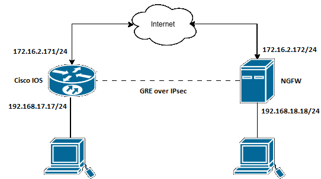

Рассмотрим настройку подключения по схеме, представленной на рисунке ниже:



Для настройки подключения Cisco IOS к Ideco UTM нужно следовать инструкции в каждой из пунктов.

<details>

<summary>Первоначальная настройка Ideco UTM и Cisco IOS</summary>

## Настройка Ideco UTM

Настройте на Ideco UTM локальный и внешний интерфейсы. Подробная информация находится в статье [Первоначальная настройка](../../../../installation/initial-setup.md).

## Настройка Cisco IOS EX

Настройку Cisco можно осуществить через консоль устройства или, воспользовавшись нашими конфигурационными скриптами, сгенерированными по адресу [https://cisco.ideco.ru/](https://cisco.ideco.ru).

### Настройка Cisco через консоль:

1. Настройка локального интерфейса:

```
enable
conf t
interface GigabitEthernet2
ip address <локальный IP Cisco> <маска подсети>
no shutdown
ip nat inside
exit
```

2. Настройка внешнего интерфейса:

```
interface GigabitEthernet1
ip address <внешний IP Cisco> <маска подсети>
no shutdown
ip nat outside
exit
```

3. Проверьте наличие связи между внешними интерфейсами Ideco UTM и Cisco. Для этого в консоли Cisco используйте команду `ping <внешний IP UTM>`. Результат вывода команды - наличие ICMP-ответов.

4. Создание access-list с адресацией локальной сети (подробную информацию можно прочитать в [статье](https://www.cisco.com/c/ru_ru/support/docs/security/ios-firewall/23602-confaccesslists.html)):

```
ip access-list extended NAT
permit ip <локальная подсеть Cisco> <обратная маска подсети> any
exit
```

5. Настройка NAT (подробную информацию можно прочитать в [статье](https://www.cisco.com/c/ru_ru/support/docs/ip/network-address-translation-nat/13772-12.html)):

```
ip nat inside source list NAT interface GigabitEthernet1 overload
exit
```

6. Сохранение настроек конфигурации:

```
write memory
```

7. **После сохранения настроек проверьте, что из локальной сети Cisco присутствует доступ в сеть Интернет.** \
 Для этого перейдите на какой-нибудь сайт (например: [https://www.cisco.com/](https://www.cisco.com)) с устройства в локальной сети Cisco.

## Настройка IKEv2+IPsec на Cisco:

1. Создание proposal (подробную информацию можно прочитать в [статье](https://www.cisco.com/c/en/us/td/docs/ios-xml/ios/sec_conn_ike2vpn/configuration/xe-16-8/sec-flex-vpn-xe-16-8-book/sec-cfg-ikev2-flex.html#GUID-6F6D8166-508A-4669-9DDC-4FE7AE9B9939__GUID-A5DB59F5-70A0-421E-86AE-AE983B283E6F)):

```
conf t
crypto ikev2 proposal ikev2proposal
encryption aes-cbc-256
integrity sha256
group 19
exit
```

2. Создание policy (подробную информацию можно прочитать в [статье](https://www.cisco.com/c/en/us/td/docs/ios-xml/ios/sec_conn_ike2vpn/configuration/xe-16-8/sec-flex-vpn-xe-16-8-book/sec-cfg-ikev2-flex.html#GUID-B5C198FE-97D9-4F74-88C6-6B5802195772__GUID-613A19C3-C5D6-456A-8D8A-4693F3553ED3)):

```
crypto ikev2 policy ikev2policy
match fvrf any
proposal ikev2proposal
exit
```

3. Создание peer (key_id - идентификатор удаленной стороны, т.е. Ideco UTM). Подробную информацию можно прочитать в [статье](https://www.cisco.com/c/en/us/td/docs/ios-xml/ios/sec_conn_ike2vpn/configuration/xe-16-8/sec-flex-vpn-xe-16-8-book/sec-cfg-ikev2-flex.html#GUID-D6AC9B42-1F22-4F60-A06A-A72575181659__GUID-A1CB9A0A-6098-475C-99BE-5D41009CD9A9):

```
crypto ikev2 keyring key
peer strongswan
address <внешний IP UTM-a>
identity key-id <key_id>
pre-shared-key local <psk>
pre-shared-key remote <psk>
exit
exit
```

4. Создание IKEv2 profile (подробную информацию можно прочитать в [статье ](https://www.cisco.com/c/en/us/td/docs/ios-xml/ios/sec_conn_ike2vpn/configuration/xe-16-8/sec-flex-vpn-xe-16-8-book/sec-cfg-ikev2-flex.html#task_20288C58E8B1416897A763FABA8B0885__GUID-B31A2B1F-E07A-4DA9-8CEA-45D92E283D14)):

```
crypto ikev2 profile ikev2profile
match identity remote address <внешний IP UTM-a> 255.255.255.255
authentication remote pre-share
authentication local pre-share
keyring local key
exit
```

5. Настройка шифрования в esp:

```
crypto ipsec transform-set TS esp-gcm 256
mode tunnel
exit
```

6. Создание ipsec-isakmp:

```
crypto map cmap 10 ipsec-isakmp
set peer <внешний IP UTM-a>
set transform-set TS
set ikev2-profile ikev2profile
match address cryptoacl
exit
```

7. Настройка crypto map на внешнем интерфейсе:

```
interface GigabitEthernet1
crypto map cmap
exit
```

8. Создание access-list для трафика между локальными сетями Cisco и UTM:

```
ip access-list extended cryptoacl
permit ip <локальная подсеть Cisco> <обратная маска подсети> <локальная подсеть UTM> <обратная маска подсети>
exit
```

9. Добавление в access-list NAT исключения трафика между локальными сетями Cisco и UTM (правило `deny` должно оказаться выше чем `permit`):

```
ip access-list extended NAT
no permit ip <локальная подсеть Cisco> <обратная маска подсети> any
deny ip <локальная подсеть Cisco> <обратная маска подсети> <локальная подсеть UTM> <обратная маска подсети>
permit ip <локальная подсеть Cisco> <обратная маска подсети> any
exit

end
```

10. Сохранение настроек конфигурации:

```
write memory
```

</details>

<details>

<summary>Настройка исходящего подключения Ideco UTM к Cisco IOS</summary>

Для настройки исходящего IPsec подключения на Ideco UTM выполните действия:

1. В веб-интерфейсе Ideco UTM откройте вкладку **Сервисы -> IPsec -> Устройства**.

2. Добавьте новое подключение:

- **Название** – любое;
- **Тип** – исходящее;
- **Тип аутентификации** – PSK;
- **PSK** – будет сгенерирован случайный PSK-ключ. Он потребуется, чтобы настроить подключение в Cisco;
- **Идентификатор UTM** – введенный вами ключ будет использоваться для идентификации исходящего подключения. Введите также этот идентификатор в Cisco;
- **Домашние локальные сети** – укажите локальную сеть Ideco UTM;
- **Удалённые локальные сети** – укажите локальную сеть Cisco.

3. Проверьте, что подключение установилось (в столбце **Статусы** зеленым цветом будет подсвечена надпись **Установлено**).

4. Проверьте наличие трафика между локальными сетями (TCP и web).

</details>

<details>

<summary> Настройка  входящего подключения Ideco UTM к Cisco IOS</summary>

Для настройки входящего IPsec подключения на Ideco UTM выполните действия:

1. В веб-интерфейсе Ideco UTM откройте вкладку **Сервисы -> IPsec -> Устройства**.

2. Добавьте новое подключение:

- **Название** – любое;
- **Тип** – входящее;
- **Тип аутентификации** – PSK;
- **PSK** – укажите PSK-ключ;
- **Идентификатор удаленной стороны** – вставьте идентификатор Cisco (параметр Key ID);
- **Домашние локальные сети** – укажите локальную сеть Ideco UTM;
- **Удалённые локальные сети** – укажите локальную сеть Cisco.

3. Сохраните созданное подключение, затем нажмите на кнопку **Включить**.

4. Проверьте, что подключение установлено (в столбце **Статусы** зеленым цветом будет подсвечена надпись **Установлено**).

5. Проверьте наличие трафика между локальными сетями (TCP и web).

</details>

Итоговая конфигурация IKEv2 IPSec на Cisco IOS должна выглядеть следующим образом:

```
crypto ikev2 proposal ikev2proposal
 encryption aes-cbc-256
 integrity sha256
 group 19

crypto ikev2 policy ikev2policy
 match fvrf any
 proposal ikev2proposal

crypto ikev2 keyring key
 peer strongswan
  address 5.5.5.5
  pre-shared-key local QWEqwe1234567890
  pre-shared-key remote QWEqwe1234567890

crypto ikev2 profile ikev2profile
 match identity remote key-id key-id
 authentication remote pre-share
 authentication local pre-share
 keyring local key

crypto ipsec transform-set TS esp-gcm 256
 mode tunnel

crypto map cmap 10 ipsec-isakmp
 set peer 5.5.5.5
 set transform-set TS
 set ikev2-profile ikev2profile
 match address cryptoacl

interface GigabitEthernet1
! внешний интерфейс
 ip address 1.1.1.1 255.255.255.0
 ip nat outside
 negotiation auto
 no mop enabled
 no mop sysid
 crypto map cmap

interface GigabitEthernet2
! локальный интерфейс
 ip address 2.2.2.2 255.255.255.0
 ip nat inside
 negotiation auto
 no mop enabled
 no mop sysid

ip nat inside source list NAT interface GigabitEthernet1 overload

ip access-list extended NAT
 deny   ip 2.2.2.0 0.0.0.255 3.3.3.0 0.0.0.255
 permit ip 2.2.2.0 0.0.0.255 any
ip access-list extended cryptoacl
 permit ip 2.2.2.0 0.0.0.255 3.3.3.0 0.0.0.255
```