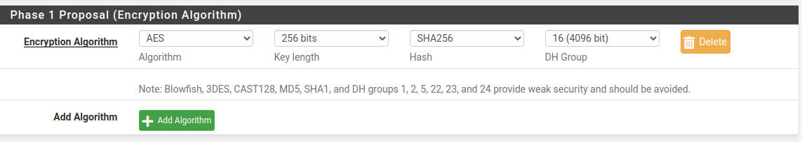
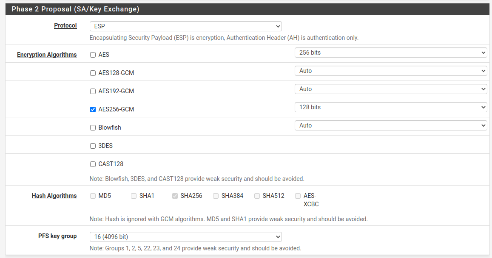

# Входящее подключение pfSense к Ideco UTM по IPsec


Объединяемые локальные сети не должны пересекаться!


## Настройка Ideco UTM

1\. В веб-интерфейсе Ideco UTM откройте вкладку **Сервисы -> IPsec -> Устройства**.

2\. Добавьте новое подключение:

* **Название** – любое;
* **Тип** – входящее;
* **Тип аутентификации** – PSK;
* **PSK** – укажите PSK-ключ, который будет использоваться для подключения;
* **Идентификатор ключа** – любой;
* **Домашние локальные сети** – укажите локальную сеть Ideco UTM, которая будет видна из подсети pfSense;
* **Удалённые локальные сети** – укажите локальную сеть pfSense, которая будет видна из подсети Ideco UTM.

3\. Сохраните созданное подключение, затем нажмите на кнопку "Включить".

4\. На Ideco UTM в папке `/etc/strongswan/swanctl/conf.d/` будут сгенерированы два конфигурационных файла. Необходимо перейти в консоль и открыть на редактирование файл вида `device_<номер>.conf`.

5\. Из этого файла необходимо скопировать значение строки `rightid` (примерный вид – @#746573745f70736b). В дальнейшем это значение потребуется прописать на pfSense.

6\. Настройка завершена, теперь переходим к настройке pfSense.

## Настройка pfSense

1\. В веб-интерфейсе pfSense перейдите на вкладку **VPN –> IPsec –> Tunnels**.

2\. Добавьте новое подключение:

* **Key Exchange version** – IKEv2;
* **Internet Protocol** – IPv4;
* **Interface** – выберите внешний интерфейс pfSense, который будет использоваться для подключения к Ideco UTM;
* **Remote Gateway** – IP внешнего интерфейса Ideco UTM;
* **Description** – любое;
* **Authentication Method** – Mutual PSK;
* **My identifier и Peer identifier** – сюда вставьте значение строки rightid на Ideco UTM (см. шаг 5 в настройке Ideco UTM);
* **Pre-Shared Key** – вставьте PSK-ключ, который ранее прописывали на Ideco UTM;
* **Encryption Algorithm: Для Ideco UTM версии 10.0 и новее** используйте следующие параметры: **Algorithm** - AES256-GCM; **Key length** - 128 bit; **Hash** - SHA256; **DH Group** - Elliptic Curve 25519-256. **Для Ideco UTM версии 9** используйте параметры, выбранные на скриншоте ниже:

Все остальные значения можно оставить по умолчанию.

3\. Сохраните подключение.

4\. Нажмите на кнопку **Show Phase 2 Entries** и добавьте новую Phase 2. Здесь укажите:

* **Encryption Algorithm**: **Для Ideco UTM версии 10.0 и новее** используйте следующие параметры: **Algorithm** - AES256-GCM; **Key length** - 128 bit; **Hash** - SHA256; **DH Group** - Elliptic Curve 25519-256. **Для Ideco UTM версии 9** используйте параметры, выбранные на скриншоте ниже:

* **Local Network** – локальную сеть pfSense, которая будет доступна из подсети Ideco UTM;
* **Remote Network** – локальную сеть Ideco UTM, которая будет доступна из подсети pfSense;

Все остальные значения можно оставить по умолчанию.

5\. Сохраняем подключение.

6\. Затем нужно разрешить хождение трафика между локальными сетями pfSense и Ideco UTM в файрвола pfSense (переходим на вкладку **Firewall -> Rules -> IPsec** и создаём два правила, разрешающее хождение трафика между локальными сетями Ideco UTM и pfSense).

Также обратите внимание на раздел файрвола WAN – по умолчанию, запрещён входящий трафик из "серых" подсетей. Поэтому стоит снять это ограничение, если оба узла находятся в частных диапазонах (10.0.0.0/8, 172.16.0.0/12, 192.168.0.0/16).

7\. Теперь переходим на вкладку **Status -> IPsec** (там должно появится созданное нами подключение), нажимаем на кнопку Connect VPN.

Настройка завершена, соединение должно успешно установиться.

Если соединение установить не удалось, а настройки файрвола pfSense сделаны верно, следует пересоздать соединение на UTM, указав в поле Идентификатор ключа, то значение, которое мы указали в My identifier и Peer identifier у pfSense, и попробовать подключиться ещё раз. На стороне pfSense никаких изменений вносить не требуется.
