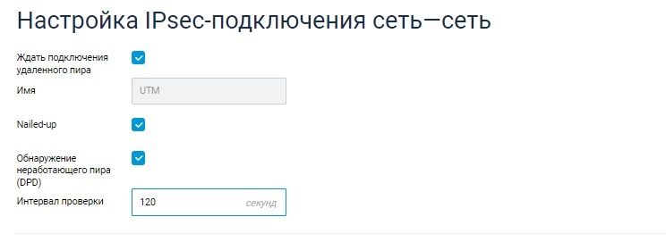
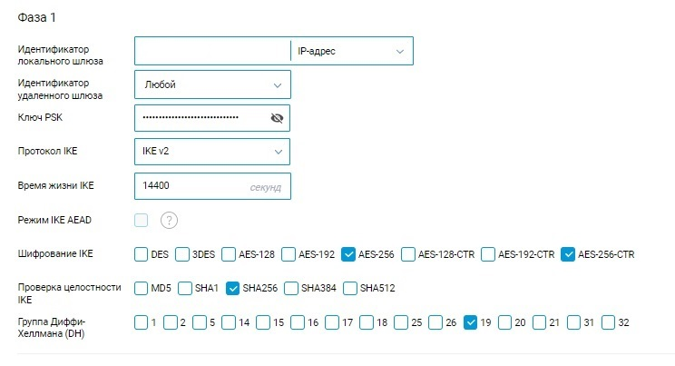

# Подключение Keenetic по IPSec

На стороне Ideco UTM произведите настройки подключения в разделе **Сервисы -&gt; IPSec -&gt; Устройства**.

На стороне устройства Keenetic используйте следующие настройки протоколов шифрования:

