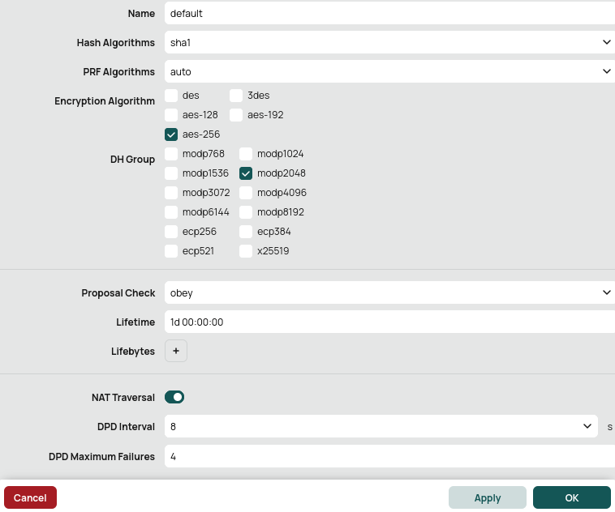
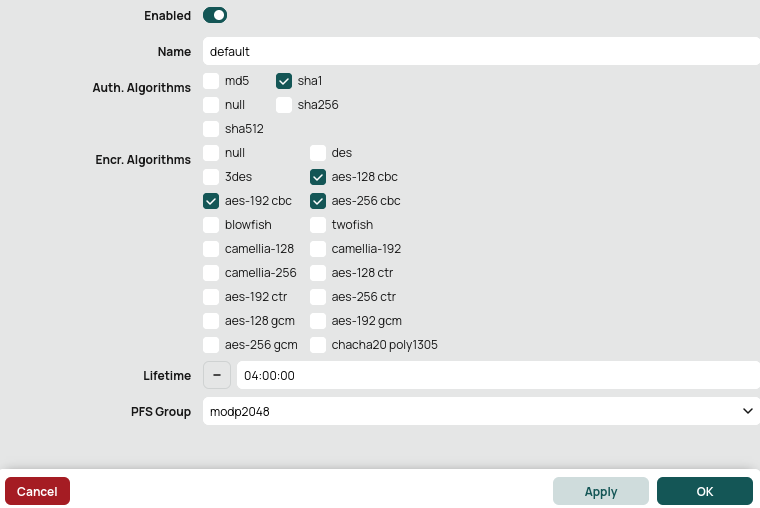

# Подключение устройств

Устройства, которые не описаны в данной инструкции, как правило, можно подключить с использованием аналогичных настроек.


При объединении сетей с помощью VPN, локальные сети в разных офисах не должны пересекаться.


**При использовании нашего конфигуратора скриптов настроек MikroTik (**[https://mikrotik.ideco.ru/](https://mikrotik.ideco.ru)**) есть несколько особенностей:**

* При подключении нескольких устройств MikroTik к одному Ideco UTM по PSK, нужно указывать разные **Идентификаторы ключа (Key id)** для каждого устройства.
* При подключении нескольких устройств MikroTik к одному Ideco UTM по сертификатам, нужно указывать разные **Имена сервера** (Common Name) для каждого устройства.


### Выбор алгоритмов шифрования на удалённых устройствах.

При настройке сторонних устройств необходимо явно указать алгоритмы шифрования, используемые для подключения. Ideco UTM поддерживает самые современные и одновременно достаточно безопасные алгоритмы, не нагружающие сервер и устройства. При этом, не поддерживаются устаревшие и считающиеся небезопасными алгоритмы (MD5, SHA1, AES128, DES, 3DES, blowfish и др.). При конфигурировании сторонних устройств, как правило, можно указать несколько поддерживаемых алгоритмов одновременно. По факту, нужен один алгоритм каждого вида. К сожалению, не все устройства поддерживают самые лучшие алгоритмы, поэтому Ideco UTM поддерживает сразу несколько. Список алгоритмов каждого вида указан ниже в порядке убывания приоритета для выбора.

* **Phase 1 (IKE):**
  * encryption (шифрование):
    * **AES256-GCM**;
    * **AES256**.
  * integrity (hash, целостность):
    * для AES256-GCM - не требуется, поскольку проверка целостности встроена в AEAD-алгоритмы;
    * для AES256, по приоритету: **SHA512, SHA256**.
  * prf (функция генерации случайных значений):
    * как правило, настраивается автоматически, в зависимости от выбора алгоритмов integrity (поэтому в примере [ниже](connecting-devices.md#primer-nastroiki-podklyucheniya-pfsense-k-ideco-utm-po-ipsec-predstavlen-na-skrinshotakh-nizhe) значение prf: PRF-HMAC-SHA512).
    * для AES-GCM может потребоваться указать явно. В этом случае по приоритету: **AESXCBC, SHA512, SHA384, SHA256**.
  * DH (Группа Diffie-Hellman):
    * **Curve25519 (group 31)**;
    * **ECP256 (group 19)**;
    * **modp4096 (group 16)**;
    * **modp2048 (group 14)**;
    * **modp1024 (group 2)**.
* **Phase 2 (ESP):**
  * encryption (шифрование):
    * **AES256-GCM**;
    * **AES256**.
  * integrity (целостность):
    * для AES256-GCM - не требуется, поскольку проверка целостности встроена в AEAD-алгоритмы;
    * для AES-256, по приоритету: **SHA512, SHA384, SHA256**.
  * DH (Группа Diffie-Hellman, PFS). **ВНИМАНИЕ! если не указать, подключаться будет, но не сработает rekey через некоторое время**:
    * **Curve25519 (group 31)**;
    * **ECP256 (group 19)**;
    * **modp4096 (group 16)**;
    * **modp2048 (group 14)**;
    * **modp1024 (group 2)**.

<details>

<summary>Пример:</summary>

* **Phase 1 (IKE)** (нужна одна из строк)**:**
  * AES256-GCM\PRF-HMAC-SHA512\Curve25519
  * AES256\SHA512\PRF-HMAC-SHA512\ECP384
  * AES256\SHA256\PRF-HMAC-SHA256\MODP2048
* **Phase 2 (ESP)** (нужна одна из строк)**:**
  * AES256-GCM\ECP384
  * AES256\SHA256\MODP2048

Пример настройки подключения pfSense к Ideco UTM по IPsec представлен на скриншотах ниже:


</details>

## Подключение Ideco UTM к MikroTik с использованием PSK

При наличии на устройстве MikroTik «белого» IP-адреса, выполните действия ниже, чтобы настроить подключение Ideco UTM к MikroTik.

### Шаг 1. 

<details>

<summary>Настройка Ideco UTM</summary>

1\. В Ideco UTM откройте вкладку **Сервисы -> IPSec -> Устройства**, нажмите на значок  и заполните следующие поля:

* **Название подключения** - укажите произвольное имя для подключения. Значение не должно быть длиннее 42 символов.
* **Тип соединения** - выберите **Исходящее**, поскольку осуществляется подключение от UTM к MikroTik.
* **Адрес удаленного устройства** - укажите внешний IP-адрес устройства MikroTik.
* **Тип аутентификации** - выберите тип **PSK**.
* **PSK** - будет сгенерирован случайный PSK-ключ. Он потребуется, чтобы настроить подключение в MikroTik.
* **Идентификатор ключа** - введенный вами ключ будет использоваться для идентификации исходящего подключения.
* **Домашние локальные сети** - перечислите все **локальные сети UTM**, которые будут доступны в IPSec-подключении, т.е. будут видны противоположной стороне.
* **Удаленные локальные сети** - перечислите все **локальные сети MikroTik**, которые будут доступны в IPSec-подключении, т.е. будут видны противоположной стороне.


2\. После заполнения всех полей нажмите кнопку **Добавить подключение**. В списке подключений появится ваше подключение:


</details>

### Шаг 2. 

<details>

<summary>Настройка Mikrotik</summary>

Настройку устройства MikroTik можно осуществить несколькими способами - через GUI, через консоль устройства или воспользовавшись нашими конфигурационными скриптами, сгенерированными по адресу [https://mikrotik.ideco.ru/](https://mikrotik.ideco.ru).

После генерации скрипта необходимо открыть раздел **System -> Scripts**, создать скрипт, вставить в него код, сгенерированный конфигуратором и запустить.

После того как скрипт закончит свою работу, никаких дополнительных действий по настройке не требуется.

</details>

## Подключение MikroTik к Ideco UTM с использованием PSK

При наличии на Ideco UTM «белого» IP-адреса, выполните действия ниже, чтобы настроить подключение устройства MikroTik к Ideco UTM.

### Шаг 1. 

<details>

<summary>Настройка MikroTik</summary>

Настройку устройства MikroTik можно осуществить несколькими способами - через GUI, через консоль устройства или, воспользовавшись нашими конфигурационными скриптами, сгенерированными по адресу [https://mikrotik.ideco.ru/](https://mikrotik.ideco.ru).

После генерации скрипта необходимо открыть раздел **System -> Scripts**, создать скрипт, вставить в него код, сгенерированный конфигуратором и запустить.

После того как скрипт закончит свою работу, никаких дополнительных действий по настройке не требуется.

</details>

### Шаг 2. 

<details>

<summary>Настройка Ideco UTM</summary>

1\. В Ideco UTM откройте вкладку **Сервисы -> IPSec -> Устройства**, нажмите на значок  и заполните следующие поля:

* **Название подключения** - укажите произвольное имя для подключения. Значение не должно быть длиннее 42 символов.
* **Тип соединения** - выберите **Входящее**, поскольку осуществляется подключение к UTM.
* **Тип аутентификации** - укажите тип **PSK**.
* **PSK** - вставьте PSK-ключ, полученный от MikroTik.
* **Идентификатор удаленной стороны** - вставьте идентификатор MikroTik (параметр Key ID в `/ip ipsec peers`).
* **Домашние локальные сети** - перечислите все **локальные сети UTM**, которые будут доступны в IPSec-подключении, т.е. будут видны противоположной стороне.
* **Удаленные локальные сети** - перечислите все локальные сети MikroTik, которые будут доступны в IPSec-подключении, т.е. будут видны противоположной стороне.


2\. После заполнения всех полей нажмите кнопку **Добавить подключение**. В списке подключений появится ваше подключение.


</details>

## Подключение Ideco UTM к MikroTik с использованием сертификатов

Подключение по сертификатам используется, так как является более безопасным, чем подключение по PSK, либо в случаях, когда устройство не поддерживает PSK.


Для корректной работы подключений по сертификатам необходимо, чтобы на MikroTIk время было синхронизировано по NTP. Для этого достаточно, чтобы на устройстве присутствовал доступ в сеть Интернет.

Не работает создание исходящих IPSec-подключений по сертификатам к MikroTik ниже версии 6.45 из-за невозможности использования в сертификатах современных криптоалгоритмов.


### Шаг 1. 

<details>

<summary>Настройка Ideco UTM</summary>

1\. В Ideco UTM откройте вкладку **Сервисы -> IPSec -> Устройства**, нажмите на значок  и заполните следующие поля:

* **Название подключения** - укажите произвольное имя для подключения. Значение не должно быть длиннее 42 символов.
* **Тип подключения** - выберите **Исходящее**, поскольку осуществляется подключение от UTM.
* **Тип аутентификации** - укажите тип **Сертификат**.
* **Адрес удаленного устройства** - укажите внешний IP-адрес MikroTik.
* **Запрос на подпись сертификата** - будет сгенерирован **запрос, который необходимо выслать для подписи на MikroTik**.


2\. После того как запрос будет подписан, необходимо будет продолжить настройку подключения в Ideco UTM.


**Не закрывайте вкладку с настройками!**


</details>

### Шаг 2. 

<details>

<summary>Настройка MikroTik</summary>

На данном этапе следует настроить MikroTik, чтобы продолжить настройку UTM.

Файл **UTM.csr**, полученный из Ideco UTM, необходимо загрузить в файловое хранилище MikroTik. Для этого необходимо открыть раздел **File**, нажать кнопку **Browse**, выбрать файл и загрузить его.

Настройку MikroTik можно осуществить несколькими способами - через GUI, через консоль устройства или, воспользовавшись нашими конфигурационными скриптами, сгенерированными по адресу [https://mikrotik.ideco.ru/](https://mikrotik.ideco.ru).

После генерации скрипта необходимо открыть раздел **System -> Scripts**, создать скрипт, вставить в него код, сгенерированный конфигуратором и запустить.

После того как скрипт закончит свою работу, в файловой системе MikroTik появятся два файла, которые необходимо скачать, чтобы впоследствии загрузить на UTM.



Файл вида `cert_export_device_<случайный набор символов>.ipsec.crt` - **это подписанный сертификат UTM**. Файл вида `cert_export_mk_ca.crt` - **это корневой сертификат MikroTik.**

На этом настройку MikroTik можно считать завершенной.

</details>

### Шаг 3. 

<details>

<summary>Завершение настройки Ideco UTM</summary>

Перейдите обратно на Ideco UTM во вкладку с настройками подключения устройства и продолжите заполнять следующие поля:

* **Подписанный сертификат UTM** - загрузите подписанный в MikroTik сертификат UTM.
* **Корневой сертификат удаленного устройства** - загрузите корневой сертификат MikroTik.
* **Домашние локальные сети** - перечислите все **локальные сети UTM**, которые будут доступны в IPSec-подключении, т.е. будут видны противоположной стороне.
* **Удаленные локальные сети** - перечислите все **локальные сети MikroTik**, которые будут доступны в IPSec-подключении, т.е. будут видны противоположной стороне.


После заполнения полей нажмите кнопку **Добавить подключение**. В списке подключений появится ваше подключение.

</details>

## Подключение MikroTik к Ideco UTM по сертификатам

Подключение по сертификатам используется, так как является более безопасным, чем подключение по PSK, либо в случаях, когда устройство не поддерживает PSK.


Для корректной работы подключений по сертификатам необходимо, чтобы на MikroTIk время было синхронизировано по NTP. Для этого достаточно, чтобы на устройстве присутствовал доступ в сеть Интернет.


### Шаг 1. 

<details>

<summary>Настройка MikroTik</summary>

Настройку MikroTik можно осуществить несколькими способами - через GUI, через консоль устройства или, воспользовавшись нашими конфигурационными скриптами, сгенерированными по адресу [https://mikrotik.ideco.ru/](https://mikrotik.ideco.ru) .

После генерации скрипта необходимо открыть раздел **System -> Scripts**, создать скрипт, вставить в него код, сгенерированный конфигуратором и запустить его.

Поскольку скриптов конфигуратором генерируется два, то и в MikroTik также нужно создать два скрипта.

Перед настройкой необходимо запустить первый скрипт. После того как он завершит работу, в файловом хранилище MikroTik появятся два файла, которые необходимо скачать, поскольку они требуются для дальнейшей настройки.:



* Файл `certificate-request.pem` - **запрос на подпись сертификата**.
* Файл `certificate-request_key.pem` - **приватный ключ**.

Далее потребуется заполнить поле **Запрос на подпись сертификата** в Ideco UTM, поэтому перейдем к его настройке.

</details>

### Шаг 2. 

<details>

<summary>Настройка Ideco UTM</summary>

1\. В Ideco UTM откройте вкладку **Сервисы -> IPSec -> Устройства**, нажмите на значок  и заполните следующие поля:

* **Название подключения** - укажите произвольное имя для подключения. Значение не должно быть длиннее 42 символов.
* **Тип подключения** - выберите **Входящее**, поскольку осуществляется подключение к UTM.
* **Тип аутентификации** - укажите тип **Сертификат**.
* **Запрос на подпись сертификата** - загрузите запрос на подпись, **полученный от MikroTik**.
* **Домашние локальные сети** необходимо перечислить все локальные сети UTM, которые будут доступны в IPSec-подключении, т.е. будут видны противоположной стороне.


2\. После настроек нажмите кнопку **Добавить подключение**. В списке подключений появится ваше подключение. Нажмите на кнопку редактирования соединения, чтобы продолжить настройку.


3\. Появится область редактирования настроек подключения. Необходимо скачать файлы, которые находятся в полях **Корневой сертификат UTM** и **Подписанный сертификат устройства**, для их последующего использования в MikroTik.


</details>

### Проблемы при повторной активации входящего подключения к Ideco UTM

Если, после использования данного подключения, вы его отключили, например, за ненадобностью, и, при попытке повторного включения, соединение не установилось, то скорее всего удаленное устройство попало в fail2ban (инструмент, который отслеживает в log-файлах попытки обратиться к сервисам, и если находит повторяющиеся неудачные попытки авторизации с одного и того же IP-адреса или хоста, блокирует дальнейшие попытки).\
Для того чтобы соединение установилось, необходимо сбросить блокировки по IP на Ideco UTM. О том как это сделать, читайте в статье [Защита от brute-force атак](../../../access-rules/fail2ban.md).

## Подключение Mikrotik к Ideco UTM по L2TP/IPsec

Настройте подключение, выполнив следующие команды:

1\. Отредактируйте IPSec profile:

```
ip ipsec profile set default hash-algorithm=sha1 enc-algorithm=aes-256 dh-group=modp2048
```

2\. Отредактируйте IPSec proposals:

```
ip ipsec proposal set default auth-algorithms=sha1 enc-algorithms=aes-256-cbc,aes-192-cbc,aes-128-cbc pfs-group=modp2048
```

3\. Создайте подключение к Ideco UTM:

```
interface l2tp-client add connect-to={server} profile=default disabled=no name={interface_name} password="{password}" user="{login}" use-ipsec="yes" ipsec-secret="{psk}"
```
