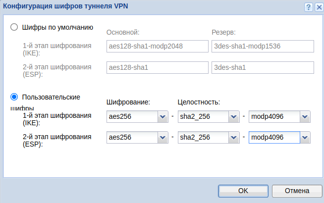
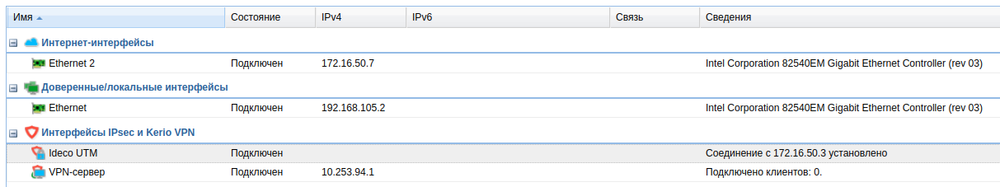

# Подключение Kerio Control к Ideco UTM по IPSec


Объединяемые локальные сети не должны пересекаться!


## Настройка Ideco UTM

1\. В веб-интерфейсе Ideco UTM откройте вкладку **Сервисы -> IPSec -> Устройства**.

2\. Добавьте новое подключение и заполните следующие поля:

* **Название подключения** – укажите произвольное имя для подключения. Значение не должно быть длиннее 42 символов;
* **Тип соединения** – выберите **Входящее**;
* **Тип аутентификации** – выберите тип PSK;
* **PSK** – укажите PSK-ключ, который будет использоваться для подключения;
* **Идентификатор UTM** - укажите ключ, который будет использоваться для идентификации подключения на Kerio;
* **Домашние локальные сети** – выберите локальную сеть Ideco UTM, которая будет видна из подсети Kerio Control;
* **Удалённые локальные сети** – укажите локальную сеть Kerio Control, которая будет видна из подсети Ideco UTM.

3\. Сохраните созданное подключение, затем активируйте подключение, нажав на иконку включения, в столбце **Управление**.

4\. Настройка завершена, теперь переходим к настройке Kerio Control.

## Настройка Kerio Control

1\. По умолчанию, Kerio Control использует IKEv1 для создания подключений к сторонним устройствам. Включить IKEv2 можно через консоль. Для этого необходимо выполнить следующие действия:

1.1. Подключитесь к Kerio Control по SSH;

1.2. Перейдите в папку `/var/winroute`;

1.3. Откройте на редактирование файл `winroute.cfg`;

1.4. В нём найдите раздел, начинающийся с текста `<table name="Firewall">`;

1.5. В этом разделе найти строку `<variable name="IKEVersion">ikev1</variable>` и изменить в ней `ikev1` на `ikev2`;

1.6. После этого требуется перезагрузить сервер и убедиться, что изменения в настройках сохранились.

2\. В разделе **Правила трафика** необходимо разрешить трафик VPN-служб.

3\. Далее перейти в раздел **Интерфейсы** и нажать на **Добавить**. В раскрывшемся списке выбрать **VPN-туннель...**.

4\. Откроется окно создания подключения. В нём выбрать:

* **Тип** – IPsec;
* **Имя** – произвольное;
* Активировать **Включить данный туннель**;
* Выбрать тип **Активное** и в поле под ним прописать IP-адрес внешнего интерфейса Ideco UTM, который будет использоваться для подключения;
* Выбрать **Предопределённый ключ** и ввести PSK-ключ, который будет использоваться для подключения;
* **Локальный ИД** - укажите ключ, который был задан в поле **Идентификатор UTM** (п.2 [**Настройка Ideco UTM**](ipsec-connection-kerio-control-to-utm.md));
* **Отдаленный ИД** - укажите IP-адрес внешнего интерфейса Ideco UTM;
* Под заданием шифров нажать на **Изменить**. Задать шифры как на скриншоте:

 

Пример итоговых настроек на скриншоте ниже:

5\. Перейти в раздел **Удалённые сети**, нажать на кнопку **Добавить** и ввести сведения о локальной сети Ideco UTM, которая будет видна из подсети Kerio Control;

6\. Затем в разделе **Локальные сети** либо нажать на кнопку **Использовать автоматически определённые локальные сети**, либо настроить сети, которые будут видны из подсети Ideco UTM вручную, как на предыдущем шаге.

7\. Настройка завершена. После добавление нового интерфейса нужно нажать на кнопку **Применить**. После чего подключение должно успешно установиться, информация об этом отображается в таблице:


В случае возникновения проблем в первую очередь обратите внимание на настройки файрвола Kerio Control.

