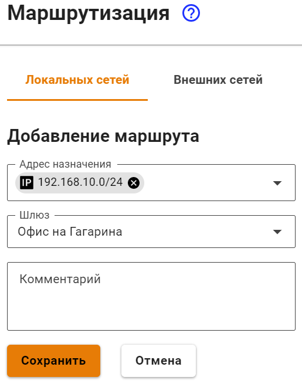

# Подключение Keenetic по SSTP

Если доступ из центрального офиса в сеть за Keenetic не нужен, то воспользуйтесь статьей [Подключение по SSTP Wi-Fi роутеров Keenetic](../../../../recipes/popular-recipes/client-to-site/sstp-connecting-keenetic-wi-fi-routers.md) по cline-to-site подключению.

## Настройка Ideco UTM

1\. Включите и настройте порт и домен для SSTP в разделе **Пользователи -> Авторизация -> VPN-подключение**.

2\. В разделе **Пользователи -> Учетные записи** создайте специального пользователя, для удаленного роутера. Установите флаг **Разрешить удаленный доступ через VPN**. Логин/пароль пользователя будут использоваться на роутере, сохраните или запишите их.

3\. Пропишите маршруты в удаленную сеть. Например, если сеть за роутером `192.168.10.0/24`, необходимо добавить следующий маршрут в раздел **Сервисы -> Маршрутизация -> Локальные сети**:

## Настройка роутера Keenetic

Настройте VPN-подключение роутера Keenetic по инструкции для client-to-site подключений.

Не забудьте выполнить все три пункта:

1. Настроить VPN-подключение.
2. Настроить маршруты.
3. Настроить DNS для резолвинга локального домена (если используете Active Directory).

## Проверка и возможные проблемы

Для проверки связи используйте утилиты ping и traceroute.

В случае, если VPN-соединение установлено, но нет доступа до ресурсов одной локальной сети из другой, воспользуйтесь инструкциями из статьи по поиску возможных проблем.

Чаще всего доступ блокируется в Windows из-за настроек сетевых профилей.

Вы можете разрешить доступ до «не локальных» сетей во всех профилях, выполнив команду в PowerShell (запущенного с повышением прав до администратора): `Enable-NetFirewallRule -Group "@FirewallAPI.dll,-28502"`
