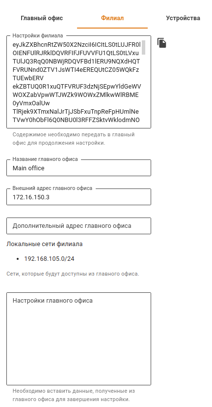

# Подключение по IPsec между двумя Ideco NGFW

## Создание IPsec подключения между двумя Ideco NGFW


* Перед тем как создать подключение между двумя NGFW, убедитесь, что в каждой из подключаемых сторон **правильно настроена временная зона**. Без этого установить подключение невозможно;
* Убедитесь, что пользовательские правила из раздела **Правила -> трафика Файрвол -> INPUT**, не блокируют входящий трафик, поступающий на внешние интерфейсы NGFW для протоколов ESP и UDP (порты 500 и 4500);
* Перед настройкой IPsec нужно учесть, что для его работы все IP-подсети, участвующие в соединениях не должны пересекаться и, тем более, не должны совпадать;
* Сети локальных интерфейсов, до которых требуется дать доступ, должны быть заданы статически;
* Перед настройкой соединения нужно убедиться в том, что один из серверов имеет публичный (белый) IP-адрес от интернет-провайдера. Входящее подключение должно настраиваться на сервере с белым IP-адресом.
* При замене/перевыпуске корневого сертификата в разделе [Сертификаты](../certificates/), IPsec-подключения перестанут работать и их необходимо будет пересоздать.
* Сети для VPN-подключений у двух NGFW не должны пересекаться.



Для доступа к локальным сетям **NGFW-1** c **NGFW-2** при подключении по VPN к **NGFW-2** выполните действия:

1. Перейдите к редактированию настроенного IPSec подключения на **NGFW-2**. 
2. Укажите в поле **Домашние локальные сети** сеть, используемую для VPN, в **NGFW-2**.


Для создания IPsec подключения между Ideco NGFW нужно настроить на одном NGFW входящее подключение, а на другом NGFW исходящее подключение. Будем настраивать на **NGFW-1** исходящее подключение, а на **NGFW-2** входящее подключение.

## Шаг 1. Первоначальные действия при настройке исходящего подключения

Перед настройкой исходящего подключения выполните предварительные действия на **NGFW-1**:

1. Перейдите в  раздел **Сервисы -> IPsec -> Устройства (исходящие подключения)** и нажмите **Добавить**.
2. Заполните поля:

* **Название подключения** - максимальное количество символов - 42;
* **Зона** - выберите зону, в которую нужно добавить IPsec подключение, или оставьте поле пустым;
* **Адрес удаленного устройства** - введите доменное имя другого Ideco NGFW или его белый IP-адрес.
* **Тип аутентификации** - выберите **Сертификат** или **PSK**;
  * При выборе типа аутентификации **Сертификат** скопируйте поле **Запрос на подпись сертификата** и сохраните его для настройки входящего подключения.
  * При выборе типа аутентификации **PSK** скопируйте поле **PSK ключ** и сохраните его для настройки входящего подключения.
  Заполните поле **Идентификатор UTM**.

3. Перед завершением настройки исходящего подключения настройте входящее подключение на другом NGFW. **Не закрывайте форму создания исходящего подключения**. Перейдите к **Шагу 2** для настройки входящего подключения на другом NGFW.

## Шаг 2. Настройка входящего подключения

Для настройки входящего подключения выполните действия на **NGFW-2**:

1. Перейдите в  раздел **Сервисы -> IPsec -> Устройства (входящие подключения)** и нажмите **Добавить**.
2. Заполните поля:

* **Название подключения** - максимальное количество символов - 42;
* **Зона** - выберите зону, в которую нужно добавить IPsec подключение, или оставьте поле пустым;
* **Тип аутентификации** - выберите **Сертификат** или **PSK**;
  *  При выборе типа аутентификации **Сертификат** заполните поле **Запрос на подпись сертификата**, вставив значение сохраненное при первоначальной настройке исходящего подключения.
  * При выборе типа аутентификации **PSK** заполните поле **PSK ключ**, вставив значение сохраненное при первоначальной настройке исходящего подключения.
  Заполните поле **Идентификатор удаленной стороны**.
 
3. Добавьте **Домашние локальные сети**, к которым должен быть доступ с другого NGFW.
4. Добавьте **Удаленные локальные сети**, к которым должен быть доступ с текущего NGFW.
5. Укажите IP-адрес интерфейса туннеля в одноименное поле при настройке BGP соседства для динамической маршрутизации.
6. Проверьте правильность заполнения полей и нажмите **Добавить подключение**.


Для доступа к удаленным локальным сетям NGFW:
* Укажите сеть в поле **Удаленные локальные сети**, 
* Добавьте статический маршрут до этой сети.

Для автоматического создания статического маршрута до удаленных локальных сетей NGFW активируйте опцию **Автоматическое создание маршрутов**. 

Если в поле **Домашние локальные сети** и **Удаленные локальные сети** указаны сети формата 0.0.0.0/0, то для доступа к удаленному NGFW нужно указать его IP-адрес в поле **IP-адрес интерфейса туннеля**.


## Шаг 3. Настройка исходящего подключения

1. В **NGFW-2** перейдите в  раздел **Сервисы -> IPsec -> Устройства (входящие подключения)** и нажмите  по ранее созданному входящему подключению.
2. При типе аутентификации **Сертификат** скопируйте поля **Корневой сертификат NGFW** и **Подписанный сертификат устройства**:

3. В **NGFW-1** перейдите в раздел **Сервисы -> IPsec -> Устройства (исходящие подключения)**.
4. При типе аутентификации **Сертификат** заполните поля **Подписанный сертификат NGFW** и **Корневой сертификат удаленного устройства** ранее скопированным значением при редактировании входящего подключения.

5. Добавьте **Домашние локальные сети**, к которым должен быть доступ с другого NGFW.
6. Добавьте **Удаленные локальные сети**, к которым должен быть доступ с текущего NGFW.
7. Укажите IP-адрес интерфейса туннеля в одноименное поле при настройке BGP соседства для динамической маршрутизации.
8. Проверьте правильность заполнения полей и нажмите **Добавить подключение**.


Для доступа к удаленным локальным сетям NGFW:
* Укажите сеть в поле **Удаленные локальные сети**, 
* Добавьте статический маршрут до этой сети.

Для автоматического создания статического маршрута до удаленных локальных сетей NGFW активируйте опцию **Автоматическое создание маршрутов**.

Если в поле **Домашние локальные сети** и **Удаленные локальные сети** указаны сети формата 0.0.0.0/0, то для доступа к удаленному NGFW нужно указать IP-адрес удаленного NGFW в поле **IP-адрес интерфейса туннеля**.



Если соединение по IPsec не устанавливается, воспользуйтесь [статьей](../../../../recipes/problem-diagnosis/ipsec.md).


