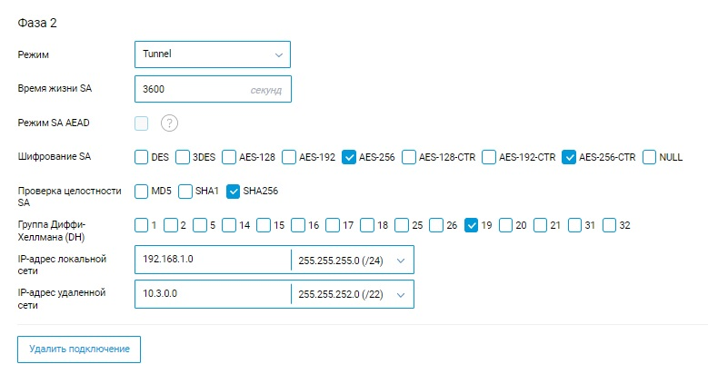

# Подключение Keenetic по IPsec

На стороне Ideco UTM произведите настройки подключения в разделе **Сервисы -> IPsec -> Устройства**.

На стороне устройства Keenetic используйте следующие настройки протоколов шифрования:

