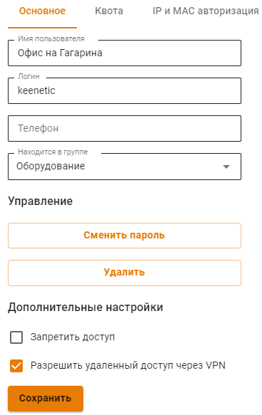
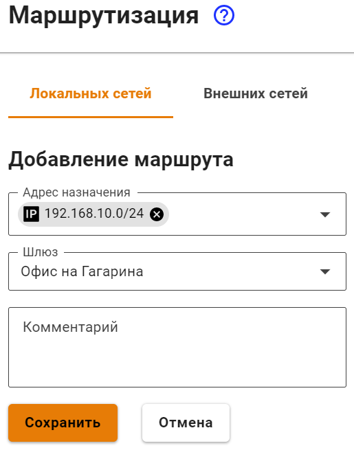
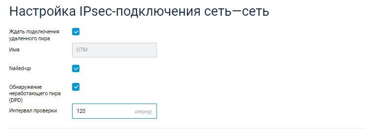
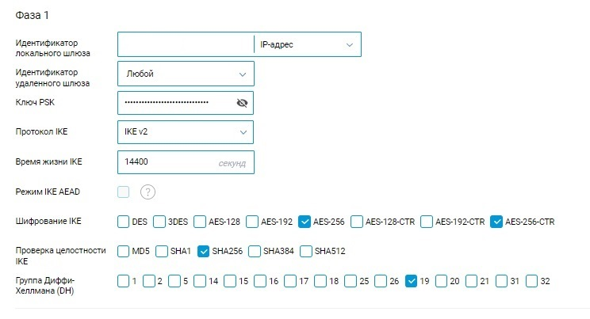

# Подключение Keenetic по SSTP

Если доступ из центрального офиса в сеть за Keenetic не нужен, то воспользуйтесь статьей [Подключение по SSTP Wi-Fi роутеров Keenetic](../../../../recipes/popular-recipes/vpn/sstp-connecting-keenetic-wi-fi-routers.md) по client-to-site подключению.

Настройка Ideco UTM

1. Включите и настройте порт и домен для SSTP в разделе **Пользователи -> VPN-подключение**.

2. В разделе **Пользователи -> Учетные записи** создайте специального пользователя для удаленного роутера и установите флаг **Разрешить удаленный доступ через VPN**. \
**Логин и пароль пользователя будут использоваться на роутере, сохраните или запишите их.**

3. Пропишите маршруты в удаленную сеть. Например, если сеть за роутером `192.168.10.0/24`, необходимо добавить следующий маршрут в раздел **Сервисы -> Маршрутизация -> Локальные сети**:

 Настройка роутера Keenetic

Настройте VPN-подключение роутера Keenetic по инструкции для client-to-site подключений.

Не забудьте выполнить все три пункта:

1. Настроить VPN-подключение;
2. Настроить маршруты;
3. Настроить DNS для резолвинга локального домена (если используете Active Directory).



Для проверки связи используйте утилиты ping и traceroute.

Доступ часто блокируется в Windows из-за настроек сетевых профилей.

Разрешите доступ до «не локальных» сетей во всех профилях, выполнив команду в PowerShell (запущенного с повышением прав до администратора): `Enable-NetFirewallRule -Group "@FirewallAPI.dll,-28502"`



# Подключение Keenetic по IPsec

На стороне Ideco UTM произведите настройки подключения в разделе **Сервисы -> IPsec -> Устройства**.

На стороне устройства Keenetic используйте следующие настройки протоколов шифрования:

