# Подключение Ideco UTM и Mikrotik


При объединении сетей с помощью VPN, локальные сети в разных офисах не должны пересекаться.

Для корректной работы подключений по сертификатам синхронизируйте время на MikroTIk по NTP (например, предоставьте доступ в Интернет).

Исходящие IPsec-подключения по сертификатам к MikroTik ниже версии 6.45 не работает из-за невозможности использования современных криптоалгоритмов.


**При использовании [нашего конфигуратора скриптов настроек MikroTik](https://mikrotik.ideco.ru) есть несколько особенностей:**

* При подключении нескольких устройств MikroTik к одному Ideco UTM по PSK, нужно указывать разные **Идентификаторы ключа (Key id)** для каждого устройства;
* При подключении нескольких устройств MikroTik к одному Ideco UTM по сертификатам, нужно указывать разные **Имена сервера** (Common Name) для каждого устройства.

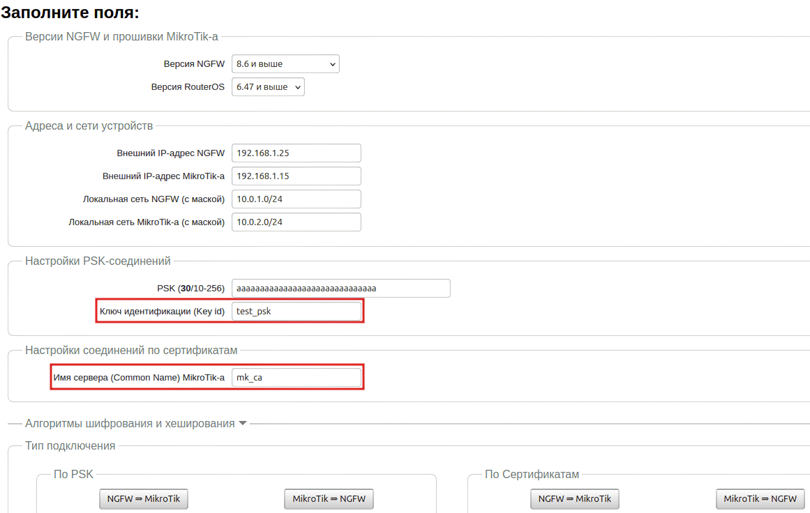

## Выбор алгоритмов шифрования на удалённых устройствах

При настройке сторонних устройств необходимо явно указать алгоритмы шифрования, используемые для подключения. \
Ideco UTM не поддерживает устаревшие и небезопасные алгоритмы (MD5, SHA1, AES128, DES, 3DES, blowfish и др.). \
При конфигурировании сторонних устройств можно указать несколько поддерживаемых алгоритмов одновременно, так как не все устройства поддерживают современные алгоритмы алгоритмы.

<details>

<summary>Список алгоритмов и пример</summary>

* **Phase 1 (IKE):**
  * encryption (шифрование):
    * **AES256-GCM**;
    * **AES256**.
  * integrity (hash, целостность):
    * для **AES256-GCM** - не требуется, поскольку проверка целостности встроена в AEAD-алгоритмы;
    * для **AES256**, по приоритету: **SHA512, SHA256**.
  * prf (функция генерации случайных значений):
    * как правило, настраивается автоматически, в зависимости от выбора алгоритмов integrity (поэтому в примере [ниже](connecting-devices.md#primer-nastroiki-podklyucheniya-pfsense-k-ideco-utm-po-ipsec-predstavlen-na-skrinshotakh-nizhe) значение prf: PRF-HMAC-SHA512).
    * для AES-GCM может потребоваться указать явно. В этом случае по приоритету: **AESXCBC, SHA512, SHA384, SHA256**.
  * DH (Группа Diffie-Hellman):
    * **Curve25519 (group 31)**;
    * **ECP256 (group 19)**;
    * **modp4096 (group 16)**;
    * **modp2048 (group 14)**;
    * **modp1024 (group 2)**.
  * Таймауты: 
    * **Lifetime**: 14400 сек;
    * **DPD Timeout** (для L2TP/IPsec): 40 сек;
    * **DPD Delay**: 30 сек.
* **Phase 2 (ESP):**
  * encryption (шифрование):
    * **AES256-GCM**;
    * **AES256**.
  * integrity (целостность):
    * для **AES256-GCM** - не требуется, поскольку проверка целостности встроена в AEAD-алгоритмы;
    * для **AES-256**, по приоритету: **SHA512, SHA384, SHA256**.
  * DH (Группа Diffie-Hellman, PFS). **ВНИМАНИЕ! если не указать, подключаться будет, но не сработает rekey через некоторое время**:
    * **Curve25519 (group 31)**;
    * **ECP256 (group 19)**;
    * **modp4096 (group 16)**;
    * **modp2048 (group 14)**;
    * **modp1024 (group 2)**. 
  * Таймаут:  
    * **Lifetime**: 3600 сек.

**Пример:**

* **Phase 1 (IKE)** (нужна одна из строк)**:**
  * AES256-GCM\PRF-HMAC-SHA512\Curve25519;
  * AES256\SHA512\PRF-HMAC-SHA512\ECP384;
  * AES256\SHA256\PRF-HMAC-SHA256\MODP2048.
* **Phase 2 (ESP)** (нужна одна из строк)**:**
  * AES256-GCM\ECP384;
  * AES256\SHA256\MODP2048.

Пример настройки подключения pfSense к Ideco UTM по IPsec:

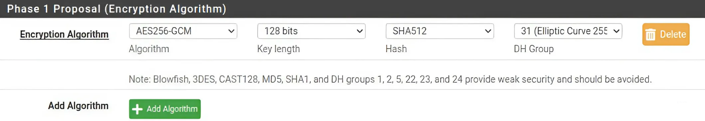

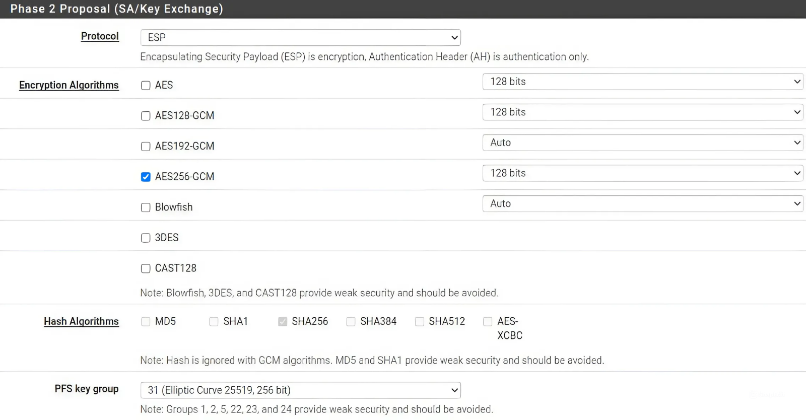

</details>

## Исходящее подключение

### Тип аутентификации PSK

<details>

<summary>Настройка Ideco UTM</summary>

1\. Откройте вкладку **Сервисы -> IPsec -> Устройства (исходящее подключение)**, нажмите на **Добавить**  и заполните поля:

* **Название подключения** - укажите произвольное имя для подключения. Значение не должно быть длиннее 42 символов;
* **Адрес удаленного устройства** - укажите внешний IP-адрес устройства MikroTik;
* **PSK** - будет сгенерирован случайный PSK-ключ. Он потребуется для настройки подключения в MikroTik;
* **Идентификатор ключа** - введенный ключ будет использоваться для идентификации исходящего подключения;
* **Домашние локальные сети** - перечислите все **локальные сети UTM**, которые будут видны противоположной стороне;
* **Удаленные локальные сети** - перечислите все **локальные сети MikroTik**, которые будут видны противоположной стороне.

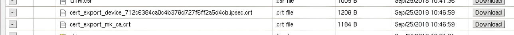

2\. После заполнения всех полей нажмите **Добавить подключение**. В списке подключений появится созданное подключение:

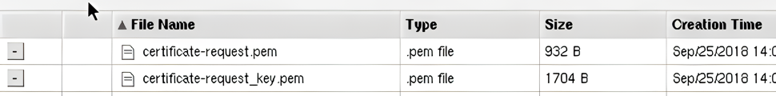

</details>

<details>

<summary>Настройка Mikrotik</summary>

Настройку устройства MikroTik можно осуществить несколькими способами: 
* GUI; 
* Консоль устройства;
* Конфигурационными скриптами ([https://mikrotik.ideco.ru/](https://mikrotik.ideco.ru)).

После генерации скрипта необходимо открыть раздел **System -> Scripts**, создать скрипт, вставить в него код, сгенерированный конфигуратором, и запустить.

После того как скрипт закончит свою работу, никаких дополнительных действий по настройке не требуется.

</details>

### Тип аутентификации Сертификат

Подключение по сертификатам является более безопасным по сравнению с PSK. 

<details>

<summary>Настройка Ideco UTM</summary>

Сгенерируйте запрос на подпись сертификата:

1\. В Ideco UTM откройте вкладку **Сервисы -> IPsec -> Устройства (исходящее подключение)**, нажмите на **Добавить**  и заполните поля:

* **Название подключения** - укажите произвольное имя для подключения. Значение не должно быть длиннее 42 символов;
* **Адрес удаленного устройства** - укажите внешний IP-адрес MikroTik;
* **Запрос на подпись сертификата** - будет сгенерирован **запрос, который необходимо выслать для подписи на MikroTik**.

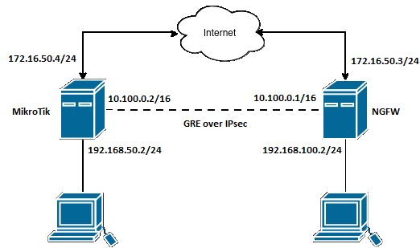

2\. После того как запрос будет подписан, необходимо будет продолжить настройку подключения в Ideco UTM.


**Не закрывайте вкладку с настройками!** При закрытии вкладки с настройками *Запрос на подпись сертификата* изменит значение и процесс подписания файла UTM.csr потребуется повторить.


</details>

<details>

<summary>Настройка MikroTik</summary>

На данном этапе следует настроить MikroTik, чтобы продолжить настройку UTM.

Файл **UTM.csr**, полученный из Ideco UTM, необходимо загрузить в файловое хранилище MikroTik. Для этого необходимо открыть раздел **File**, нажать кнопку **Browse**, выбрать файл и загрузить его.

Настройку MikroTik можно осуществить несколькими способами - через GUI, через консоль устройства или, воспользовавшись нашими конфигурационными скриптами, сгенерированными по адресу [https://mikrotik.ideco.ru/](https://mikrotik.ideco.ru).

После генерации скрипта необходимо открыть раздел **System -> Scripts**, создать скрипт, вставить в него код, сгенерированный конфигуратором, и запустить.

После того как скрипт закончит свою работу, в файловой системе MikroTik появятся два файла, которые необходимо скачать, чтобы впоследствии загрузить на UTM.

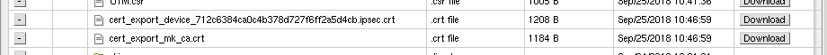

Файл вида `cert_export_device_<случайный набор символов>.ipsec.crt` - **это подписанный сертификат UTM**. \
Файл вида `cert_export_mk_ca.crt` - **это корневой сертификат MikroTik.**

Настройку MikroTik можно считать завершенной.

</details>

<details>

<summary>Завершение настройки Ideco UTM</summary>

Перейдите обратно на Ideco UTM во вкладку с настройками подключения устройства и продолжите заполнять поля:

* **Подписанный сертификат UTM** - загрузите подписанный в MikroTik сертификат UTM;
* **Корневой сертификат удаленного устройства** - загрузите корневой сертификат MikroTik;
* **Домашние локальные сети** - перечислите все **локальные сети UTM**, которые будут видны противоположной стороне;
* **Удаленные локальные сети** - перечислите все **локальные сети MikroTik**, которые будут видны противоположной стороне.

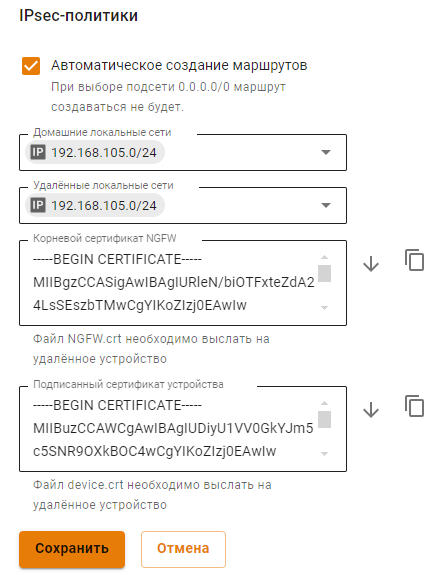

После заполнения полей нажмите кнопку **Добавить подключение**. 

</details>

## Входящее подключение

### Тип аутентификации PSK

<details>

<summary>Настройка MikroTik</summary>

Настройку устройства MikroTik можно осуществить:
* Через GUI
* Через консоль устройства 
* Через конфигурационные скрипты, сгенерированные по адресу [https://mikrotik.ideco.ru/](https://mikrotik.ideco.ru).

После генерации скрипта необходимо открыть раздел **System -> Scripts**, создать скрипт, вставить в него код, сгенерированный конфигуратором и запустить.

После того как скрипт закончит свою работу, никаких дополнительных действий по настройке не требуется.

</details>

<details>

<summary>Настройка Ideco UTM</summary>

1\. В Ideco UTM откройте вкладку **Сервисы -> IPsec -> Устройства (входящее подключение)**, нажмите на **Добавить**  и заполните поля:

* **Название подключения** - укажите произвольное имя для подключения. Значение не должно быть длиннее 42 символов;
* **PSK** - вставьте PSK-ключ, полученный от MikroTik;
* **Идентификатор удаленной стороны** - вставьте идентификатор MikroTik (параметр Key ID в `/ip ipsec peers`);
* **Домашние локальные сети** - перечислите все **локальные сети UTM**, которые будут видны противоположной стороне;
* **Удаленные локальные сети** - перечислите все локальные сети MikroTik, которые будут видны противоположной стороне.

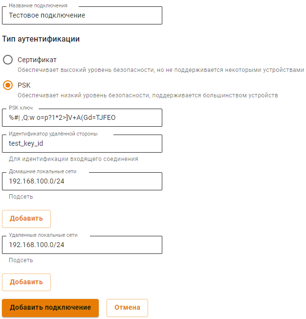

2\. После заполнения всех полей нажмите кнопку **Добавить подключение**. 

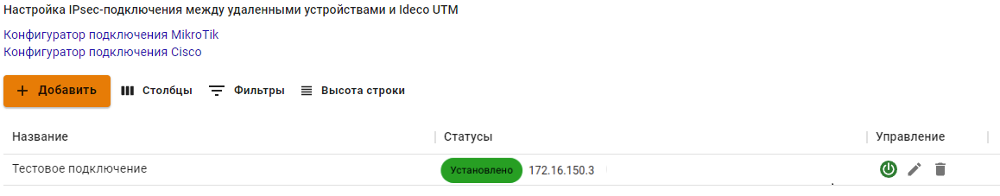

</details>

### Тип аутентификации Сертификат

Подключение по сертификатам является более безопасным, чем подключение по PSK.

<details>

<summary>Настройка MikroTik</summary>

Настройку MikroTik можно осуществить несколькими способами - через GUI, через консоль устройства или, воспользовавшись нашими конфигурационными скриптами, сгенерированными по адресу [https://mikrotik.ideco.ru/](https://mikrotik.ideco.ru) .

После генерации скрипта необходимо открыть раздел **System -> Scripts**, создать скрипт, вставить в него код, сгенерированный конфигуратором и запустить его.

Поскольку скриптов конфигуратором генерируется два, то и в MikroTik также нужно создать два скрипта.

Перед настройкой необходимо запустить первый скрипт. После того как он завершит работу, в файловом хранилище MikroTik появятся два файла, которые необходимо скачать, поскольку они требуются для дальнейшей настройки.:


* Файл `certificate-request.pem` - **запрос на подпись сертификата**;
* Файл `certificate-request_key.pem` - **приватный ключ**.

Далее переходим к настройке Ideco UTM.

</details>

<details>

<summary>Настройка Ideco UTM</summary>

1\. В Ideco UTM откройте вкладку **Сервисы -> IPsec -> Устройства (входящее подключение)**, нажмите на **Добавить**  и заполните поля:

* **Название подключения** - укажите произвольное имя для подключения. Значение не должно быть длиннее 42 символов;
* **Запрос на подпись сертификата** - загрузите запрос на подпись, **полученный от MikroTik**;
* **Домашние локальные сети** необходимо перечислить все локальные сети UTM, которые будут доступны в IPsec-подключении, т.е. будут видны противоположной стороне.

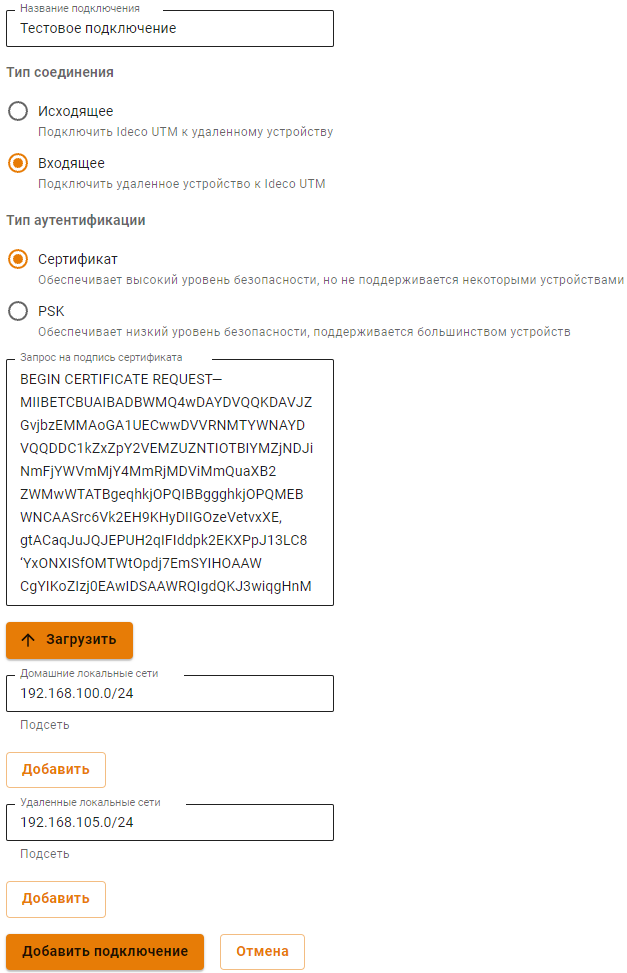

2\. После настроек нажмите кнопку **Добавить подключение**. В списке подключений появится подключение. Нажмите на кнопку редактирования соединения, чтобы продолжить настройку.

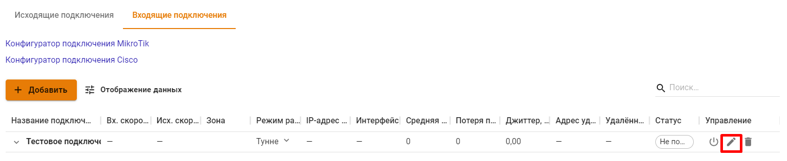

3\. Появится область редактирования настроек подключения. Необходимо скачать файлы, которые находятся в полях **Корневой сертификат UTM** и **Подписанный сертификат устройства**, для их последующего использования в MikroTik.

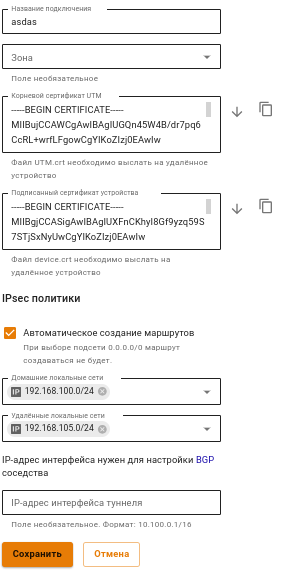

</details>

### Проблемы при повторной активации входящего подключения к Ideco UTM

Если подключение было отключено и при повторной попытке включения соединение не установилось, удаленное устройство попало в fail2ban. Для установки соединения сбросьте блокировки по IP на Ideco UTM. О сбросе блокировки читайте в статье [Защита от brute-force атак](../../../../settings/monitor/logs.md).

Fail2ban отслеживает в log-файлах попытки обратиться к сервисам, и если находит повторяющиеся неудачные попытки авторизации с одного и того же IP-адреса или хоста, блокирует дальнейшие попытки.

## Подключение Mikrotik к Ideco UTM по L2TP/IPsec

Настройте подключение, выполнив команды:

1\. Отредактируйте IPsec profile:

```
ip ipsec profile set default hash-algorithm=sha1 enc-algorithm=aes-256 dh-group=modp2048
```

2\. Отредактируйте IPsec proposals:

```
ip ipsec proposal set default auth-algorithms=sha1 enc-algorithms=aes-256-cbc,aes-192-cbc,aes-128-cbc pfs-group=modp2048
```

3\. Создайте подключение к Ideco UTM:

```
interface l2tp-client add connect-to={server} profile=default disabled=no name={interface_name} password="{password}" user="{login}" use-ipsec="yes" ipsec-secret="{psk}"
```
