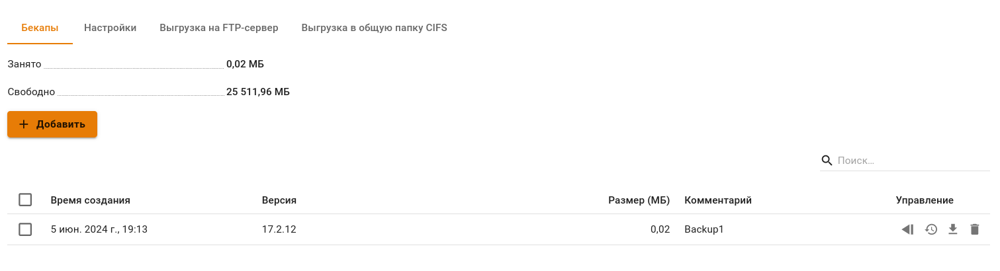
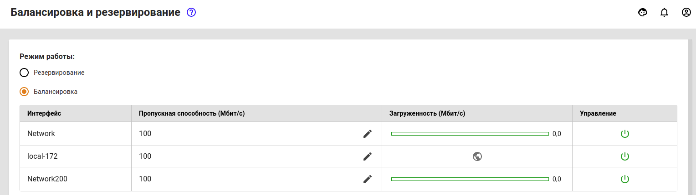
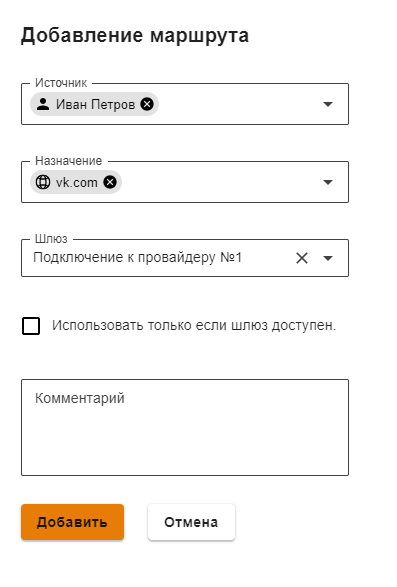

# Балансировка и резервирование


Название службы раздела **Балансировка и резервирование**: `ideco-routing-backend.service`. \
Список служб для других разделов доступен по [ссылке](../server-management/terminal.md).


При наличии нескольких подключений к интернет-провайдерам балансировку и резервирование можно осуществлять следующими способами:
 
* Резервирование одного из подключений, при отключении которого трафик пойдёт через другие доступные подключения;
* Статическая балансировка трафика между несколькими подключениями. При этом часть пользователей локальной сети будет выходить в сеть Интернет через одного провайдера, часть через другого;
* Динамическая балансировка трафика между несколькими подключениями. При этом подключения будут поочередно переключаться в зависимости от нагрузки, а сессии от всех пользователей будут равномерно распределяться между ними.

Перед настройкой убедитесь, что на сервере уже созданы минимум два подключения к сети Интернет. Если нет, то создайте дополнительное подключение. Подробнее о создании подключения в статье [Настройка Внешнего Ethernet](connection-to-provider/ethernet-connection.md) 

Для работы с трафиком в Ideco UTM важно учитывать 2 момента: маршрутизация и NAT. Это касается как балансировки, так и резервирования.

## Резервирование каналов

Перейдите в раздел **Сервисы -> Балансировка и резервирование** и выбрать режим **Резервирование**.


Приоритет использования подключений задается их порядком в таблице, сверху вниз. \
Если сеть Интернет стала недоступна через используемое подключение, то UTM будет перебирать подключения сверху вниз (до первого рабочего подключения).


Подключение, которое используется в данный момент, отмечено тегом **Используется**. Для смены приоритета используйте соответствующие элементы управления ().

## Динамическая балансировка. Распределение нагрузки по нескольким подключениям 

Действия для настройки:

1\. Перейдите в раздел **Сервисы -> Балансировка и резервирование**.

2\. Выберите режим работы **Балансировка**.

Для равномерного распределения сессий между подключениями необходимо указать значение **Пропускной способности** - максимальной скорости Интернета по тарифам провайдеров.Сервер автоматически будет балансировать трафик в зависимости от загрузки подключений.


Создавать маршруты или выполнять еще какие-либо настройки для балансировки трафика не требуется. Трафик прокси-сервера также будет балансироваться автоматически.


## Статическая балансировка. Доступ к сети Интернет через определенное подключение к провайдеру 

Способы применения:

1. Направление части трафика через интернет провайдера, чья тарификация для этого трафика дешевле.
2. Предоставление доступа к внутренним сетям одного из провайдеров для определенных пользователей/групп пользователей.

Действия для настройки:

1\. Перейдите в раздел меню **Сервисы -> Маршрутизация -> Внешних сетей**.

2\. Добавьте правила маршрутизации для определенного списка ресурсов, трафик к которым необходимо направить через нужное подключение к провайдеру, нажав кнопку **Добавить**.

Пример направления трафика к ресурсу **vk.com** от пользователя **Иван Петров** через подключение к провайдеру **Подключение к провайдеру №1**:

