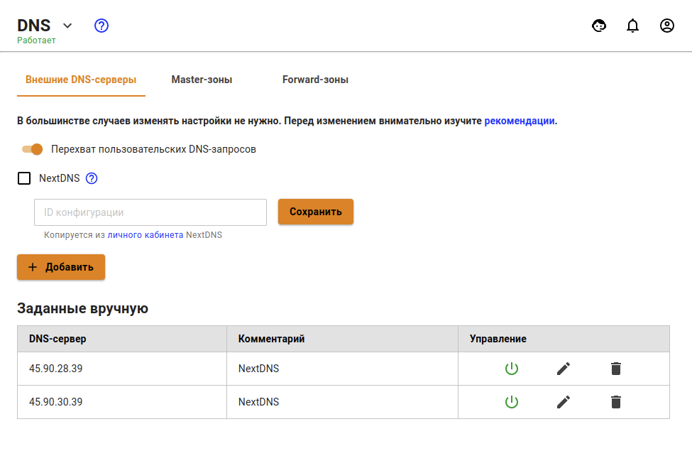

# NextDNS

NextDNS является облачным поставщиком услуг DNS в Интернете, используемый для управления и настройки вашей интернет-безопасности и родительского контроля.

NextDNS имеет клиент-серверную конфигурацию - облачный сервер, размещенный на NextDNS, будет обмениваться данными через клиентское приложение.

Начиная с версии 12.0 в Ideco UTM появилась интеграция с сервисом NextDNS в разделе **Сервисы -> DNS**.

## Настройка NextDNS на Ideco UTM через NextDNS ID

Для интеграции Ideco UTM с NextDNS, необходим ID, выдаваемый на сайте [my.nextdns.io](https://my.nextdns.io).

Далее в Ideco UTM в разделе **Сервисы -> DNS** необходимо:

1\. Нажать на окошко с **NextDNS** и вставить в поле ID из личного кабинета, как показано на скриншоте:

2\. Нажать на кнопку **Сохранить**.

После проделанных действий в личном кабинете произойдут изменения, из котрых будет видно, что весь DNS трафик теперь ходит через сервера NextDNS. 

## Настройка NextDNS на Ideco UTM через DNS-сервера

В разделе **Сервисы -> DNS** создайте 2 записи с DNS-серверами NextDNS.

