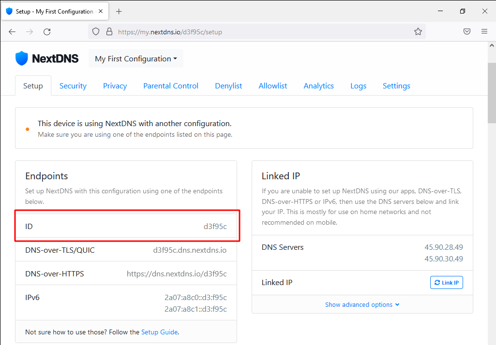
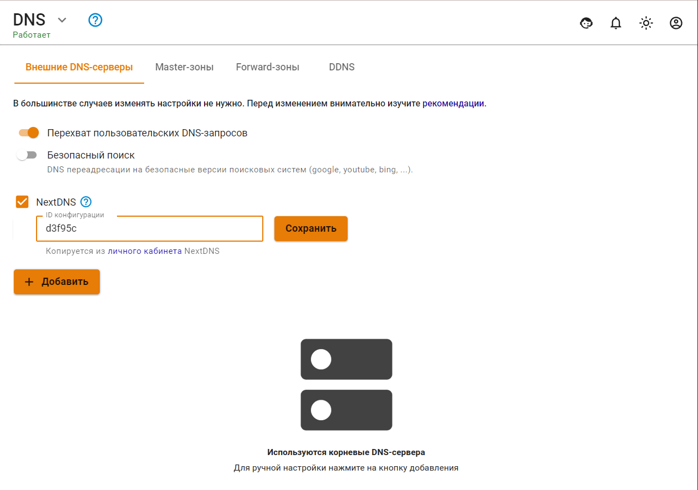
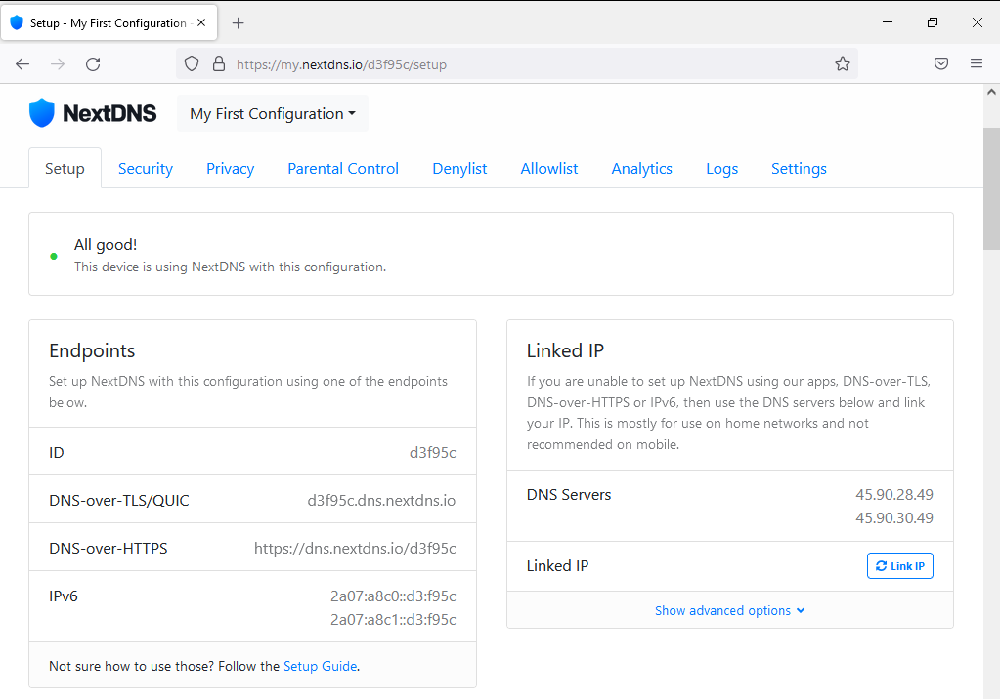

# NextDNS

NextDNS является облачным поставщиком услуг DNS в Интернете, используемый для дополнительного управления и фильтрации баннеров и прочей рекламы. А также ограничения доступа к нежелательным сайтам по доменным именам.

Начиная с версии 12.0 в Ideco UTM появилась интеграция с сервисом NextDNS в разделе **Сервисы -> DNS**.


Данная интеграция была внедрена в Ideco UTM с целью предоставить возможность использовать функциональность сервиса NextDNS всем пользователям, находящимся в локальных сетях сервера Ideco UTM.


## Настройка NextDNS на Ideco UTM


Чтобы использовать NextDNS, необходимо предварительно создать в нем аккаунт.


Для интеграции Ideco UTM с NextDNS, необходим ID, выдаваемый на сайте [my.nextdns.io](https://my.nextdns.io)

Далее в Ideco UTM в разделе **Сервисы -> DNS** необходимо:

1\. Нажать на окошко с **NextDNS** и вставить в поле ID из личного кабинета, как показано \
на скриншоте:

2\. Нажать на кнопку **Сохранить**.

После нажатия кнопки **Сохранить**, все имеющиеся в вашем личном кабинете NextDNS правила фильтрации начнут действовать на исходящие DNS-запросы от пользователей из локальных сетей Ideco UTM".

После завершения интеграции Ideco UTM с NextDNS, дополнительная фильтрация настраивается на самом сайте [my.nextdns.io](https://my.nextdns.io) и не зависит от Ideco UTM.


При возникновении проблем с сервисами NextDNS, необходимо обращаться \
в техническую поддержку NextDNS.

Техническая поддержка Ideco UTM не относится к сервису NextDNS.

