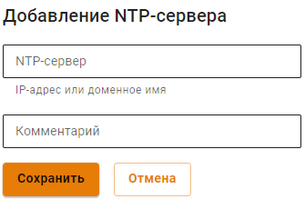

# NTP-сервер

NTP - протокол для синхронизации времени. По умолчанию работает на 123 порту. 

Синхронизация времени происходит путем обращения NTP-клиента к серверу времени. Ideco UTM может выступать в роли сервера времени. 

## Настройка Ideco UTM

Для настройки перейдите в раздел **Сервисы -> NTP-сервер**.

При включении опции **NTP-сервер на всех локальных интерфейсах (порт 123/UDP)**, Ideco UTM становится NTP-сервером для запросов из локальной сети по 123 порту.

Для добавления NTP-сервера, с которым UTM будет синхронизировать время, нажмите **Добавить** в левом верхнем углу. Заполните поле **NTP-сервер**, указав IP-адрес или доменное имя:

