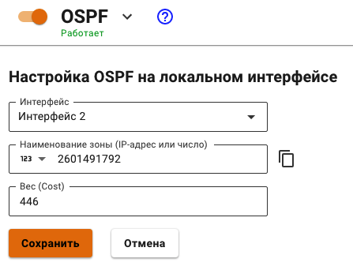

# OSPF

В Ideco UTM 12 реализована поддержка OSPF (Open Shortest Path First) - протокола маршрутизации по состоянию каналов. Канал — это интерфейс маршрутизатора. Канал также представляет собой сегмент сети, который соединяет два маршрутизатора. Данные о состоянии этих каналов также называются состоянием канала. Вся информация о состоянии канала включает префикс сети, длину префикса и стоимость.

В данном разделе описывается принцип работы OSPF, а так же его настройка в веб-интерфейсе UTM.

Использование данного модуля лучше всего подойдет для сетей, имеющих балансировку нагрузки на сеть и резервирование каналов.&#x20;

## Принцип работы маршрутизации по состоянию канала

#### **1. Установление отношений смежности с соседними устройствами**

Маршрутизатор, использующий OSPF, отправляет пакеты приветствия для определения всех соседних устройств в пределах этих каналов. При наличии соседнего устройства маршрутизатор пытается установить с ним отношения смежности.

#### **2. Обмен объявлениями о состоянии каналов**

После установления смежности устройства выполняют обмен объявлениями о состоянии канала (LSA). LSA содержат информацию о состоянии и стоимости каждого канала с прямым подключением.

#### **3. Создание базы данных состояния связи**

На основе объявления LSA маршрутизаторы собирают базу данных, в которой содержатся данные о топологии сети в области.

#### **4. Исполнение алгоритма SPF**

Затем на устройствах выполняется алгоритм SPF, результатом которого является создание дерева кратчайших путей.

#### **5. Выбор лучшего маршрута**

На основании данных дерева SPF предлагаются наилучшие пути для таблицы IP-маршрутизации. Маршрут добавляется в таблицу маршрутизации, если отсутствует источник маршрута к той же сети с меньшим административным расстоянием, например статический маршрут. Решения по маршрутизации принимаются на основе записей в таблице маршрутизации.

## Настройка Ideco UTM

Рассмотрим настройки Ideco UTM на примере топологии, представленной на схеме ниже:

1. В веб-интерфейсе UTM перейдите в раздел **Маршрутизация - OSPF** и нажмите кнопку **Добавить.**
2.  Заполните следующие поля:

    В поле **Интерфейс** выберите локальный интерфейс, подключенный к роутеру.

    В поле **Наименование зоны** введите номер зоны (для небольших сетей введите зону 0).

    В поле **Вес** (опционально) введите стоимость маршрута.
3. Нажмите **Сохранить.**

Пример настройки:

Пример готовой таблицы:

## Настройка MikroTik

1. Включите динамическую маршрутизацию, поставив крестик на модуле routing.
2.  Установить необходимые интерфейсы, но без статичных маршрутов:

    `interface bridge add name=loopback ip address add interface=loopback address=1.1.1.1/32`&#x20;

    (можно указать любой IP, который будет уникален)
3.  Если устройство является пограничным и должен сообщать другим, что он является шлюзом по умолчанию для выхода в Интернет:

    `routing ospf instance set numbers=0 router-id=1.1.1.1 redistribute-default=always-as-type-1`&#x20;

    Если устройство не имеет прямого выхода в Интернет:

    `routing ospf instance set numbers=0 router-id=1.1.1.1`&#x20;

    такой же IP-адрес, который установили на loopback
4.  Добавляем его в динамическую сеть, этот адрес будет всегда доступен, требуется для идентификации роутеров&#x20;

    `routing ospf network add network=1.1.1.1/32 area=backbone`
5.  Любые другие подсети, которые нужно передать соседям по динамической маршрутизации, повторять команду добавляя каждую по одной&#x20;

    `routing ospf network add network=(другие подсети)/24 area=backbone`&#x20;
6. `ip route print`&#x20;
