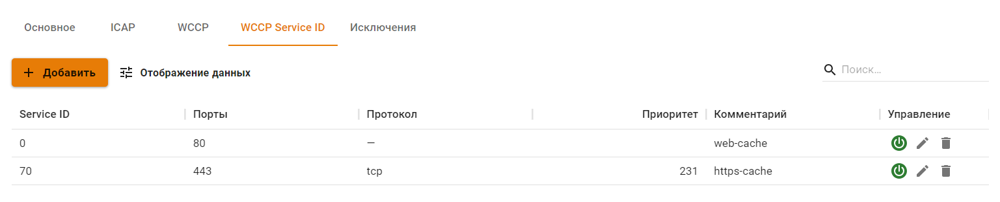
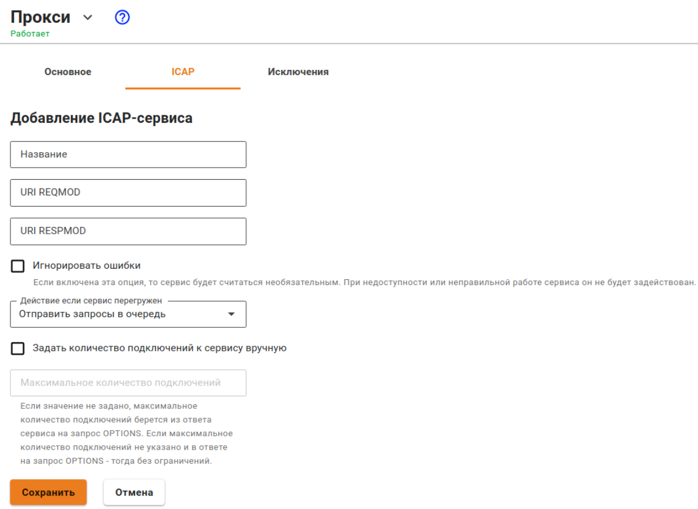

# Прокси


Название службы раздела **Прокси**: `ideco-proxy-backend`; `squid`. \
Список служб для других разделов доступен по [ссылке](../../server-management/terminal.md).


Прокси-сервер, помимо проксирования веб-трафика, используется для передачи трафика следующим сервисам:

* Антивирус для веб-трафика (Антивирус Касперского или ClamAV);
* Сервис отчетности по веб-трафику пользователей;
* Контент-фильтр. 

Порядок обработки веб-трафика подробнее описан в [статье](../../../recipes/popular-recipes/processing-order.md).


Не указывайте на хостах локальной сети настройки прокси. Достаточно указания UTM в качестве шлюза по умолчанию для устройств в сети.

Для настройки фильтрации HTTPS-трафика нужно добавить корневой сертификат UTM на компьютеры пользователей. Подробнее в статье [Настройка фильтрации HTTPS](../../access-rules/content-filter/filtering-https-traffic.md).


## Основное

На вкладке **Основное** предоставлены возможности:
 
* **Разрешить прямые подключения к прокси** \
Этот режим применяется, когда Ideco UTM не является шлюзом по умолчанию для клиентов сети. \
Порт, указанный на стороне UTM, следует указать на сетевых устройствах локальной сети, веб-трафик которых нужно пропускать через прокси.
* **Включить журналирование** \
Включает запись логов Контент-фильтра и Антивирусов веб-трафика.\
  

О настройке прямого подключения к прокси и прокси с одним интерфейсом читайте в [статье](./proxy-single-interface.md).

## ICAP

Протокол ICAP используется для отправки HTTP(S)-трафика в расшифрованном виде сторонним серверам. ICAP-сервисы будут обрабатывать трафик после антивирусов и контент-фильтра.

При добавлении ICAP-сервиса доступны следующие настройки:

* **Игнорировать ошибки** - если включена эта опция, то сервис будет считаться необязательным. При недоступности или неправильной работе сервиса он не будет задействован.
* **Задать количество подключений к сервису вручную** - если значение не задано, максимальное количество подключений берется из ответа сервиса на запрос OPTIONS. Если максимальное количество подключений не указано и в ответе на запрос OPTIONS, тогда - без ограничений.


Для корректной работы ICAP-сервиса должна быть настроена расшифровка HTTPS-трафика в **Контент-фильтре**.


## Исключения

Исключения ресурсов из обработки прокси-сервером работают только для прозрачного режима прокси. При прямых подключениях к прокси-серверу исключить что-либо из обработки прокси нельзя.

Подробнее о типах исключений в статье:


[exclusions.md](exclusions.md)


