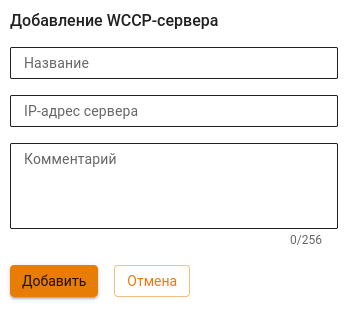

# Прокси


Название службы раздела **Прокси**: `ideco-proxy-backend`; `squid`. \
Список служб для других разделов доступен по [ссылке](../../server-management/terminal.md).


Прокси-сервер, помимо проксирования веб-трафика, используется для передачи трафика следующим сервисам:

* Антивирус для веб-трафика (Антивирус Касперского или ClamAV);
* Сервис отчетности по веб-трафику пользователей;
* Контент-фильтр. 

Порядок обработки веб-трафика подробнее описан в [статье](../../../recipes/popular-recipes/processing-order.md).


На хостах локальной сети не нужно явно указывать настройки прокси. Достаточно указания NGFW в качестве шлюза по умолчанию для устройств в сети.

Для настройки фильтрации HTTPS-трафика нужно добавить корневой сертификат NGFW на компьютеры пользователей. Подробнее в статье [Настройка фильтрации HTTPS](../../access-rules/content-filter/filtering-https-traffic.md).


## Основное

На вкладке **Основное** предоставлены возможности:
* **Включить кэширование трафика на диск** \
По умолчанию кэширование трафика на диск отключено, но оно осуществляется в оперативной памяти сервера. **Не рекомендуется включать эту опцию из-за излишней нагрузки на дисковую подсистему**. 
* **Разрешить прямые подключения к прокси** \
Данный режим применяется в случае, когда Ideco NGFW не является шлюзом по умолчанию для клиентов сети. \
Порт, указанный на стороне NGFW, следует указать на сетевых устройствах локальной сети, веб-трафик которых нужно пропускать через прокси.
* **Включить журналирование** \
Включает запись логов Контент-фильтра и Антивирусов веб-трафика.

О настройке прямого подключения к прокси и прокси с одним интерфейсом читайте в [статье](./proxy-single-interface.md).

## ICAP

Протокол ICAP используется для отправки HTTP(S)-трафика в расшифрованном виде сторонним серверам. ICAP-сервисы будут обрабатывать трафик после антивирусов и контент-фильтра.

При добавлении ICAP-сервиса доступны следующие настройки:
* **Игнорировать ошибки** - если включена эта опция, то сервис будет считаться необязательным. При недоступности или неправильной работе сервиса он не будет задействован.
* **Задать количество подключений к сервису вручную** - если значение не задано, максимальное количество подключений берется из ответа сервиса на запрос OPTIONS. Если максимальное количество подключений не указано в ответе на запрос OPTIONS - тогда без ограничений.


Если указать в опции **Задать количество подключений к сервису вручную** значение меньше четырех, то клиентские подключения могут быть нестабильными.



Для корректной работы ICAP-сервиса должна быть настроена расшифровка HTTPS-трафика в **Контент-фильтре**.


## WCCP

Протокол WCCP используется для перенаправление веб-трафика на прокси-сервера. 

Трафик, отличающийся от HTTP/HTTPS, не перенаправляется на Ideco NGFW. Веб-запросы обрабатываются роутером в соответствии с уровнем WCCP.

Для активации WCCP переведите опцию **Включить перенаправление трафика c WCCP-серверов на Ideco UTM** в положение **Включен**. Ideco NGFW запустит процесс согласования параметров с WCCP-сервером.

В NGFW предусмотрено два режима работы WCCP - L2 и GRE. Для выбора режима раскройте блок **Настройки**. \
Если на WCCP-сервере задан пароль, сохраните его в соответствующем поле:

Если роутер использует несколько Ideco NGFW, настроить распределение трафика можно с помощью указания приоритета в поле **Вес**. Допустимые значения от 1 до 10000.

Для добавления WCCP-сервера нажмите **Добавить** в левом верхнем углу и укажите IP-адрес сервера:

 L2 

Режим L2 используется, если роутер и Ideco NGFW находятся в одном сетевом сегменте.

Последовательность обработки веб-запросов на уровне L2:
* Пользователь отправляет веб-запрос;
* Запрос перенаправляется роутером на Ideco NGFW;
* Ideco NGFW обрабатывает запрос. 
* Если запрос заблокирован,  информация о блокировке отправляется обратно пользователю.
* Если запрос не заблокирован, то Ideco NGFW подменяет IP-адрес источника и направляет запрос на внешний сервер. 

Ответ возвращается обратно по тому же пути, по которому уходил на внешний сервер.

 GRE 

Режим GRE используется, если роутер и Ideco NGFW находятся в разных сетевых сегментах.

Последовательность обработки веб-запросов на уровне GRE:
* Пользователь отправляет веб-запрос;
* Запрос перенаправляется по GRE-туннелю на Ideco NGFW;
* Ideco NGFW обрабатывает запрос.
* Если запрос заблокирован, то информация о блокировке отправляется обратно пользователю.
* Если запрос не заблокирован, то Ideco NGFW подменяет IP-адрес источника и направляет запрос на внешний сервер. 

Ответ возвращается через WCCP-роутер, минуя Ideco NGFW и GRE-туннель.

## Исключения

Исключения ресурсов из обработки прокси-сервером работают только для прозрачного режима прокси. При прямых подключениях к прокси-серверу исключить что-либо из обработки прокси нельзя.

Подробнее о типах исключений в статье [Исключения](/settings/services/proxy/exclusions.md).
