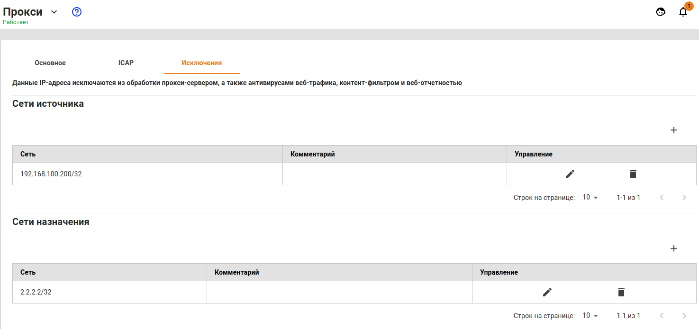

# Исключить IP-адреса из обработки прокси сервером


Исключения ресурсов из обработки прокси-сервером работают только для прозрачного режима прокси. При прямых подключениях к прокси-серверу исключить что-либо из обработки прокси нельзя. 


**Можно настроить два типа исключений:**

* Исключение трафика хостов локальных сетей UTM направленного вовне из обработки прокси \(**Сети источника**\).
* Исключение трафика всех хостов в локальной сети, обслуживаемой UTM до определенных ресурсов во внешних сетях \(**Сети назначения**\).

Указывать можно только IP-адреса или IP-сети.

Трафик, исключенный из обработки прокси, не будет участвовать в **Отчетах**, а также не может быть проверен на вирусы и обработан модулем **Контент-фильтра**. В то же время такой трафик будет проверен файрволом, службами предотвращения вторжений и контролем приложений.

## Программы, работающие по протоколам, отличным от HTTP\(S\) через веб-прокси

Некоторые программы, отправляющие трафик на свои сервера по портам 80 и 443, но при этом работающие по протоколам, отличным от HTTP\(S\), не могут быть обработаны веб-прокси сервером на UTM с включенной фильтрацией HTTPS трафика. Трафик таких программ следует исключать из обработки прокси в поле **Сети назначения**.

### Сети «1С Коннект»

* `185.104.248.141/32`;
* `77.244.213.204/32`;
* `185.188.183.87/32`;
* `185.24.93.122/32`;
* `185.143.172.61/32`;
* `185.99.140.108/32`.

### Сети «ВЭД-Декларант»

* `212.49.126.110/32`;
* `46.48.116.196/32`;
* `94.213.21.144/32`;
* `194.213.21.144/32`;
* `91.220.57.3/32`.

