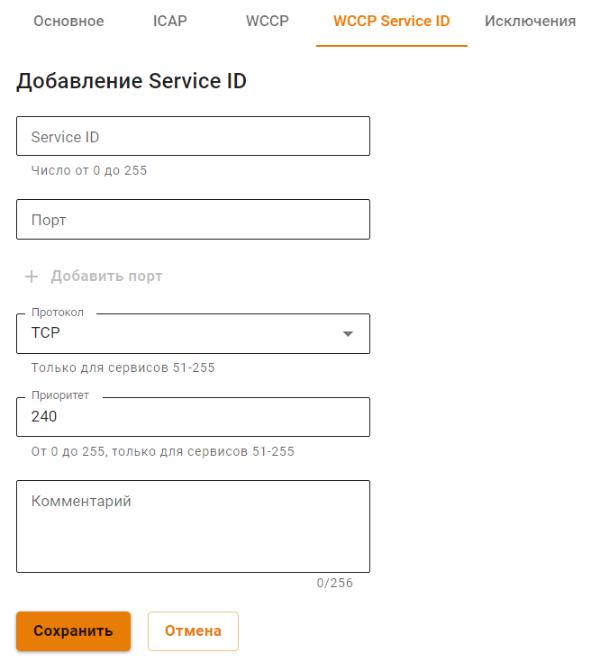
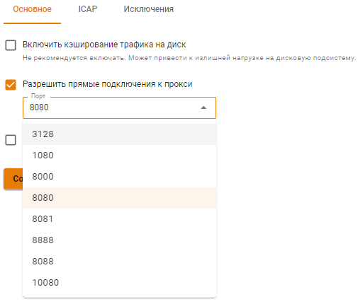

# Настройка прямого подключения к прокси и прокси с одним интерфейсом

## Настройка прямого подключения к прокси

* Укажите IP-адрес локального интерфейса Ideco UTM в качестве веб-прокси в локальной сети на клиентских устройствах (зафиксировать путь для настройки и скриншот конечной настройки);
* В настройках прокси на Ideco UTM укажите порт для прямых подключений к прокси (возможен выбор портов из списка: 3128, 1080, 8000, 8080, 8888, 8081, 8088, 10080).

В таком режиме UTM сможет предоставлять клиентским устройствам веб-трафик по другим портам (по умолчанию по всем, при необходимости можно закрыть порты файрволом). 

Если прямое подключение к прокси требуется только части клиентских устройств или части локальных интерфейсов, то создайте INPUT правило файрвола. 

По необходимости производя учет (квоты), контроль и проверку веб-трафика на вирусы, контент и вредоносное содержимое при соблюдении следующих условий:

Для учета, контроля и проверки веб-трафика на вирусы, требуется соблюдение следующих условий:

* Локальная подсеть не должна пересекаться с внешним интерфейсом UTM;
* У сервера Ideco UTM должен быть доступ в интернет;
* На клиентских устройствах указать адрес веб-прокси (в настройках прокси-сервера в браузерах); 
* При [Single Sign-On](../../users/active-directory/active-directory-user-authorization.md#nastroika-ideco-utm) авторизации через Active Directory, указать в настройках клиентских устройств IP-адрес Ideco UTM.

Если в настройках программы под ОС Windows или Mac OS X нет возможности указать прокси-сервер, то можно воспользоваться сторонним ПО для маршрутизации всего трафика рабочей станции на прокси-сервер. Например, такую возможность предоставляет программа **Proxifier**. Подробнее о том как **настроить программу Proxifier для прямых подключений к прокси серверу** указано в статье по [ссылке](../../../recipes/popular-recipes/configuring-proxifier.md).

## Настройка прокси с одним интерфейсом

При необходимости можно использовать Ideco UTM в качестве прокси-сервера с прямыми подключениями клиентов к прокси, с одним интерфейсом. Для этого необходимо выполнить следующие настройки:

1\. При создании локального интерфейса в разделе **Сервисы -> Сетевые интерфейсы** нужно указать **Шлюз**:

2\. Разрешить прямые подключения к прокси-серверу на вкладке **Сервисы -> Прокси**, выбрав нужный порт из списка:

При использовании Ideco UTM в качестве прокси-сервера с прямыми подключениями к прокси, большинство функций будет работать в обычном режиме, но с некоторыми особенностями:

* В правилах межсетевого экрана для пользователей необходимо указывать пути INPUT, вместо FORWARD;
* Глубокий анализ трафика системой предотвращения вторжений и модулем контроля приложений будет осуществляться только для трафика, проходящего через прокси-сервер (часть правил работать не будет);
* Исключения из прокси-сервера необходимо делать средствами браузера или маршрутами на конечных устройствах. Настройки на вкладке **Сервисы -> Прокси -> Исключения** применяются только для прозрачного режима работы прокси-сервера.
