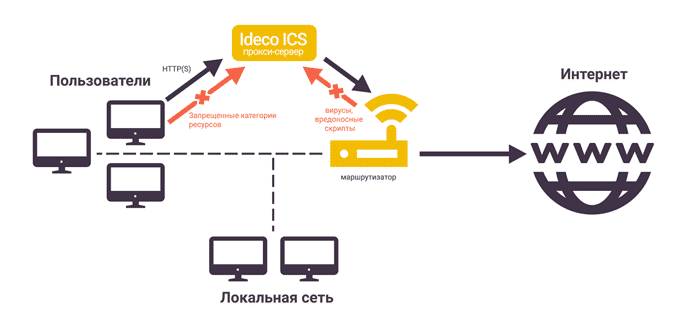

# Прокси сервер

## Прокси-сервер для веб-трафика

На хостах локальной сети не нужно явно указывать настройки прокси. Достаточно указания UTM в качестве шлюза по умолчанию для устройств в сети.

По умолчанию кэширование трафика на диск отключено, но оно осуществляется в оперативной памяти сервера. Включить кэширование веб-трафика на диск вы можете в разделе **Сервисы -> Прокси**, но мы не рекомендуем этого делать по причине излишней нагрузки на дисковую подсистему. Как правило, кэширования в оперативную память достаточно.

**Прямые подключения к прокси-серверу** можно настроить, отметив соответствующий чекбокс в разделе **Сервисы -> Прокси**, указав порт на стороне UTM. Затем эти реквизиты следует указать на тех сетевых устройствах локальной сети, веб-трафик которых нужно пропускать через прокси.

Для настройки фильтрации HTTPS-трафика нужно добавить корневой сертификат UTM на компьютеры пользователей. Подробнее в статье [Настройка фильтрации HTTPS](../../access-rules/content-filter/filtering-https-traffic.md).

Ниже предоставлен скриншот вкладки **Основное** раздела **Прокси**.

## Роль прокси-сервера в работе шлюза Ideco UTM

Прокси-сервер, помимо проксирования веб-трафика, играет роль мастер-службы для нескольких сервисов, связанных с обработкой, контролем и учетом веб-трафика пользователей на шлюзе, а именно:

* Антивирус для веб-трафика (Антивирус Касперского или ClamAV);
* Сервис отчетности по веб-трафику пользователей;
* Контент-фильтр.

## Прямые подключения к прокси-серверу

Данный режим применяется в случае, когда Ideco UTM не является шлюзом по умолчанию для клиентов сети.

### Настройка режима

* Указать локальный IP-адрес Ideco UTM в качестве веб-прокси в локальной сети на клиентских устройствах. Возможно использование прокси-сервера для всех протоколов;
* В настройках прокси на Ideco UTM должны быть указаны IP-адрес и порт для прямых подключений к прокси (возможен выбор портов из списка: 3128, 1080, 8000, 8080, 8888, 8081, 8088, 10080).

В таком режиме UTM сможет предоставлять хостам веб-контент и трафик по другим портам (по умолчанию по всем, при необходимости можно закрыть порты файрволом), по необходимости производя учет (квоты), контроль и проверку веб-трафика на вирусы, контент и вредоносное содержимое при соблюдении следующих условий:

* Наличие доступа в Интернет у сервера Ideco UTM (его внешний интерфейс должен находится в не пересекающейся с локальной подсетью диапазоне и иметь доступ в сеть Интернет);
* Авторизация хоста-потребителя веб-трафика на сервере UTM одним из типов авторизации, поддерживаемым UTM;
* Явное указание хосту (в настройках прокси-сервера в браузерах) адреса веб-прокси. При [Single Sign-On](../../users/active-directory/active-directory-user-authorization.md#nastroika-ideco-utm) авторизации через Active Directory необходимо указывать в настройках доменное имя Ideco UTM, а не его IP-адрес.

Если в настройках программы под ОС Windows или Mac OS X нет возможности указать прокси-сервер, то можно воспользоваться сторонним ПО для маршрутизации всего трафика рабочей станции на прокси-сервер. Например, такую возможность предоставляет программа **Proxifier**. Подробнее о том как **настроить программу Proxifier для прямых подключений к прокси серверу** указано в статье по [ссылке](../../../recipes/popular-recipes/configuring-proxifier.md).

## Исключения ресурсов из обработки прокси-сервером

На вкладке **Исключения** возможно исключить ресурсы из обработки прокси-сервером и всеми связанными службами (контент-фильтр, веб-отчетность, антивирусы).

* **Сети источника:** прокси-сервер исключается из обработки запросов из указанных внутренних сетей или IP-адресов;
* **Сети назначения:** прокси-сервер исключается из обработки запросов на внешние сети или IP-адреса (как правило адреса веб-сайтов или веб-сервисов).


**Настоятельно не рекомендуем исключать из обработки прокси-сервером ВСЮ локальную сеть.**



При прямом подключении к прокси-серверу нельзя исключить трафик из обработки прокси. Исключать трафик нужно в настройках прокси-сервера на устройстве (в веб-браузере или системных настройках прокси-сервера).

