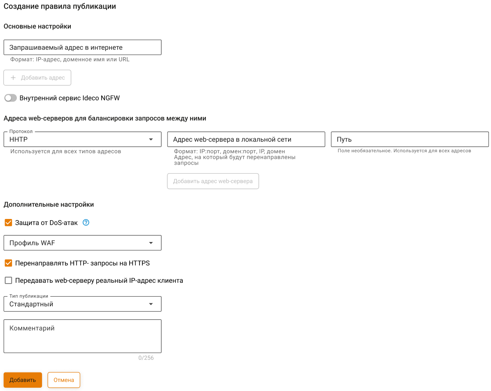

# Обратный прокси


Название службы раздела **Обратный прокси**: `ideco-reverse-backend`. \
Список служб для других разделов доступен по [ссылке](../server-management/terminal.md).


Технология обратного прокси (реверс-прокси, reverse-proxy) позволяет проксировать веб-трафик в обратном направлении: из сети Интернет в локальную сеть, в отличие от наиболее часто используемого варианта — из локальной сети в Интернет. Такой подход заменил портмаппинг (DNAT) и расширил возможности по публикации веб-ресурсов.

Обратный прокси отличается от DNAT тем, что работает на более высоком уровне (прикладной протокол HTTP вместо сетевого протокола IP) и позволяет более гибко реализовать публикацию ресурсов. Основным параметром при публикации веб-ресурса является **Запрашиваемый адрес в Интернете**. Из внешней сети по протоколу HTTP и данному URL будет произведено обращение на UTM. Обратный прокси позволяет «смаршрутизировать» (http-routing) такой запрос на HTTP-сервер в локальной сети. Таким образом, имея одну ресурсную A-запись для внешнего сетевого интерфейса UTM, можно опубликовать несколько ресурсов в локальной сети, распределив их по нескольким входящим URL. Если же с внешним IP-адресом UTM ассоциировано несколько A-записей, то маршрутизация становится еще более простой, а входящие URL - более удобными для посетителей ресурсов.

## Создание и настройка правила

Настройка сертификатов для публикуемых ресурсов не требует их ручной загрузки. Сейчас Ideco UTM сам отправляет запрос на выпуск сертификата Let's Encrypt. Выпуск сертификата может занять до 20 минут. Выпущенные сертификаты будут доступны в разделе [Сертификаты](certificates/).

Для создания правила перейдите в раздел **Сервисы -> Обратный прокси** и нажмите на кнопку **Добавить**. Форма добавления правила разделена на два подраздела: **Основные настройки** и **Дополнительные настройки**.

### Основные настройки

* **Запрашиваемый адрес в Интернете** - введите IP-адрес, доменное имя или URL, который будет запрашиваться пользователями. Для добавления дополнительных адресов нажмите кнопку **Добавить адрес**;
* **Адрес в локальной сети** - введите IP-адрес из локальной сети, на который будут перенаправляться пользователи.


Если указать в строке **Запрашиваемый адрес в интернете** *0.0.0.0*, перенаправление будет работать со всех внешних IP-адресов Ideco UTM на адрес из строки **Адрес локальной сети**.

Чтобы перенаправление работало с доменов Ideco UTM на адрес из строки **Адрес локальной сети**, необходимо явно указать домены в строке **Запрашиваемый адрес в интернете**.
 

### Дополнительные настройки

* Функция **Перенаправлять HTTP запросы на HTTPS** используется в случае, если ваш сайт работает только по протоколу HTTPS, но при этом вы не хотите терять посетителей, обратившихся к вашему сайту по HTTP;
* Функция **Web Application Firewall** позволяет защитить опубликованные ресурсы с помощью Ideco UTM веб-приложения от различного вида атак (включая атаки SQLi, XSS, DoS и другие). 
  

**Web Application Firewall** анализирует запросы к сайту и блокирует атаки на уязвимые компоненты веб-приложения (в частности типы атак, входящие в [OWASP TOP-10](https://owasp.org/www-project-top-ten/)). При активации данного модуля также будут блокироваться злоумышленники, ведущие сканирование сайта на уязвимости, с помощью модуля защиты от brute force атак.
 

* Поле **Тип публикации** позволяет выбрать один из типов: **Стандартный** и **Outlook Web Access**. Тип **Outlook Web Access** используется для публикации Microsoft Exchange.

В полях **Запрашиваемый адрес в Интернете** и **Адрес в локальной сети** для типа **Outlook Web Access** укажите только домены `https://youdomain/` без остальной части URL (она не используется при публикации этим способом).

При публикации Outlook Web Access не включайте Web Application Firewall. Их совместная работа будет возможна в следующих версиях.

Если у вас имеется доверенный SSL-сертификат для домена, по которому будет идти обращение извне на публикуемый ресурс, то его можно загрузить в раздел **Сервисы -> Сертификаты** с помощью кнопки **Добавить**.

Доменные имена, указываемые в поле **Запрашиваемый адрес в Интернете**, должны резолвиться во внешний IP-адрес сервера UTM. Доменные имена, указываемые в поле **Адрес в локальной сети**, должны резолвиться в IP-адреса публикуемых ресурсов самим сервером UTM.

**Публикация CMS**

На данный момент нами протестирована и официально поддерживается публикация сайтов на двух популярных CMS: **Joomla** и **Wordpress**. Подробности публикации каждой CMS описаны ниже.

Joomla

Joomla в текущей реализации публикуется, если настроить перенаправление с внешнего домена на локальный домен без префикса:

* Ассоциировать с внешним адресом UTM дополнительное доменное имя специально для публикации Joomla: `joomla.mydomain.ru`;
* Настроить правило публикации `joomla.mydomain.ru` -> `joomla.local:port` (порт не обязателен).

WordPress

WordPress в текущей реализации публикуется только в конфигурации, когда в wordpress и в обратном прокси настроен один и тот же домен:

* Для домена компании добавить A-запись `wordpress.mydomain.ru`, указывающую на внешний IP-адрес UTM;
* На локальном сервере, в админ-панели wordpress должен быть настроен домен `wordpress.mydomain.ru` на стандартном порту HTTP;
* Добавить в обратный прокси правило публикации `wordpress.mydomain.ru` -> `wordpress.mydomain.ru`.

