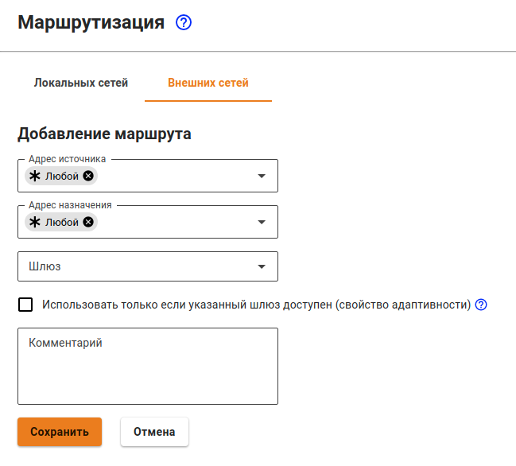
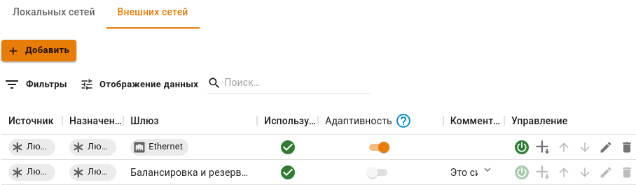
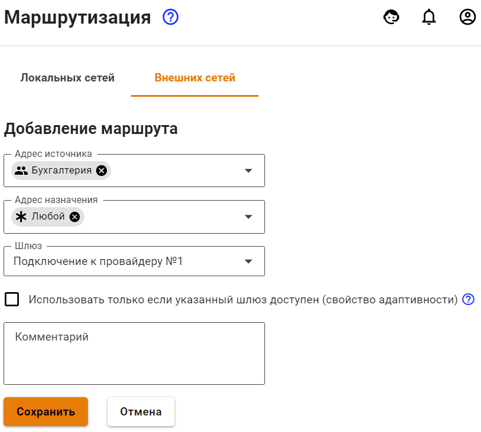
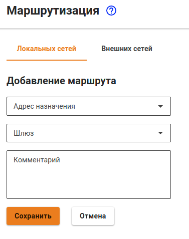

# Маршрутизация

Имеет ряд преимуществ по сравнению с некоторыми другими традиционными системами маршрутизации. Среди них:

* Возможность указывать сеть источника прямо в маршруте.
* Функция адаптивности \(в случае недоступности шлюза или интерфейса, поиск маршрута продолжится по следующим правилам маршрутизации\).

В веб-интерфейсе Ideco UTM есть возможность маршрутизировать локальные и внешние сети. Создавать и редактировать маршруты можно через веб-интерфейс Ideco UTM в разделе **Сервисы -&gt; Маршрутизация**.

## Маршрутизация внешних сетей

Для добавления нового маршрута перейдите на вкладку маршрутизации **Внешних сетей** нажмите кнопку **Добавить**. На странице откроется форма создания маршрута:

Опишем назначение каждой опции:

* **Источник** - выберите объекты, для которых будет применяться данное правило. Возможные типы объектов: группы, пользователи, IP-адрес, домен, диапазон IP-адресов, подсеть, список адресов.
* **Назначение** - выберите объекты, при обращении к которым будет применяться данное правило. Возможные типы объектов: группы, пользователи, IP-адрес, домен, диапазон IP-адресов, подсеть, список адресов.
* **Шлюз** - выберите объект, через который будет направлен трафик. Возможные типы объектов: сетевые интерфейсы, IP-адреса.
* **Использовать только если шлюз доступен \(адаптивность\)** - если это свойство включено, то в случае недоступности шлюза или интерфейса, поиск маршрута продолжится по следующим правилам маршрутизации, а если свойство отключено \(по умолчанию\), то трафик отправляется в выбранный шлюз или интерфейс. Если шлюз недоступен или интерфейс не работает, то такой трафик будет отброшен \(destination unreachable\).
* **Комментарий** - необязательное поля для описания маршрута. Значение не должно быть длиннее 128 символов.

После сохранения маршрута страница выглядит так:

Описание элементов управления маршрутами в таблице:

| Элемент управление | Описание |
| :---: | :--- |
|  | Позволяет выключать и включать маршруты |
|  | Позволяет повысить приоритет правила в таблице |
|  | Позволяет понизить приоритет правила в таблице |
|  | Позволяет отредактировать правило |
|  | Позволяет удалить правило |

В таблице есть статус **Используется**. У него есть два состояния:

| Состояние | Описание |
| :---: | :--- |
|  | Маршрут активен, и трафик попадающий под условия маршрута будет перенаправлен в указанный Шлюз |
|  | Маршрут не активен, и трафик попадающий под условия маршрута не будет данным правилом |


Трафик, не попавший под условия правил маршрутизации, или с объектом **Любой** в качестве шлюза, будет отправлен в [Балансировку и резервирование](https://github.com/ideco-team/docsUTM/tree/c6fdc8e9437797db7478b8404ef059e57173d3af/Настройка/Подключение-к-провайдеру/Одновременное-подключение-к-нескольким-провайдерам/README.md).


### Примеры популярных маршрутов:


При маршрутизации трафика через подключения к провайдеру важно понимать, что чаще всего одного маршрута недостаточно, понадобится также переопределить адрес с помощью SNAT, иначе такой маршрут просто не будет работать. SNAT можно настроить с помощью файрвола.


**Задача:** любой трафик в подсеть `150.1.0.0/16` направлять на шлюз `67.12.8.9`: 

**Задача:** весь трафик пользователей из группы **Бухгалтерия** направить через шлюз выбранного сетевого интерфейса:


Если вы настраиваете маршрут в удаленную сеть, доступную через дополнительный роутер, расположенный в той же локальной сети, что и клиенты, то убедитесь, что вы избежали "ассиметричной маршрутизации" и вынесли роутер в DMZ. 


## Маршрутизация локальных сетей

Маршрутизация локальных сетей действует внутри локальной сети и при добавлении маршрута не имеет поле **Адрес источника**. Для добавления нового маршрута перейдите на вкладку маршрутизации **Локальных сетей** и нажмите кнопку **Добавить**.

На странице откроется форма создания маршрута:

* **Адрес назначения** - выберите объекты, при обращении к которым будет применяться данное правило. Возможные типы объектов: IP-адрес, подсеть.
* **Шлюз** – выберите объект, через который будет направлен трафик. Возможные типы объектов: сетевые интерфейсы, IP-адреса.
* **Комментарий** - необязательное поля для описания маршрута. Значение не должно быть длиннее 128 символов.

