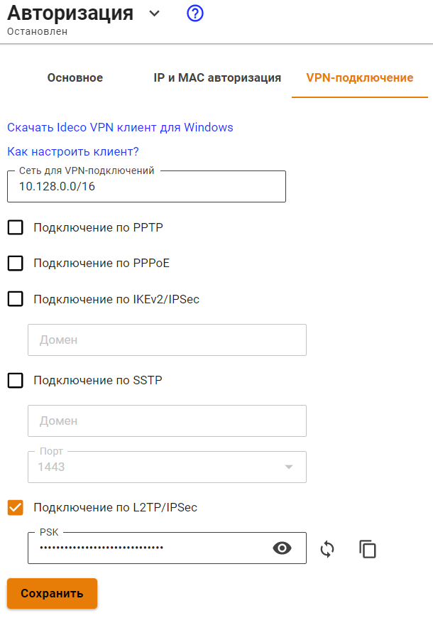
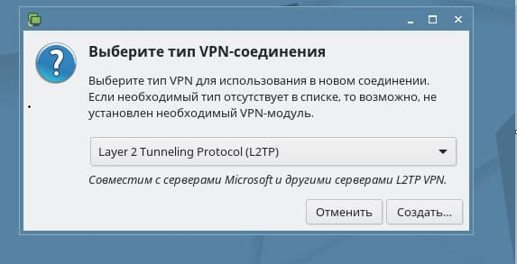
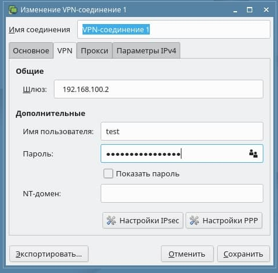
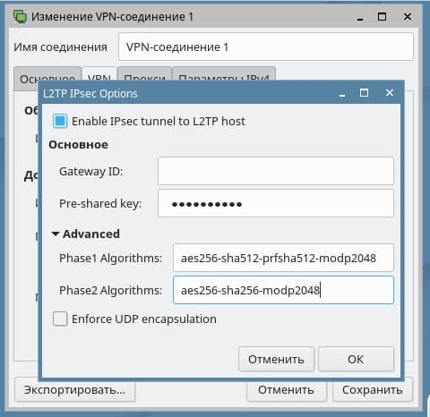
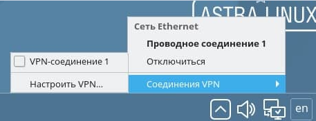

# Инструкция по созданию подключения в Astra Linux


Перед настройкой VPN-подключения, в дереве пользователей в карточке нужных пользователей и установите флаг **Разрешить удаленный доступ через VPN**. Для этого перейдите в раздел **Пользователи -&gt; Учетные записи**.


## Протокол PPTP

## Протокол PPPoE
## Протокол L2TP/IPSec

Перед созданием подключения в Astra Linux, настройте Ideco UTM:

1\. Перейдите в раздел **Пользователи -&gt; Авторизация -&gt; VPN-подключение**.

2\. Установите флаг **Подключение по L2TP/IPSec** и скопируйте **PSK**-ключ:

**Создание подключения в Astra Linux**

1\. Откройте терминал сочетанием клавиш Ctrl+Alt+F1 и выполните две команды:

    sudo apt update
    sudo apt install network-manager-l2tp network-manager-l2tp-gnome

2\. В трее в настройках сети выберите **Соединение VPN -> Добавить VPN-соединение**:

3\. Выберите тип соединения **Layer 2 Tunneling Protocol (L2TP)** и нажмите **Создать**:

4\. В разделе **VPN** заполните поля:

* **Шлюз** - IP-адрес внешнего интерфейса Ideco UTM или домен
* **Имя пользователя** - например *test*
* **Пароль** 
  

5\. Нажмите **Настройки IPSec**.

6\. Заполните поля:

* **Pre-shared key** -  PSK-ключ из настроек Ideco UTM
* **Phase1** - алгоритм aes256-sha512-prfsha512-modp2048 
* **Phase2** - алгоритмы aes256-sha256-modp2048 

Так как Astra Linux по умолчанию запрашивает не самые защищенные алгоритмы, то рекомендуем заполнить их самостоятельно.

7\. Нажмите **OК**, затем **Сохранить**.

Далее в трее в настройках сети **Соединение VPN** появится VPN-подключение. Для активации установите галку **VPN-соединение**:

## Протокол SSTP

## Протокол L2TP/IPSec