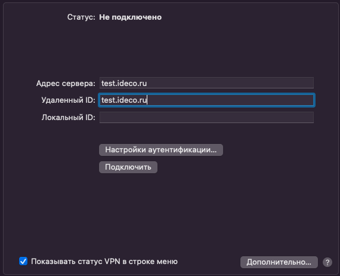
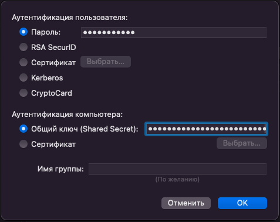

# Инструкция по созданию подключения в Mac OS

## Протокол PPPoE

Для настройки Ideco UTM перейдите в раздел **Пользователи -&gt; Авторизация -&gt; VPN-подключение** и установите флаг **Подключение по PPPoE**:

**Создание подключения в Mac OS**

1\. Перейдите в раздел **Системные настройки -&gt; Сеть**;

2\. Нажмите **Добавить** в левом нижнем углу (иконка );

3\. В появившемся окне заполните:

* **Интерфейс** - PPPoE;
* **Ethernet** - Например Wi-Fi;
* **Имя службы** - имя подключения.

4\. Нажмите **Создать** и заполните:

*  **Имя службы PPPoE** - имя службы;
*  **Имя учетной записи** - логин;
*  **Пароль** - пароль (пароль от УЗ пользователя?)

5\. Нажмите **Подключить**.

## Протокол IKEv2/IPSec

Настройте Ideco UTM:

1\. Перейдите в раздел **Пользователи -&gt; Авторизация -&gt; VPN-подключение**.

2\. Установите флаг **Подключение по IKEv2/IPSec** и заполните поля **Домен**:

**Создание подключения в Mac OS**

1\. Перейдите в раздел **Системные настройки -&gt; Сеть**:

2\. Нажмите **Добавить** в левом нижнем углу (иконка );

3\. В появившемся окне заполните поля:

* **Интерфейс** - VPN;
* **Тип VPN** - IKEv2;
* **Имя службы** - имя подключения.

4\. Нажмите **Создать**;

5\. Установите параметры подключения:

* **Адрес сервера** - адрес VPN-сервера;
* **Удаленный ID** - продублируйте адрес VPN-сервера.

6\. Выберите **Настройки аутентификации**;

7\. Укажите идентификационные данные и нажать **OK**:

* **Имя пользователя** - имя пользователя, которому разрешено подключение по VPN;
* **Пароль** - пароль пользователя.

8\. Нажмите **ОК**;

9\. Поставьте флаг в пункте **Показывать статус VPN в строке меню** и нажмите **Применить**.
## Протокол L2TP/IPSec

Перед созданием подключения, настройте Ideco UTM:

1\. Перейдите в раздел **Пользователи -&gt; Авторизация -&gt; VPN-подключение**.

2\. Установите флаг **Подключение по L2TP/IPSec** и скопируйте **PSK**-ключ:

**Создание подключения в Mac OS**

1\. Перейдите в раздел **Системные настройки -&gt; Сеть**:

2\. Нажмите **Добавить** в левом нижнем углу (иконка );

3\. В появившемся окне заполните:

* **Интерфейс** - VPN;
* **Тип VPN** - L2TP через IPSec;
* **Имя службы** - имя подключения.

4\. Нажмите **Создать**;

5\. Заполните **Адрес сервера** и **Имя учетной записи**:

6\. Поставьте флаг на пункте **Показывать статус VPN в строке меню** и выберите **Настройки аутентификации**.

7\. В **Аутентификации пользователя** заполните **Пароль** и в **Аутентификации компьютера** **Общий ключ (Shared Secret)**

8\. Нажмите **ОК -&gt; Применить**.

Включите VPN-соединение:

* В левой верхней части экрана нажмите значок VPN-соединения ( )
* Выберите *Подключить (имя службы, заданное в пункте 3)*:

    
