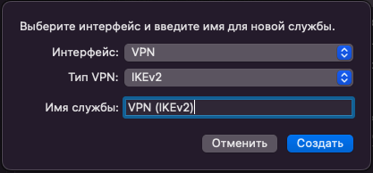

# Инструкция по созданию подключения в Mac OS

## Протокол PPTP

Перед созданием подключения в Mac OS перейдите в Ideco UTM, в раздел **Пользователи -&gt; Авторизация -&gt; VPN-подключение** и установите флаг **Подключение по PPTP**:

**Создание подключения в Mac OS**

1\. Перейдите в раздел **Системные настройки -&gt; Сеть**:

2\. Нажмите **Добавить** в левом нижнем углу (иконка );

3\. В появившемся окне заполните:

* **Интерфейс** - VPN;
* **Тип VPN** - PPTP;
* **Имя службы** - имя подключения;
* **Кодирование** - Максимум (только 128 бит).

4\. Нажмите **Настройки аутентификации**;

5\. Введите **Пароль** и нажмите **OK**:

6\. Выберите **Дополнительно -&gt; Параметры** и установите флаг в строке **Отправлять весь трафик через VPN**:

7\. Нажмите **OK -&gt; Подключить**.

## Протокол PPPoE

## Протокол L2TP/IPSec

Перед созданием подключения, настройте Ideco UTM:

1\. Перейдите в раздел **Пользователи -&gt; Авторизация -&gt; VPN-подключение**.

2\. Установите флаг **Подключение по L2TP/IPSec** и скопируйте **PSK**-ключ:

**Создание подключения в Mac OS**

1\. Перейдите в раздел **Системные настройки -&gt; Сеть**:

2\. Нажмите **Добавить** в левом нижнем углу (иконка );

3\. В появившемся окне заполните:

* **Интерфейс** - VPN;
* **Тип VPN** - L2TP через IPSec;
* **Имя службы** - имя подключения.

4\. Нажмите **Создать**;

5\. Заполните **Адрес сервера** и **Имя учетной записи**:

6\. Поставьте флаг на пункте **Показывать статус VPN в строке меню** и выберите **Настройки аутентификации**.

7\. В **Аутентификации пользователя** заполните **Пароль** и в **Аутентификации компьютера** **Общий ключ (Shared Secret)**

8\. Нажмите **ОК -&gt; Применить**.

Включите VPN-соединение:

* В левой верхней части экрана нажмите значок VPN-соединения ( )
* Выберите *Подключить (имя службы, заданное в пункте 3)*:

    

## Протокол SSTP
