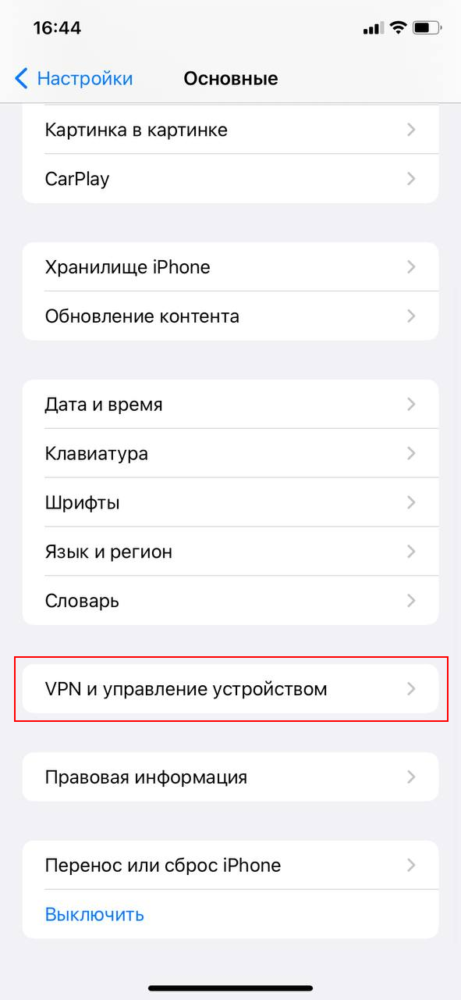

# Инструкция по созданию VPN-подключения на мобильных устройствах


Перед настройкой VPN-подключения, в дереве пользователей в карточке нужных пользователей и установите флаг **Разрешить удаленный доступ через VPN**. Для этого перейдите в раздел **Пользователи -&gt; Учетные записи**:



Подключение через приложение StrongSwan

1\. Нажмите **Добавить VPN профиль**:

2\. Заполните поля:

* Сервер - домен, указанный в Ideco UTM в разделе **Пользователи -&gt; Авторизация -&gt; VPN-подключение -&gt; Подключение по IKEv2/IPSec**;
* VPN тип - IKEv2 EAP (Логин/Пароль);
* Логин - имя пользователя, которому разрешено подключение по VPN;
* Пароль - пароль пользователя.

3\. Нажмите **Сохранить** и кликните по созданному подключению:

Подключение на Android

1\. Перейдите в **VPN** в раздел **Настройки -&gt; Подключения -&gt; Другие настройки**. При необходимости воспользуйтесь строкой поиска по настройкам.

2\. Выберите тип подключения и заполните следующие поля:

**Для PPTP:**

* Имя - имя подключения;
* Адрес сервера - адрес VPN-сервера;
* Имя пользователя - имя пользователя, которому разрешено подключение по VPN;
* Пароль - пароль пользователя.

**Для IKEv2/IPSec MSCHAPv2:**

* Имя - имя подключения;
* Адрес сервера - адрес VPN-сервера;
* Идентификатор IPSec - продублируйте **Адрес сервера**;
* Сертификат сервера - Принято от сервера;
* Сертификат ЦС IPSec - Не проверять сервер;
* Имя пользователя - имя пользователя, которому разрешено подключение по VPN;
* Пароль - пароль пользователя.

**Для L2TP/IPSec PSK:**

* Имя - имя подключения;
* Адрес сервера - адрес VPN-сервера;
* Общий ключ IPSec - значение строки **PSK** в разделе **Пользователи -&gt; Авторизация -&gt; VPN-подключение -&gt; Подключение по L2TP/IPSec**

4\. Нажмите **Сохранить** и активируйте подключение.

Подключение на iOS

1\. Перейдите в раздел **Настройки -&gt; Основные -&gt; VPN**:

2\. Нажмите **Добавить конфигурацию VPN**:

3\. Выберите **Тип** подключения и заполните соответствующие поля:

**Для PPTP:**

Начиная с версии iOS 10 компания Apple убрала поддержку протокола PPTP. 

* Описание - название соединения;
* Сервер -  адрес VPN-сервера;
* Учетная запись - имя пользователя, которому разрешено подключение по VPN;
* Пароль - пароль пользователя.

**Для L2TP:**

* Описание - название соединения;
* Сервер -  адрес VPN-сервера;
* Учетная запись - имя пользователя, которому разрешено подключение по VPN;
* Пароль - пароль пользователя;
* Общий ключ - значение строки **PSK** в разделе **Пользователи -&gt; Авторизация -&gt; VPN-подключение -&gt; Подключение по L2TP/IPSec**.

**Для IKEv2:**

* Описание - название соединения;
* Сервер -  адрес VPN-сервера;
* Удаленный ID - адрес VPN-сервера;
* Имя пользователя - имя пользователя, которому разрешено подключение по VPN;
* Пароль - пароль пользователя;

4\. Нажмите **Готово**;

5\. Для подключения перевести переключатель **Статус** вправо:

