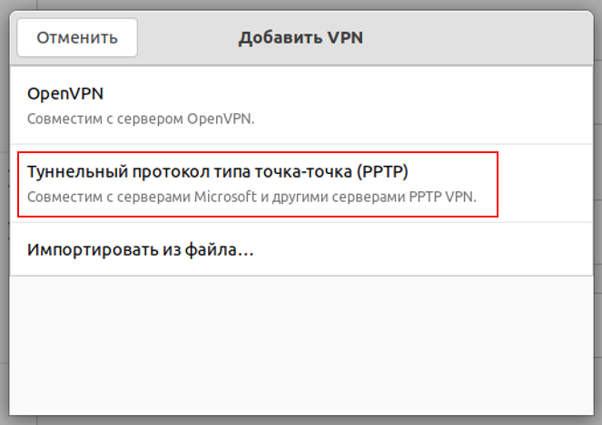
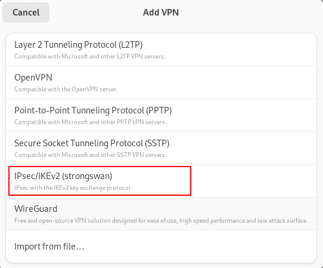
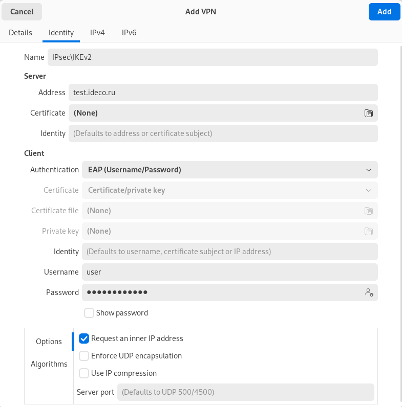
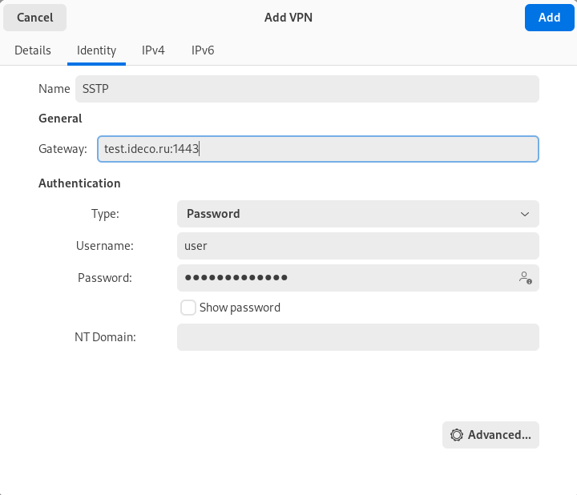
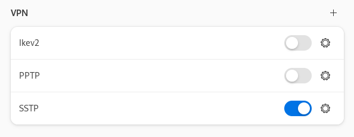

# Инструкция по созданию подключения в Ubuntu

## Протокол PPTP

Перед созданием подключения в Ubuntu перейдите в Ideco UTM, в раздел **Пользователи -&gt; Авторизация -&gt; VPN-авторизация** и установите флаг **Авторизация PPTP**:

**Создание подключения в Ubuntu**

1\. Перейдите **Настройки -> Сети** и в строке **VPN** нажмите :

2\. В окне создания подключений выберите пункт **Туннельный протокол типа точка-точка (PPTP)**:

3\. В разделе **Идентификация** и заполните следующие поля:

* **Название** - имя подключения
* **Шлюз** - доменное имя или IP-адрес внутреннего интерфейса UTM
* **Имя пользователя** - имя пользователя, которому разрешена авторизация по VPN
* **Пароль** - пароль пользователя. В правой части поля необходимо выбрать вариант хранения для пароля от VPN-соединения
* **NT-домен** - оставьте поле пустым

Рекомендуем нажать **Дополнительно** и установить флаги на пунктах:

* **Разрешить следующие методы аутентификации** - установите флаг на пункте *MSCHAPv2*
* **Использовать шифрование MPPE** - в строке *Шифрование* выберите 128-бит (наиболее защищенное)
* **Использовать для данных сжатие BSD** - использование алгоритма BSD-compress
* **Использовать для данных сжатие Deflate** - использование алгоритма Deflate
* **Использовать сжатие заголовков TCP** - использование метода сжатия заголовков TCP/IP Вана Якобсона

4\. Нажмите **ОК** и **Добавить**.

5\. Поставить переключатель созданного VPN-подключения в положение включен:

## Протокол IKEv2/IPSec

Перед созданием подключения в Ubuntu, настройте Ideco UTM:

1\. Перейдите в раздел **Пользователи -&gt; Авторизация -&gt; VPN-авторизация**.

2\. Установите флаг **Авторизация IKEv2/IPSec** и заполните поля **Домен** и **Маршруты**:

**Создание подключения в Ubuntu**

1\. Откройте терминал сочетанием клавиш Ctrl+Alt+F1 и выполните команду:

    sudo apt install -y network-manager-strongswan libcharon-extra-plugins libstrongswan-extra-plugins

2\. После окончания установки перезагрузите компьютер:

    sudo reboot

3\. Перейдите в **Настройки -> Сети** и в строке **VPN** нажмите 

4\. В появившемся окне выберите **IPSec\IKEv2 (strongswan)**:

5\. В разделе **Идентификация** и заполните следующие поля:

* **Название** - имя подключения
* **Address** - введите домен, который указан в настройках **Пользователи -&gt; Авторизация -&gt; VPN-авторизация -&gt; Авторизация IKEv2/IPSec**

 Установите флаг **Request an inner IP address** и нажмите **Добавить:**

6\. Поставьте переключатель созданного VPN-подключения в положение включен.

## Протокол SSTP

Перед созданием подключения в Ubuntu, настройте Ideco UTM:

1\. Перейдите в раздел **Пользователи -&gt; Авторизация -&gt; VPN-авторизация**.

2\. Установите флаг **Авторизация SSTP** и заполните поля **Домен** и **Порт**:

**Создание подключения в Ubuntu**

1\. Откройте терминал сочетанием клавиш Ctrl+Alt+F1 и выполните две команды:

    sudo apt-add -repository ppa:eivnaes/network-manager-sstp
    sudo apt install -y network-manager-sstp sstp-client 

2\. После окончания установки перезагрузите компьютер:

    sudo reboot
    
3\. После окончания установки пакетов, перейдите в **Настройки -> Сети** и в строке **VPN** нажмите :

4\. В появившемся окне выберите **Туннельный протокол типа точка-точка (SSTP)**:

5\. В разделе **Идентификация** и заполните следующие поля:

* **Название** - имя подключения
* **Шлюз** - доменное имя или IP-адрес внутреннего интерфейса UTM
* **Имя пользователя** - имя пользователя, которому разрешена авторизация по VPN
* **Пароль** - пароль пользователя. В правой части поля необходимо выбрать вариант хранения для пароля от VPN-соединения
* **NT-домен** - оставьте поле пустым

Рекомендуем нажать **Advanced** и установить флаги на пунктах:

* **Разрешить следующие методы аутентификации** - установите флаг на пункте *MSCHAPv2*
* **Использовать шифрование MPPE** - в строке *Шифрование* выберите 128-бит (наиболее защищенное)
* **Использовать для данных сжатие BSD** - использование алгоритма BSD-compress
* **Использовать для данных сжатие Deflate** - использование алгоритма Deflate
* **Использовать сжатие заголовков TCP** - использование метода сжатия заголовков TCP/IP Вана Якобсона

6\. Нажмите **Добавить** и поставьте переключатель созданного VPN-подключения в положение включен:

## Протокол L2TP/IPSec
Перед созданием подключения в Astra Linux, настройте Ideco UTM:

1\. Перейдите в раздел **Пользователи -&gt; Авторизация -&gt; VPN-авторизация**.

2\. Установите флаг **Авторизация L2TP/IPSec** и скопируйте **PSK**-ключ:

Для настройки VPN-подключения выполните следующие действия: 

1\. Подключите репозиторий, в котором находятся необходимые пакеты для создания L2TP VPN-соединения, а затем обновите информацию о репозиториях. Для этого выполните следующие команды:

    sudo add-apt-repository ppa:nm-l2tp/network-manager-l2tp
    sudo apt update

2\. Установите дополнение к стандартному NetworkManager с помощью двух пакетов:

    sudo apt install -y network-manager-l2tp network-manager-l2tp-gnome

3\. После окончания установки перезагрузите компьютер:

    sudo reboot

4\. После окончания установки пакетов, перейдите в **Настройки -> Сети** и в строке **VPN** нажмите :

5\. В окне создания подключений по VPN выберите пункт **Layer 2 Tunneling Protocol (L2TP)**:

6\. Во вкладке **Идентификация** и заполните следующие поля:

* **Название** - имя подключения
* **Шлюз** - доменное имя или IP-адрес внутреннего интерфейса UTM
* **Тип** - Password-аутентификация по пользователю и паролю
* **Имя пользователя** - имя пользователя, которому разрешена авторизация по VPN
* **Пароль** - пароль пользователя. В правой части поля необходимо выбрать вариант хранения для пароля от VPN-соединения
* **NT-домен** - оставьте поле пустым

7\. Перейдите в **Настройки IPSec** и включите опцию **Enable IPsec tunnel to L2TP host**, чтобы активировалась возможность настраивать остальные параметры:

* **Type: Pre-shared key (PSK)** – аутентификация по общему ключу
* **Pre-shared key** - ключ, который необходимо скопировать по пути **Пользователи -> Авторизация -> VPN-авторизация** из поля **PSK**

Раздел **Advanced** необязательный для заполнения. Значения параметров: 

* **Remote ID** - доменное имя UTM 
* **Phase1 Algorithms** - дополнительные параметры, используемые при формировании первой фазы (IKE) (по умолчанию используется Main Mode) 
* **Phase2 Algorithms** - дополнительные параметры, используемые при формировании второй фазы (ESP) (по умолчанию используется Quick Mode) 
* **Phase1 Lifetime** - время до пересоздания IKE SA, можно оставить по умолчанию
* **Phase2 Lifetime** - время до пересоздания IPsec SA, можно оставить по умолчанию
* Enforce UDP encapsulation: принудительно использовать UDP инкапсуляцию, может помочь, когда фаервол блокирует ESP трафик.
* **Use IP compression** - сжатие необработанных пакетов перед их шифрованием
* **Use IKEv2 key exchange** - использование IKEv2, можно не использовать
* **Use PFS** выключение алгоритма perfect forward secrecy

После окончания настройки **L2TP IPsec Options** нажмите **ОК**.

8\. Перейдите в **Настройки РРР** и настройте раздел **Аутентификация**, **Шифрование и сжатие** и **Прочие**:

**Аутентификация**

* **CHAP** - аутентификация с проверкой подлинности с использованием косвенных сведений о пользователе, выполняется через трехстороннее рукопожатие
* **MSCHAP** - аутентификация с проверкой подлинности без передачи пароля клиента, использующий механизм «вызов-ответ», выполняется через трехстороннее рукопожатие
* **MSCHAPv2** - улучшенная версия MSCHAP, предоставляет возможность клиенту менять пароль (по истечению срока пароля), для приема и передачи данных используются разные ключи шифрования
* **EAP** - используется для выбора метода аутентификации, передачи ключей и обработки этих ключей подключаемыми модулями (методами EAP)

**Шифрование и сжатие**

* **Использовать шифрование MPPE** - используется для шифрования данных в подключениях на базе PPP или в VPN подключениях по PPTP
* **Использовать для данных сжатие BSD** - использование алгоритма BSD-compress
* **Использовать для данных сжатие Deflate** - использование алгоритма Deflate
* **Использовать сжатие заголовков TCP** - использование метода сжатия заголовков TCP/IP Вана Якобсона
* **Использовать protocol field compression negotiation** - использовать сжатие на поле «Протокол»
* **Использовать сжатие Address/Control** - использовать сжатие полей «Адрес/Управление»

**Прочие**

* **Посылать эхо-пакеты РРР** - использовать LCP-эхо запросы
* **Multilink PPP MRRU** - максимальный размер принимаемых пакетов на многоканальной связке
* **MTU** - размер максимального блока передачи данных, можно оставить по умолчанию
* **MRU** - размер максимального блока получения данных, можно оставить по умолчанию

9\. После настройки **Параметры РРР** нажмите **ОК** и **Применить**.

10\. Поставить переключатель созданного VPN-подключения в положение включен:

