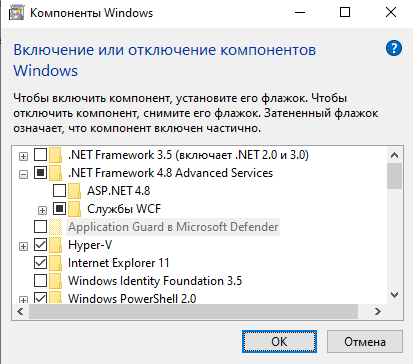
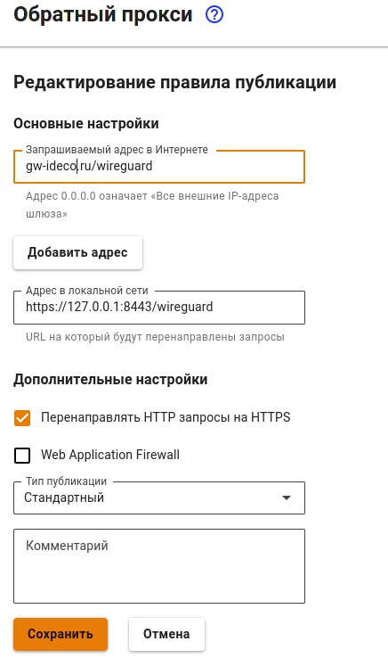
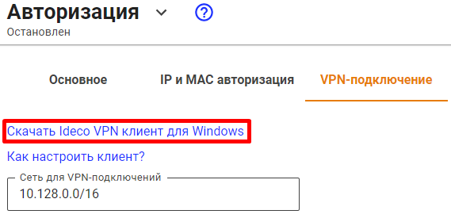
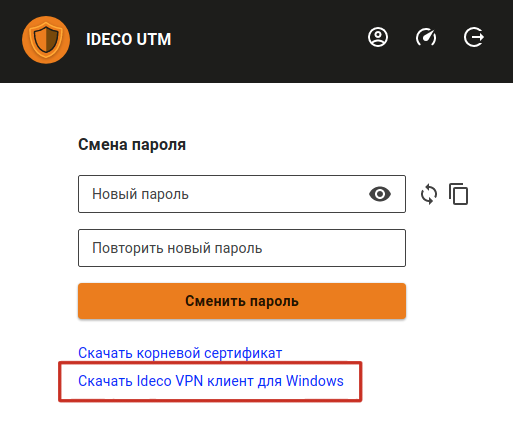
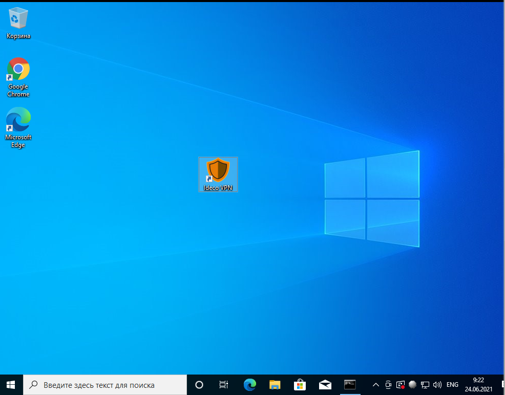
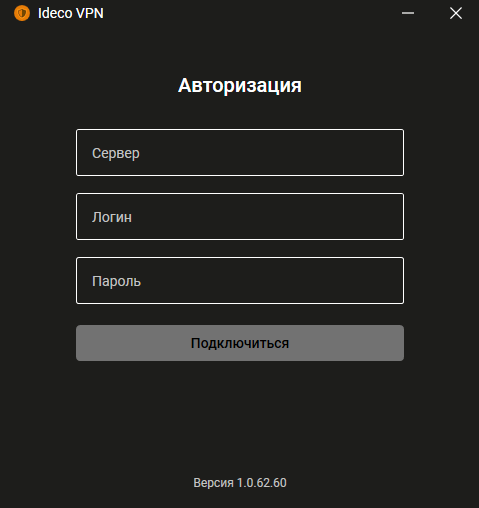
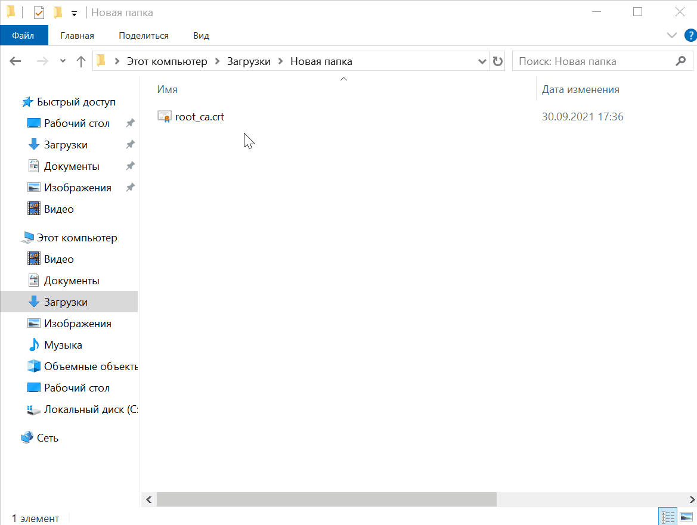
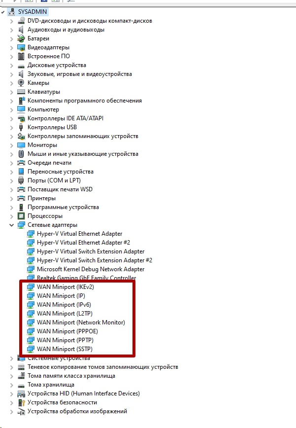
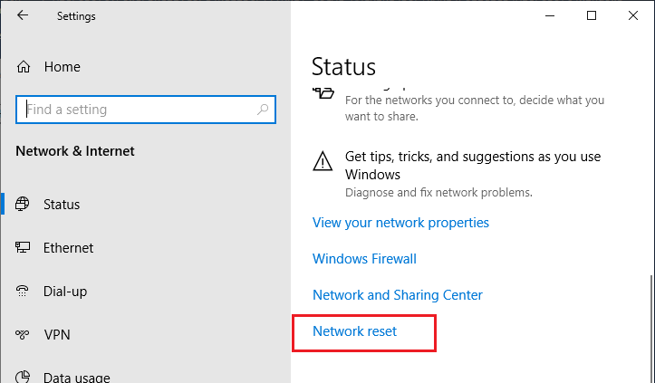

# Ideco VPN-клиент

Настройка VPN-подключения к Ideco UTM включает в себя следующие действия:

1\. Убедитесь, что на вашей ОС Windows установлена версия .NET Framework версии 4.8. В ином случае программа Ideco VPN может запросить установить более новую версию .NET. Для этого перейдите в **Панель управления -> Установка и удаление программ -> Включение и отключение компонентов Windows**.

2\. Настроить правило [обратного прокси](../../reverse-proxy.md) в веб-интерфейсе Ideco UTM.

3\. В поле **Запрашиваемый адрес в Интернете** введите домен сервера Ideco UTM в формате: `домен/wireguard`.

4\. В поле **Адрес в локальной сети** укажите URL `https://127.0.0.1:8443/wireguard`.

Пример правила представлен на скриншоте ниже:

5\. Скачать и установить программу Ideco VPN.


Установить программу Ideco VPN можно только на ОС семейства Windows начиная с 8 версии и новее.


Скачать Ideco VPN агент можно несколькими способами:

* В веб-интерфейсе Ideco UTM перейдите в раздел **Пользователи -> Авторизация -> VPN-подключение** и перейдите по ссылке **Скачать Ideco VPN клиент для Windows**.

* В личном кабинете пользователя перейдите по ссылке **Скачать Ideco VPN клиент для Windows**.

После скачивания установите и запустите программу двойным нажатием левой кнопкой мыши на иконку программы.

Откроется окно, в котором вам необходимо заполнить поля **Сервер**, **Логин** и **Пароль**.

* В поле **Сервер** введите доменное имя вашего сервера или IP-адрес сервера.
* В полях **Логин** и **Пароль** введите данные от учетной записи, авторизованной на Ideco UTM.

Если вы хотите подключиться к серверу по IP-адресу, а не по доменному имени сервера, сначала установите[ корневой сертификат](../../certificates/) в хранилище сертификатов локального компьютера, иначе при попытке соединения появится ошибка **"Не удалось получить последнюю версию"**.\
Добавление сертификата в хранилище сертификатов локального компьютера представлено ниже:

При успешном подключении появится окно с информацией о соединении (название сервера и время сессии).

## Возможные ошибки при подключении

Если при подключении с ОС Windows 10 к VPN серверу Ideco возникает ошибка (например, сервер не отвечает). А попытки подключения по протоколам PPTP, L2TP, IKEv2 не помогают решить проблему, то, возможно, возникла ошибка службы RASMAN (Remote Access Connections Manager) для Always on VPN.\
Эта проблема признана Microsoft и по последним данным исправлена в обновлении для Windows 10 1903 — KB4522355 ([https://support.microsoft.com/en-us/help/4522355/windows-10-update-kb4522355](https://support.microsoft.com/en-us/help/4522355/windows-10-update-kb4522355)). Вы можете скачать и установить данное обновление вручную или через Windows Update/WSUS.\
Если обновление не помогло, переустановите виртуальные адаптеры **WAN miniports** в диспетчере устройств. Для этого выполните следующие действия:

1\. Запустите **Диспетчер устройств** (devmgmt.msc).

2\. Разверните секцию **Сетевые адаптеры (Network Adapters).**

3\. Последовательно щелкните правой кнопкой по следующим адаптерам и удалите их (**Uninstall device**): **WAN Miniport (IP)**, **WAN Miniport(IPv6)** и **WAN Miniport (PPTP)**.

4\. После удаления выберите в меню **Действие -> Сканировать на предмет изменений оборудования** **(Action -> Scan for Hardware changes)** и дождитесь, пока Windows не обнаружит и не установит драйвера для этих виртуальных устройств.

5\. После этого сбросьте сетевые настройки Windows 10: **Настройки -> Сеть и Интернет -> Сброс сети -> Сбросить сейчас (Settings -> Network & Internet -> Network Reset -> Reset now).**

