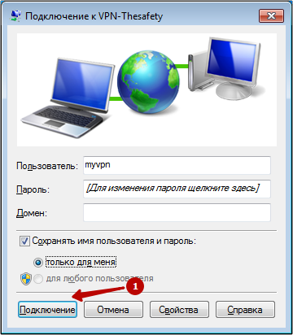

# Инструкция по созданию подключения в Windows 7

Вам потребуется доменное имя вашего сервера (можно получить у системного администратора) и учетные данные пользователя (логин/пароль).

1\. Откройте «Центр управления сетями и общим доступом».

 (2) (2) (2) (2) (2) (2) (2) (2) (2) (2) (2).png>)

2\. Выберите «Настройка нового подключения или сети».

 (2) (2) (2) (2) (2) (2) (2) (3) (3) (2) (2).png>)

3\. Выберите «Подключение к рабочему месту».

4\. Выберите «Использовать мое подключение к Интернету (VPN)».

 (2) (2) (2) (2) (2) (2) (2) (3) (3) (3) (2).png>)

5\. Введите доменное имя сервера в качестве адреса подключений. Имя местоназначения может быть произвольным.

 (2) (2) (2) (2) (2) (1).png>)

6\. Введите ваш логин и пароль.

 (2) (2) (2) (2) (2) (2) (2) (3) (3) (3) (3) (1).png>)

7\. Нажмите **Закрыть**.

 (2) (2) (2) (2) (2) (2) (2) (2) (2) (2) (2).png>)

8\. Выберите «Подключение к IKEv2 VPN серверу» в Windows 7.

9\. Выберите «Свойства».

 (2) (2) (2) (2) (2) (2) (2) (2) (2) (2) (2).png>)

10\. Выберите протокол IKEv2 и обязательное шифрование.

11\. Подключитесь к IKEv2 VPN серверу в Windows 7.

