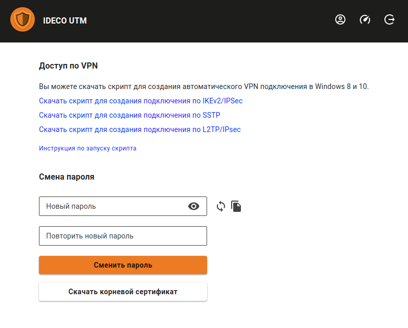
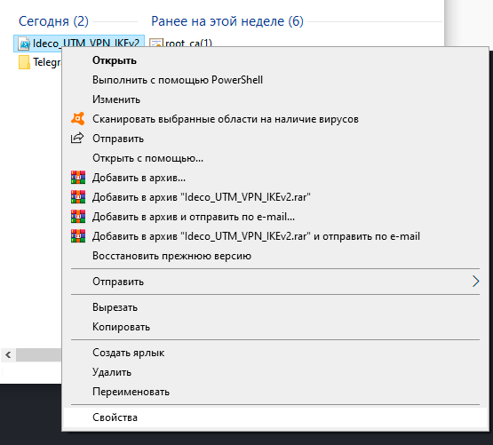

# Инструкция по запуску PowerShell скриптов

Если вы используете Windows 7, необходимо создать подключение вручную\(cм. статью [Инструкция по созданию подключения в Windows 7](new-connection-windows-7.md)\).

## Какой протокол VPN выбрать?

При нескольких вариантах возможных подключений по VPN выбирайте протоколы по следующим критериям: 

1. **KEv2/IPSec** - самый лучший в плане производительности и надежности подключения протокол. 
2. **SSTP** - протокол основанный на TCP и SSL. Выберите его, если подключение по IKEv2 не проходит через вашего провайдера. 
3. **L2TP/IPSec** - надежный в плане шифрования, но не самый оптимальный в плане скорости и производительности протокол. 
4. **PPTP** - устаревший протокол, используйте его только в случае крайней необходимости и не работоспособности других протоколов на вашей ОС.

## Как запустить PowerShell скрипт?

1. Скачайте скрипт, кликнув по ссылке на него в личном кабинете.

2. Щелкните правой кнопкой мыши по скаченному файлу и в контекстном меню выберите **Свойства**.

3. Поставьте галочку **Разблокировать** справа в нижнем углу свойств файла \(по умолчанию ОС блокирует выполнение скаченных из интернета файлов\).

4. Снова нажмите правой кнопкой мыши на файл и выберите **Выполнить в PowerShell** в контекстном меню.

При появлении ошибки «Выполнение сценариев отключено в этой системе», нужно включить выполнение сценариев, выполнив команду в PowerShell \(вызовите его через меню «Пуск»\): `Set-ExecutionPolicy Unrestricted`.

5. Ответьте **Да** на вопрос о внесении изменений в ваш компьютер.

6. Подключение создано. Нажмите **Подключиться** в списке ваших сетей.

## Что делать, если запустить скрипт не получается?

Возможно вам не хватает прав на запуск скриптов или PowerShell не установлен в системе.

Воспользуйтесь инструкцией для создания подключения в Windows 8-ой и 10-ой версии в статье [IPSec IKEv2](ipsec-ikev2.md).

