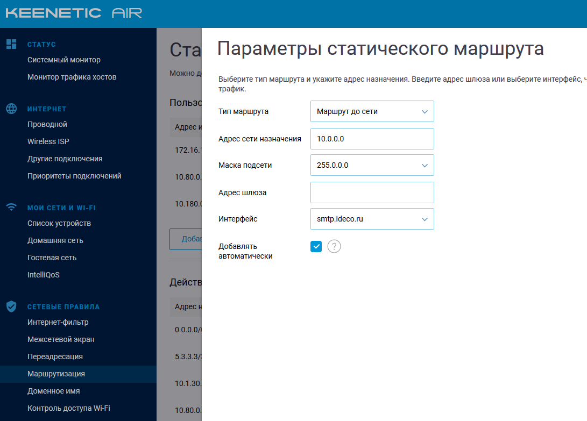

# Подключение по SSTP Wi-Fi роутеров Keenetic

Поддерживаются все роутеры на базе KeeneticOS 3.х.х.

1\. Выполните настройку пользователей в Ideco UTM и включите SSTP в разделе **Пользователи -> Авторизация -> VPN-авторизация**.

2\. Зайдите в веб-интерфейс управления Keenetic: `http://my.keenetic.net`.

3\. Установите компонент системы **Клиент SSTP** на странице **Общие настройки** в разделе **Обновления и компоненты**, нажмите **Изменить набор компонентов**.

 (2) (2) (2) (2) (2) (2) (3) (3) (3).png>)

Подробнее о настройках в [документации Keenetic](https://help.keenetic.com/hc/ru/articles/360000599979-%D0%9A%D0%BB%D0%B8%D0%B5%D0%BD%D1%82-SSTP).

4\. Создайте подключение в разделе **Интернет -> Другие подключения** нажмите кнопку **Добавить подключение**

Не устанавливайте флажок **Использовать для выхода в Интернет**.

Введите имя подключения, протокол SSTP, адрес сервера (**обязательно укажите в адресе порт через двоеточие**), имя пользователя и пароль.

5\. В разделе **Сетевые правила -> Маршруты** добавьте маршруты в вашу рабочую сеть. Например, если сеть офиса `10.0.0.0/8`, добавьте следующий маршрут:

Выберите в качестве **Интерфейса** созданное вами VPN-подключение и установите флажок **Добавлять автоматически**, чтобы маршрут действовал только при активном VPN-подключении.

6\. Настройте DNS для вашего локального домена (например Active Directory), чтобы вы могли обращаться к ресурсам (файловым и иным серверам) по DNS-именам.

В разделе **Сетевые правила -> Интернет-фильтр -> Серверы DNS** укажите DNS-сервер вашего контроллера домена и имя домена.

Настройка закончена.

7\. Используйте утилиту ping в командной строке для проверки связи и маршрутизации.

`nslookup` - для проверки резолвинга локальных имен рабочей сети.

В случае, если VPN работает, но до некоторых ресурсов (например файловых или RDP) нет связи, воспользуйтесь инструкцией для диагностики проблем.
