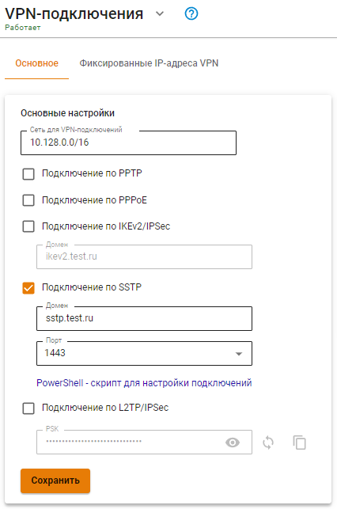

# SSTP


По возможности не используйте этот тип подключения. Этот способ подключения лучше других проходит через NAT, но при нестабильном качестве связи работает значительно [хуже](https://en.wikipedia.org/wiki/Secure\_Socket\_Tunneling\_Protocol) чем другие VPN (особенно при передаче звука/видео), так как инкапсулирует все данные внутри TCP. Рекомендуется использовать IPSec-IKEv2 вместо SSTP.

UTM не поддерживает подключение Mikrotik по SSTP, так как Mikrotik использует устаревший и небезопасный алгоритм SHA-1.

Инструкции по настройке VPN-подключений на разных ОС: [Windows](connection-for-windows.md), [Ubuntu](connection-for-ubuntu.md), [Mac OS](connection-for-high-sierra-macos.md) и на [мобильных устройствах](connection-for-mobile-devices.md).


## Настройка Ideco UTM

1\. Для включения авторизации по SSTP установите флажок **Авторизация SSTP** в веб-интерфейсе в разделе **Пользователи -> Авторизация -> VPN-подключение**.

2\. Подключение возможно только по DNS-имени, поэтому IP-адрес внешнего интерфейса Ideco UTM должен резолвится в одно из имен вашей внешней доменной зоны. В поле **Домен** необходимо указать данное DNS-имя (используйте реальное имя с правильной А-записью, т.к. оно необходимо для выписки сертификата Let’s Encrypt).

3\. **Порт** - выберите предлагаемый порт (из вариантов: 1443, 2443, 3443, 4443).



4\. У пользователей, которым необходимо подключаться извне по VPN установите флажок **Разрешить удалённый доступ через VPN** в дереве пользователей. Указанный логин и пароль будут использоваться для подключения.


## Скрипт автоматического создания пользовательских подключений по SSTP

Вы можете запустить следующий скрипт PowerShell для автоматического создания подключения на компьютерах пользователей с Windows 8.1 и 10. Для этого скачайте готовый скрипт из раздела **Пользователи -> Авторизация -> VPN-подключение**.

**Подключение будет создано со следующими параметрами:**

1. Протокол **SSTP** с использованием PSK-ключа.
2.  Параметр **Использовать основной шлюз в удаленной сети** выключен.

    Доступ к локальным сетям того же класса, что были получены для VPN-подключения по умолчанию в Windows 7 и 10 будет осуществляться через VPN-подключение, поэтому дополнительных маршрутов создавать не нужно (если вы не используете разные классы сетей в локальной сети офиса).

Создайте текстовый файл с именем **ideco_utm_sstp.ps1** (в Блокноте или редакторе Windows PowerShell ISE) и скопируйте туда следующий текст:

```
### Ideco UTM SSTP connection ###
param([switch]$Elevated)
$currentUser = New-Object Security.Principal.WindowsPrincipal $([Security.Principal.WindowsIdentity]::GetCurrent())
if (!$currentUser.IsInRole([Security.Principal.WindowsBuiltinRole]::Administrator))  {
  if (!$elevated) {
    Start-Process `
            powershell.exe `
            -Verb RunAs `
            -ArgumentList ('-noprofile -noexit -file "{0}" -elevated' -f ( $myinvocation.MyCommand.Definition ))
  }
  exit
}
Enable-NetFirewallRule -Group "@FirewallAPI.dll,-28502"
Add-VpnConnection `
    -Force `
    -Name "Ideco UTM SSTP VPN" `
    -TunnelType SSTP `
    -ServerAddress my.domain.com:4443 `
    -EncryptionLevel "Required" `
    -AuthenticationMethod MSChapV2 `
    -SplitTunneling $False `
    -DnsSuffix activedirectory.domain `
    -RememberCredential
```

**Поменяйте в нем необходимые параметры на соответствующие вашим настройкам:**

1. **Ideco UTM SSTP VPN** - имя подключения в системе (может быть произвольным).
2. **my.domain. com:4443** - домен внешнего интерфейса Ideco UTM и порт, на котором вы включили SSTP.
3. **activedirectory.domain** - ваш домен Active Directory (если домена нет, нужно удалить эту строчку из скрипта).

**Запустить скрипт на компьютере пользователя можно из контекстного меню файла «Выполнить с помощью PowerShell». Нажмите «Ок» в диалоге повышения прав (они требуются для разрешения доступа к общим файлам и принтерам).**

После этого подключение в системе будет создано, а также включен общий доступ к файлам и принтерам для всех сетей (иначе доступ к файловым ресурсам в локальной сети может быть невозможен).

Пользователю при первой авторизации необходимо ввести свой логин/пароль.

## Возможные ошибки при выполнении скрипта

При ошибке «Выполнение сценариев отключено в этой системе», нужно включить выполнение сценарием, выполнив команду в PowerShell: `Set-ExecutionPolicy Unrestricted`.

## Если VPN-соединение установлено, но не получается получить доступ к ресурсам локальной сети

Выполните рекомендации статьи [Особенности маршрутизации и организации доступа](features.md).
