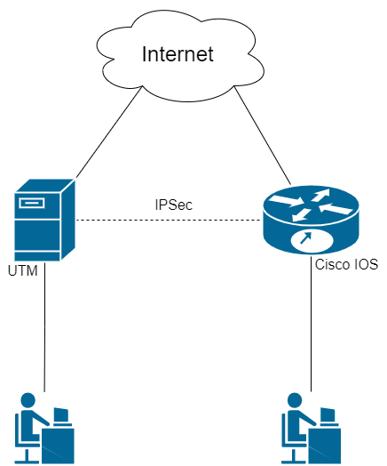

# Исходящее подключение Ideco UTM к Cisco IOS по IPSec

Рассмотрим настройку подключения по схеме, представленной на рисунке ниже:



## 

## Шаг 1. Первоначальная настройка Ideco UTM 

Настройте UTM в режиме роутера \(наличие локального и [внешнего](../../../connection-to-provider/ethernet-connection.md) интерфейсов\).

## Шаг 2. Первоначальная настройка Cisco IOS EX

1. Настройка локального интерфейса:

```text
enable
conf t
interface GigabitEthernet2
ip address 10.80.211.100 255.255.255.0
no shutdown
ip nat inside
exit
```

2. Настройка внешнего интерфейса:

```text
interface GigabitEthernet1
ip address 172.16.200.100 255.255.255.0
no shutdown
ip nat outside
exit
```

3. **Проверьте наличие связи между внешними интерфейсами Ideco UTM и Cisco**.

4. Создание access-list с адресацией локальной сети:

```text
ip access-list extended NAT
permit ip 10.80.211.0 0.0.0.255 any
exit
```

4. Настройка NAT:

```text
ip nat inside source list NAT interface GigabitEthernet1 overload
exit
```

5. Сохранение настроек конфигурации:

```text
write memory
```

6. **После сохранения настроек проверьте, что из локальной сети Cisco присутствует доступ в сеть Интернет**.

## Шаг 3. Настройка IKEv2+IPSec на Cisco

1. Создание proposal \(подробную информацию по настройке данного пункта вы можете прочитать в [статье ](https://www.cisco.com/c/en/us/td/docs/ios-xml/ios/sec_conn_ike2vpn/configuration/xe-16-8/sec-flex-vpn-xe-16-8-book/sec-cfg-ikev2-flex.html#GUID-6F6D8166-508A-4669-9DDC-4FE7AE9B9939__GUID-A5DB59F5-70A0-421E-86AE-AE983B283E6F)на официальном сайте Cisco\):

```text
conf t
crypto ikev2 proposal ikev2proposal 
encryption aes-cbc-256
integrity sha256
group 19
exit
```

2. Создание policy \(подробную информацию по настройке данного пункта вы можете прочитать в [статье ](https://www.cisco.com/c/en/us/td/docs/ios-xml/ios/sec_conn_ike2vpn/configuration/xe-16-8/sec-flex-vpn-xe-16-8-book/sec-cfg-ikev2-flex.html#GUID-B5C198FE-97D9-4F74-88C6-6B5802195772__GUID-613A19C3-C5D6-456A-8D8A-4693F3553ED3)на официальном сайте Cisco\):

```text
crypto ikev2 policy ikev2policy 
match fvrf any
proposal ikev2proposal
exit
```

3. Создание peer \(key\_id - идентификатор удаленной стороны, т.е. Ideco UTM\). Подробную информацию по настройке данного пункта вы можете прочитать в [статье ](https://www.cisco.com/c/en/us/td/docs/ios-xml/ios/sec_conn_ike2vpn/configuration/xe-16-8/sec-flex-vpn-xe-16-8-book/sec-cfg-ikev2-flex.html#GUID-D6AC9B42-1F22-4F60-A06A-A72575181659__GUID-A1CB9A0A-6098-475C-99BE-5D41009CD9A9)на официальном сайте Cisco.

```text
crypto ikev2 keyring key
peer strongswan
address {внешний IP UTM-a}
identity key-id {key_id}
pre-shared-key local {psk}
pre-shared-key remote {psk}
exit
exit
```

4. Создание IKEv2 profile \(подробную информацию по настройке данного пункта вы можете прочитать в [статье ](https://www.cisco.com/c/en/us/td/docs/ios-xml/ios/sec_conn_ike2vpn/configuration/xe-16-8/sec-flex-vpn-xe-16-8-book/sec-cfg-ikev2-flex.html#task_20288C58E8B1416897A763FABA8B0885__GUID-B31A2B1F-E07A-4DA9-8CEA-45D92E283D14)на официальном сайте Cisco\):

```text
crypto ikev2 profile ikev2profile
match identity remote address {внешний IP UTM-a} 255.255.255.255 
authentication remote pre-share
authentication local pre-share
keyring local key 
exit
```

5. Настройка шифрования в esp:

```text
crypto ipsec transform-set TS esp-gcm 256 
mode tunnel
exit
```

6. Создание ipsec-isakmp:

```text
crypto map cmap 10 ipsec-isakmp 
set peer {внешний IP UTM-a}
set transform-set TS 
set ikev2-profile ikev2profile
match address cryptoacl
exit
```

7. Настройка crypto map на внешнем интерфейсе:

```text
interface GigabitEthernet1
crypto map cmap
exit
```

8. Создание access-list для трафика между локальными сетями Cisco и UTM:

```text
ip access-list extended cryptoacl
permit ip 10.80.211.0 0.0.0.255 192.168.211.0 0.0.0.255
exit
```

9. Добавление в access-list NAT исключения трафика между локальными сетями Cisco и UTM \(правило `deny` должно оказаться выше чем `permit`\):

```text
ip access-list extended NAT 
no permit ip 10.80.211.0 0.0.0.255 any
deny ip 10.80.211.0 0.0.0.255 192.168.211.0 0.0.0.255
permit ip 10.80.211.0 0.0.0.255 any
exit

end
```

10. Сохранение настроек конфигурации:

```text
write memory
```

## Шаг 4. Создание исходящего IPSec подключения на Ideco UTM

1. В веб-интерфейсе Ideco UTM откройте вкладку **Сервисы -&gt; IPsec -&gt; Устройства**.
2. Добавьте новое подключение:
   * **Название** – любое;
   * **Тип** – исходящее;
   * **Тип аутентификации** – PSK;
   * **PSK** – укажите PSK-ключ, который будет использоваться для подключения \(см. Шаг 3 пункт 3\);
   * **Идентификатор ключа** – любой \(см. Шаг 3 пункт 3\);
   * **Домашние локальные сети** – укажите локальную сеть Ideco UTM;
   * **Удалённые локальные сети** – укажите локальную сеть Cisco.
3. Проверьте, что подключение установилось. 
4. Проверьте наличие трафика между локальными сетями \(TCP и web\).

## Итоговая конфигурация Cisco IOS

Итоговая конфигурация IKEv2 IPSec на Cisco IOS должна выглядеть следующим образом:

```text
crypto ikev2 proposal ikev2proposal 
 encryption aes-cbc-256
 integrity sha256
 group 19

crypto ikev2 policy ikev2policy 
 match fvrf any
 proposal ikev2proposal

crypto ikev2 keyring key
 peer strongswan
  address 5.5.5.5
  pre-shared-key local QWEqwe1234567890
  pre-shared-key remote QWEqwe1234567890

crypto ikev2 profile ikev2profile
 match identity remote key-id key-id
 authentication remote pre-share
 authentication local pre-share
 keyring local key

crypto ipsec transform-set TS esp-gcm 256 
 mode tunnel

crypto map cmap 10 ipsec-isakmp 
 set peer 5.5.5.5
 set transform-set TS 
 set ikev2-profile ikev2profile
 match address cryptoacl

interface GigabitEthernet1
! внешний интерфейс
 ip address 1.1.1.1 255.255.255.0
 ip nat outside
 negotiation auto
 no mop enabled
 no mop sysid
 crypto map cmap

interface GigabitEthernet2
! локальный интерфейс
 ip address 2.2.2.2 255.255.255.0
 ip nat inside
 negotiation auto
 no mop enabled
 no mop sysid

ip nat inside source list NAT interface GigabitEthernet1 overload

ip access-list extended NAT
 deny   ip 2.2.2.0 0.0.0.255 3.3.3.0 0.0.0.255
 permit ip 2.2.2.0 0.0.0.255 any
ip access-list extended cryptoacl
 permit ip 2.2.2.0 0.0.0.255 3.3.3.0 0.0.0.255
```

