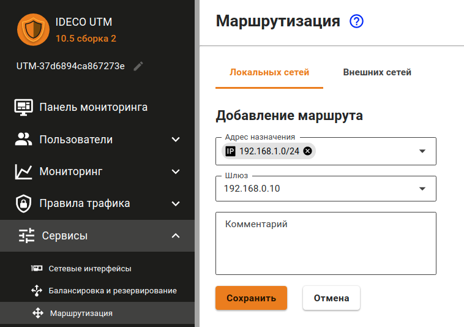
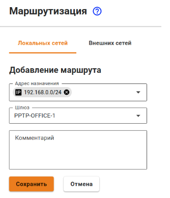

# PPTP VPN


По возможности используйте более надежный и безопасный протокол для подключения филиалов - IPsec. Подробности по настройке в статье [Подключение устройств](ipsec/connecting-devices.md).

Для связи Ideco UTM с Ideco UTM также используйте IPSec (см. статью [Филиалы и главный офис](ipsec/branch-office-and-main-office.md)).


**Процесс настройки состоит из двух этапов:**

* Подготовка сервера и конфигурирование локальных сетей.
* Создание VPN-туннелей и настройка маршрутизации.

## Подготовка сервера и конфигурирование локальных сетей

Для объединения локальных сетей офисов вам необходимо обеспечить в них уникальность пространства IP-адресов. В каждом офисе должна быть своя уникальная сеть. Иначе, при создании VPN-туннеля вы можете столкнуться с некорректной работой маршрутизации.

Рассмотрим пример объединения сетей двух офисов. Настройте вашу сеть и шлюз безопасности Ideco UTM в соответствии с данными таблицы ниже:

| Параметр                | Офис №1 (Ideco UTM)                                                                            | Офис №2 (Роутер)                                                                               |
| ----------------------- | ---------------------------------------------------------------------------------------------- | ---------------------------------------------------------------------------------------------- |
| Пространство IP-адресов | 
<strong>IP-адрес:</strong> 192.168.0.0

<strong>Маска сети:</strong> 255.255.255.0
 | 
<strong>IP-адрес</strong>: 192.168.1.0

<strong>Маска сети</strong>: 255.255.255.0
 |
| Локальный IP-адрес      | 
<strong>IP-адрес</strong>: 192.168.0.1

<strong>Маска сети</strong>: 255.255.255.0
 | 
<strong>IP-адрес</strong>: 192.168.1.1

<strong>Маска сети</strong>: 255.255.255.0
 |

## Создание VPN-туннелей и настройка маршрутизации

### Настройка интернет-шлюза Ideco UTM в офисе №1

1\. Создайте учетную запись пользователя, например «office2», от имени которой сервер Ideco UTM в офисе №2 будет осуществлять подключение к серверу Ideco UTM в офисе №1.

2\. Разрешите созданной учетной записи **Удаленный доступ через VPN**. Данный параметр можно активировать в разделе **Пользователи -> Учетные записи -> Основное**, выбрав нужного пользователя.

3\. Создайте фиксированную привязку выдаваемого по VPN IP-адреса для данного пользователя (нужна для работы маршрутов). Для этого перейдите в раздел **Пользователи -> Авторизация -> Фиксированные IP-адреса VPN**.

4\. Добавьте маршруты в таблицу маршрутизации. Для этого перейдите в раздел **Сервисы -> Маршрутизация** -**> Локальных сетей** и нажмите кнопку добавления. Нам необходимо добавить следующий маршрут:

* **Назначение:** `192.168.1.0/255.255.255.0`;
* **Шлюз:** `10.128.0.10`.

### Настройка роутера в офисе №2

В примере настройки приводятся для Ideco UTM, выступающего в качестве роутера. Как правило, роутеры различных производителей настраиваются аналогично.

Необходимо создать VPN-подключение к удаленному серверу и прописать маршрут до удаленной сети через VPN-подключение. Выполните для этого следующие действия:

* Создайте новый интерфейс типа **Ethernet + PPTP**. В качестве **VPN-сервера** укажите внешний IP-адрес или доменное имя офиса №1, а в качестве логина и пароля используйте данные учетной записи, которая была создана на сервере в офисе №1 (в нашем примере – office2).
*   Добавьте маршруты в таблицу маршрутизации. Для этого в веб-интерфейсе перейдите в раздел **Сервисы -> Маршрутизация** и нажмите кнопку добавления. Укажите необходимые значения и нажмите кнопку **Сохранить**. Нам необходимо добавить следующий маршрут:

    **Назначение:** `192.168.0.0/24`;

    **Шлюз:** Выберите Ethernet + PPTP интерфейс, который вы создали.

