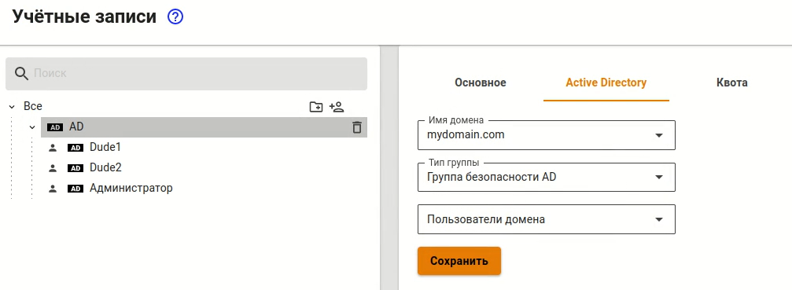
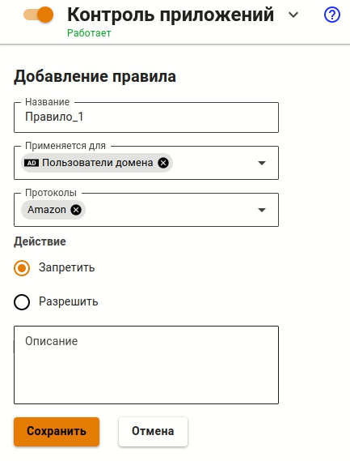

# Интеграция с Active Directory


Название службы раздела **Active Directory**: `ideco-ad-backend`; `ideco-ad-log-collector@<имя домена>`. \
Список служб для других разделов доступен по [ссылке](../../server-management/terminal.md).


Импортируются учетные записи и номера телефонов, исключая пароли. При прохождении пользователем процедуры аутентификации, проверка осуществляется средствами Active Directory.


Поддерживается интеграция с Windows Server 2008 (только R2), 2012, 2016, 2019, 2022.

Для подключения к Active Directory откройте порт 464 до контроллера домена.

При выходе из домена удаляются все пользователи и группы, импортированные из него.



Приостанавливается синхронизация с AD, если локальные пользователи Ideco UTM находятся в группах AD. \
Для возобновления синхронизации вынесите локальных пользователей из групп AD. Автоматическая синхронизация произойдет через 15 минут.


## Особенности использования интеграции с несколькими доменами Active Directory

При интеграции Ideco UTM с несколькими доменами имеются следующие ограничения:

* Из дерева доменов Active Directory в Ideco UTM импортируются данные только того контроллера домена, к которому подключился Ideco UTM;
* При Single Sign-On авторизации при первом открытии браузера, пользователю будет предложен выбор домена для аутентификации. Выбор будет сохранен с помощью cookie и будет использован при следующей авторизации. Если вы хотите изменить домен - очистите cookie (для локального IP-адреса Ideco UTM).

## Использование импортированных учетных записей в качестве объектов правил фильтрации

Импортированные из Active Directory группы безопасности и учетные записи можно использовать в качестве объектов правил фильтрации в следующий разделах:

* [Файрвол](../../access-rules/firewall.md);
* [Контроль приложений](../../access-rules/application-control.md);
* [Ограничение скорости](../../access-rules/shaper.md);
* [Контент-фильтр](../../access-rules/content-filter/).

Пример использования:

1\. Импортируйте из Active Directory учетные записи или/и группы безопасности в разделе **Пользователи -> Учетные записи** (подробнее в статье [Импорт пользователей](user-import.md)). В этом примере импортируется группа безопасности AD **Пользователи домена**:

2\. Перейдите в раздел, в котором требуется использовать импортированную из Active Directory группу или учетную запись. Например, в _Контроль приложений_:

3\. Заполните требуемые поля и нажмите **Сохранить**.
