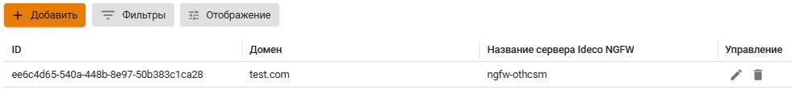


Приостанавливается синхронизация с контроллером домена, если локальные пользователи Ideco UTM находятся в группах AD. \
Для возобновления синхронизации вынесите локальных пользователей из групп AD. Автоматическая синхронизация произойдет через 15 минут.


# Настройка авторизации пользователей

Для пользователей, имортированных из Aсtive Directory, доступны все типы авторизации.


Рекомендуется одновременно использовать оба типа авторизации.


Для пользователей, импортированных из Samba, доступны **все типы авторизации**, кроме **авторизации через журнал безопасности**.


Если на контроллере домена отключить пользователя, который уже импортирован, то после включения ему присвоится новый ID и ранее настроенные правила фильтрации перестанут работать.


# Настройка Ideco UTM

Для включения **SSO аутентификации** и **Авторизации через журнал безопасности Active Directory** перейдите на вкладку **Пользователи -> Авторизация -> Основное** и включите эти типы авторизации. Нажмите кнопку **Сохранить**.


После заполнения поля **Доменное имя Ideco UTM** и сохранения настроек будет выдан Let’s Encrypt сертификат, и пользователь будет перенаправляться на окно авторизации, минуя страницу исключения безопасности:

Если сертификат для такого домена уже загружен в разделе [Сертификаты](../../services/certificates/README.md), то будет использоваться загруженный сертификат, новый сертификат выдаваться не будет.


# Настройка сервера Microsoft Active Directory

**Авторизация через журнал безопасности Active Directory:**


При аутентификации через журнал безопасности контроллера домена AD пользователи будут аутентифицированы при попытке выхода в Интернет. Автоматической аутентификации без прохождения трафика через UTM не происходит, т.к. используется конкурентная политика аутентификации.


Для работы авторизации через журнал безопасности выполните настройку на основном контроллере домена:

1. В настройках брандмауэра Windows на всех контроллерах домена (или доменов) разрешите **удаленное управление журналом событий (Remote Event Log Management)**:

2. Добавьте Ideco UTM в группу безопасности **Читатели журнала событий (Event Log Readers)**:

3. Перезапустите службу **Авторизация через журнал безопасности Active Directory** на Ideco UTM. Отключите эту настройку и заново включите;

При изменении стандартной политики безопасности контроллеров домена выполните действия:

**Англоязычная версия:**

**Русскоязычная версия:**


Для обновления политик контроллеров доменов выполните `gpupdate /force`;\
Если авторизация пользователей при логине не происходит, нужно проверить в журнале безопасности наличие событий 4768, 4769, 4624.


# Настройка клиентских машин для веб-аутентификации (SSO или NTLM)

Для работы аутентификации через веб-браузер (с использованием Kerberos или NTLM) настройте Internet Explorer (остальные браузеры подхватят его настройки). \
В системе Windows 10 параметры прокси нужно настроить без Internet Explorer, в разделе **Параметры -> Сеть и интернет -> Прокси-сервер**.


Обязательно используйте эти настройки, т.к в некоторых случаях будет необходима аутентификация пользователей через браузер (даже при авторизации через журнал безопасности).


Для настройки аутентификации через веб-браузер, выполните следующие действия:

1. Зайдите в свойства браузера на вкладку **Безопасность**.
2. Выберите **Местная интрасеть -> Сайты -> Дополнительно**.
3. Добавьте в открывшемся окне ссылку на Ideco UTM под тем именем, под которым ввели его в домен. Нужно указывать два URL: c `http://` и с `https://`.

Пример введения Ideco UTM в домен `example.ru` под именем `idecoics`.

Для применения настройки ко всем пользователям на клиентской машине выполните действия:

1.  Перейдите по пути:

Англоязычная версия

**Edit group policy -> Computer Configuration -> Administrative Templates -> Windows Components -> Internet Explorer ->  Internet Control Panel -> Security Page -> Site to Zone Assignment List** 

Русскоязычная версия

**Изменение локальной групповой политики -> Политика "Локальный компьютер" -> Административные шаблоны -> Компоненты Windows -> Internet Explorer -> Панель управления браузером -> Вкладка безопасность -> Список назначений зоны для веб-сайтов**

2. Введите назначение зоны для DNS-имени Ideco UTM (в примере idecoics.example.ru) со значением равным 1 (интрасеть). Укажите два назначения для схем работы по http и https.


При входе на HTTPS-сайт необходимо разрешить браузеру доверять сертификату Ideco UTM. Чтобы не делать это каждый раз, можно добавить корневой сертификат Ideco UTM в доверенные корневые сертификаты устройства.


На странице настроек браузера **Mozilla Firefox** (about:config в адресной строке) настройте следующие параметры:

* **network.automatic-ntlm-auth.trusted-uris** и **network.negotiate-auth.trusted-uris** добавьте адрес локального интерфейса Ideco UTM (например `idecoUTM.example.ru`);
* **security.enterprise\_roots.enabled** в значении `true` позволит Firefox доверять системным сертификатом и авторизовать пользователей при переходе на HTTPS-сайты.

Способы аутентификации импортированных пользователей:

* **Через Ideco Agent** - подходит для аутентификации пользователей терминальных серверов (с использованием Remote Desktop IP Virtualization на терминальном сервере);
* **Авторизация по IP-адресу** - подходит для пользователей с фиксированным IP-адресом. IP-адреса на UTM необходимо прописать вручную каждому пользователю;
* **Авторизация по VPN** - подходит для аутентификации пользователей удаленных сетей.

## Настройка аутентификации пользователей при прямых подключениях к прокси-серверу

Настройка прозрачной аутентификации пользователей при прямых подключениях к прокси-серверу аналогична настройке прозрачной **SSO** аутентификации.\
Единственная особенность - указание в качестве адреса прокси-сервера **DNS-имени Ideco UTM**.


При прямых подключениях к прокси **не указывайте** в качестве шлюза IP-адрес Ideco UTM.


Настройка браузера Mozilla Firefox для аутентификации по NTLM при прямом подключении к прокси-северу

Для аутентификации компьютеров, которые **не находятся в домене**, под доменным пользовательским аккаунтом на странице настроек браузера **Mozilla Firefox** (about:config в адресной строке) укажите следующие параметры:

* **network.automatic-ntlm-auth.allow-proxies** = false;
* **network.negotiate-auth.allow-proxies** = false.

Не отключайте данные опции для компьютеров, входящих в домен, т.к. в таком случае будет использоваться устаревший метод авторизации по NTLM.

Возможные проблемы

Если в Internet Explorer появляется окно с текстом **Для получения доступа требуется аутентификация**, и аутентификация происходит только при ручном переходе по ссылке. Установите параметр **Активные сценарии** в Internet Explorer в значение **Включить**.

Доменному пользователю должно быть разрешено аутентифицироваться на Ideco UTM. На контроллере домена зайдите в свойства выбранных пользователей во вкладку **Учетная запись** -> **Вход на...**, выберите пункт **только на указанные компьютеры** и пропишите имя рабочей станции для входа в систему.

Пример данной настройки представлен на скриншоте ниже:

