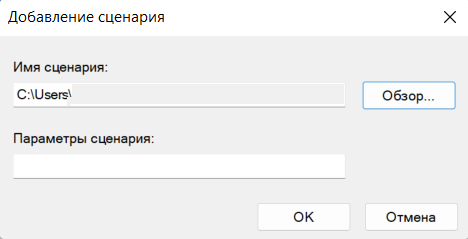

# Скрипты автоматической разавторизации 

Разавторизация пользователей возможна в полностью автоматическом режиме.

Для этого нужно настроить скрипт, исполняемый при выходе пользователей из системы [logout](https://docs.microsoft.com/en-us/previous-versions/windows/it-pro/windows-server-2008-R2-and-2008/cc753583\(v=ws.11\)?redirectedfrom=MSDN). Это можно сделать, например, с помощью групповых политик домена (GPO).


Для работы данных скрипта необходимо выполнить все настройки политик безопасности домена и браузера, описанные в статье [Авторизация пользователей](active-directory-user-authorization.md).

Для авторизации по SSO используйте [Ideco агент](../ideco-agent.md).



Приостанавливается синхронизация с AD, если локальные пользователи Ideco UTM находятся в группах AD. \
Для возобновления синхронизации вынесите локальных пользователей из групп AD. Автоматическая синхронизация произойдет через 15 минут.


## Разавторизация пользователя

Удобно применять этот скрипт, когда один компьютер используют разные пользователи для посещения ресурсов сети Интернет. Данный скрипт можно скачать из веб-интерфейса, нажав кнопку **Скачать скрипт для разавторизации**. Для этого в разделе **Пользователи -> Авторизация**, установите галку **Веб-аутентификация**:

Для работы скрипта разавторизации пользователя необходима установка сертификата сервера в качестве доверенного корневого центра сертификации на компьютеры пользователей. Можно сделать это локально или через групповые политики домена, как описано в [инструкции](../../access-rules/content-filter/filtering-https-traffic.md#dobavlenie-sertifikata-cherez-politiki-domena-microsoft-active-directory).

Также необходимо отключить предупреждение о несоответствии адреса сертификата в свойствах Internet Explorer:

Этот параметр также можно установить через GPO, изменив параметр реестра:

HKEY\_CURRENT\_USER\Software\Microsoft\Windows\CurrentVersion\Internet Settings параметр `WarnonBadCertRecving = 0`

Далее необходимо добавить скрипт, выполняемый [при выходе пользователя из системы](https://docs.microsoft.com/en-us/previous-versions/windows/it-pro/windows-server-2008-R2-and-2008/cc753583\(v=ws.11\)?redirectedfrom=MSDN):

1\. Откройте групповые политики (gpedit.msc) от имени администратора на устройстве пользователя;

2\. Перейдите в **Конфигурации пользователя**, далее в **Конфигурации Windows**:

4\. Нажмите **Сценарии (вход/выход из системы)**;

5\. Откройте **Выход из системы** и перейдите на вкладку **Сценарии PowerShell**:

6\. Нажмите **Добавить** и выберите скачанный файл **UTM_logout.ps1** нажав на кнопку **Обзор**:

7\. Обновите групповые политики, выполнив команду `gpupdate /force` в консоли.

## Возможные ошибки при выполнении скриптов

* Если в Internet Explorer появляется окно с текстом **Для получения доступа требуется аутентификация**, и авторизация происходит только при ручном переходе по ссылке на авторизацию, то переход в браузере на страницу авторизации может не произойти (он может быть ограничен настройками безопасности браузера). В таком случае, установите параметр **Активные сценарии** в Internet Explorer в значение **Включить**.

* Автоматически групповая политика обновляется не сразу после внесения изменений. Чтобы скрипты начали работать, обновите политику вручную командой `gpupdate /force` на рабочей станции.
