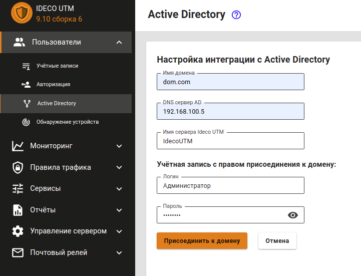
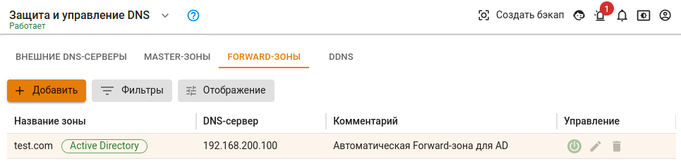

# Ввод сервера в домен

1. Перейдите на вкладку **Пользователи -&gt; Active Directory**.
2. Нажмите на кнопку **Добавить**.
3. Заполните следующие поля:
   * **Имя домена**: введите полное наименование домена \(DNS name домена т.е. имя домена, а не контроллера домена\). Максимальное количество символов - 64. Например: `mydomain.example`.
   * **DNS-сервер AD**: введите адрес сервера, обладающий ролью DNS-сервера в Active Directory \(как правило, один из контроллеров домена\), доступный с локального интерфейса Ideco UTM.
   * **Имя сервера Ideco UTM**: введите имя сервера. Оно может содержать только буквенные символы \(A-z\), цифры \(0-9\), а также не может начинаться или заканчиваться на дефис. Максимальное количество символов - 15.
   * **Логин и пароль пользователя с правом присоединения к домену**: эти данные не сохраняются на сервере и используется один раз для присоединения к домену. Пользователь может не быть администратором домена, но должен обладать правами на присоединения компьютеров к домену.

Пример настройки интеграции с AD представлен на скриншоте ниже:


Внимание: хотя бы один контроллер домена должен находиться в локальной сети Ideco UTM \(или быть доступен через локальный интерфейс с помощью настроенной маршрутизации\).


Процесс присоединения к домену после нажатия одноименной кнопки может занять некоторое время - до 1 минуты.

Возможно присоединение сервера к нескольким доменам Active Directory, с некоторыми особенностями работы, описанными в [статье](./).

## Настройка DNS для разрешения имен локального домена

В настройках DNS-сервера на Ideco UTM для корректной работы синхронизации пользователей и их авторизации, на сервере необходимо настроить разрешение имен локального домена. Для этого в настройках DNS-сервера необходимо прописать Forward-зону и DNS-серверы для нее \(как правило, основной и резервные контроллеры домена\).


В Ideco UTM Forward-зона DNS создается автоматически при вводе сервера в домен, и настраивать ее вручную нет необходимости. Создавайте ее вручную только если вы по ошибке удалили данную зону из настроек DNS-сервера или если у вас не получилось присоединить сервер к домену.


**В примере:**

* **in.mydomain.example** - имя домена Active Directory;
* **192.168.100.20** - IP-адрес контроллера домена.

При такой настройке компьютеры могут использовать Ideco UTM в качестве основного DNS-сервера. При этом разрешение локальных и интернет-имен будет работать корректно, в том числе и для всех сервисов, предоставляемых Active Directory.

