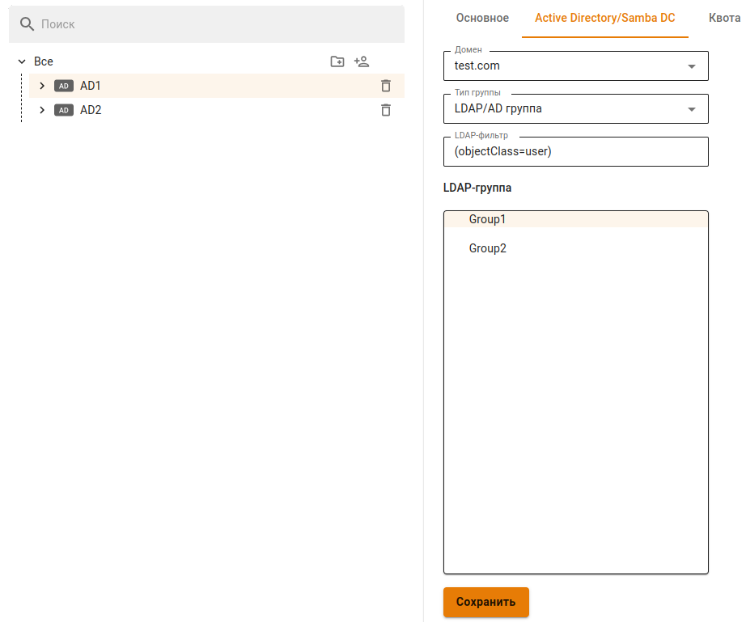
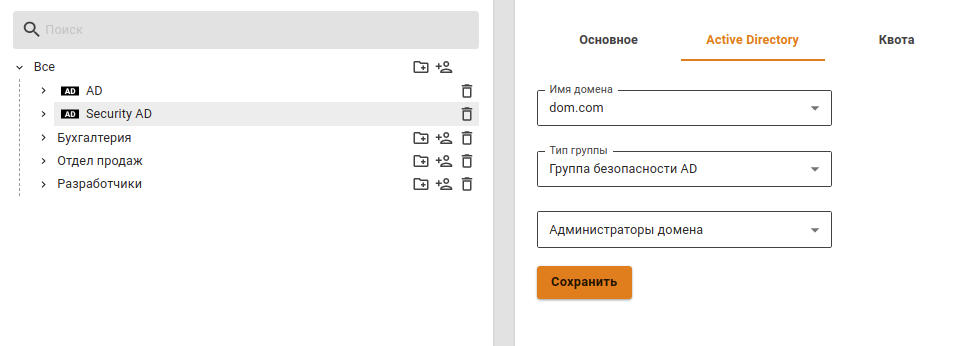
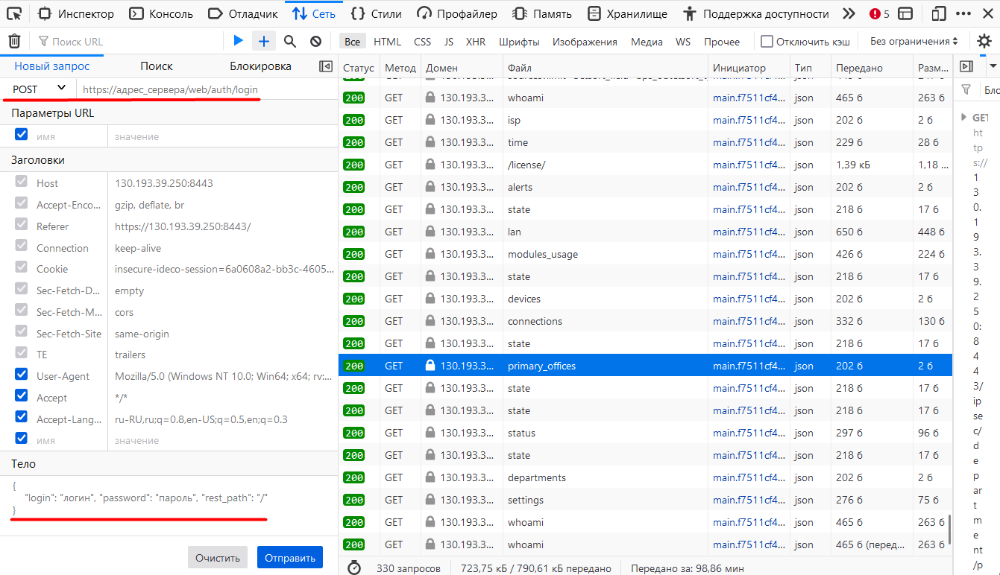
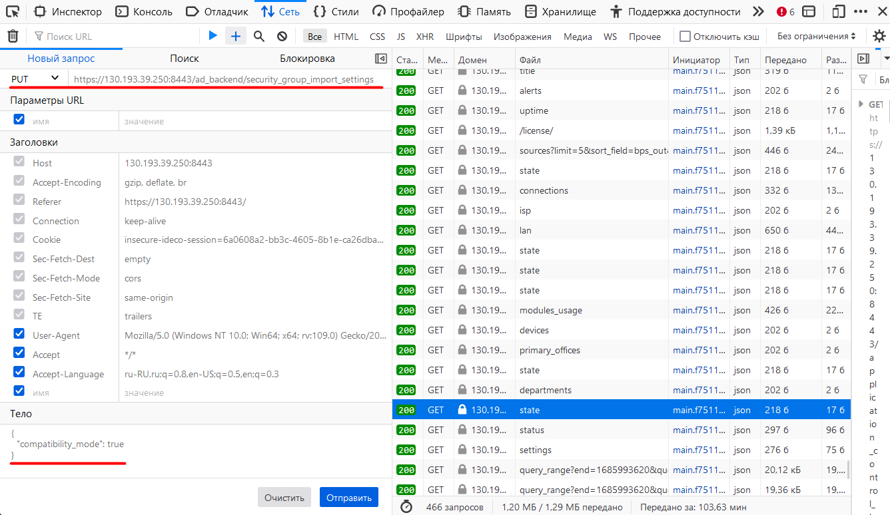

# Импорт пользователей


Приостанавливается синхронизация с контроллером домена, если локальные пользователи Ideco NGFW находятся в группах AD.\
Для возобновления синхронизации вынесите локальных пользователей из групп AD. Автоматическая синхронизация произойдет через 15 минут.


## Импорт учетных записей из LDAP

В Ideco NGFW реализована возможность импорта учетных записей из LDAP-каталога. Импорт осуществляется по протоколам LDAP/LDAPS (протокол LDAPS не требует дополнительных настроек со стороны NGFW и будет использоваться автоматически в случае использования его на контроллере домена).

Импортировать группы пользователей контроллера домена можно в специально созданные группы пользователей в Ideco NGFW. Их название может быть произвольным.

Для импорта пользователей выполните следующие действия:

1. Создайте группу в дереве пользователей Ideco NGFW. Подробнее о создании групп в статье [**Управление пользователями**](../user-tree/user-management.md#sozdanie-gruppy).
2. Выберите эту группу в дереве и перейдите на вкладку **Active Directory/Samba DC** в правой части экрана.
3. Выберите домен, из которого требуется импортировать пользователей (если Ideco NGFW является членом нескольких доменов).
4. В поле **Тип группы** выберите LDAP/AD группа.
5. При нажатии на поле **LDAP группа** откроется дерево пользователей Выберите из него необходимую группу для импорта (также можно выбрать корневую группу для импорта всего дерева).
6. Нажмите **Сохранить** (будет произведен импорт пользователей).




В дальнейшем пользователи будут автоматически синхронизироваться с контроллером домена каждые 15 минут.

При импорте пользователей также импортируются и номера телефонов для использования [двухфакторной аутентификации](broken-reference).


При необходимости можно воспользоваться фильтром запросов. Например, если в одних и тех же контейнерах находятся пользователи и компьютеры, а хотите импортировать только пользователей, то в поле **LDAP-фильтр** напишите следующий текст:

`(&(objectCategory=person)(objectClass=user))`

Можно импортировать разные группы пользователей контроллера домена в различные группы Ideco NGFW для удобства назначения на них правил файрвола, контентной фильтрации, контроля приложений, ограничения полосы пропускания и других модулей.


Не стоит импортировать подгруппы уже импортированной группы, потому что они автоматически будут импортированы вместе с основной группой.


## Импорт учетных записей из групп безопасности


Пользователь контроллера домена может быть импортирован только в одну группу Ideco NGFW. Если он находится в нескольких группах безопасности, он попадет только в одну группу, которая была импортирована самой последней.


Можно импортировать любое количество групп безопасности AD в разные папки в дереве пользователей Ideco NGFW.

1. Создайте группу в дереве пользователей Ideco NGFW.
2. Выберите эту группу в дереве и перейдите на вкладку **Active Directory/Samba DC**.
3. В поле **Имя домена** выберите нужный домен.
4. В поле **Тип группы** выберите **Группа безопасности AD**.
5. В поле ниже из раскрывающегося списка выберите нужную группу безопасности.
6. Нажмите на кнопку **Сохранить**.

Пример настройки импорта пользователей из групп безопасности представлен на скриншоте ниже:



<details>

<summary>Если импортировались не все пользователи</summary>

Если импортировались не все пользователи, то включите режим совместимости. **Важно**: включенный режим совместимости импортирует пользователей медленнее.

Примеры включения через терминал и браузер:

**Терминал**

1\. Авторизуйтесь командой:

```
curl -c /tmp/cookie -b /tmp/cookie -X POST https://адрес_сервера/web/auth/login -d '{"login": "логин", "password": "пароль", "rest_path": "/"}' -k
```

2\. Отправьте запрос на включение режима:

```
curl -c /tmp/cookie -b /tmp/cookie -X PUT https://адрес_сервера/ad_backend/security_group_import_settings -d '{"compatibility_mode": true}' -i -k -H 'Content-type: application/json'
```

**Браузер**

1\. Откройте веб-интерфейс Ideco NGFW и нажмите F12;

2\. Перейдите во вкладку **Сеть** и нажмите на любой запрос;

3\. В появившемся окне перейдите на вкладку **Новый запрос**;

4\. Отправьте запрос авторизации:

```
POST https://адрес_сервера/web/auth/login
```

Тело запроса:

```
{
    "login": "логин", "password": "пароль", "rest_path": "/"
}
```



5\. Отправьте запрос на включение режима:

```
PUT /ad_backend/security_group_import_settings
```

Тело запроса:

```
{
  "compatibility_mode": true
}
```



Для выключения режима совместимости в теле запроса вместо `true` укажите `false`.

</details>
