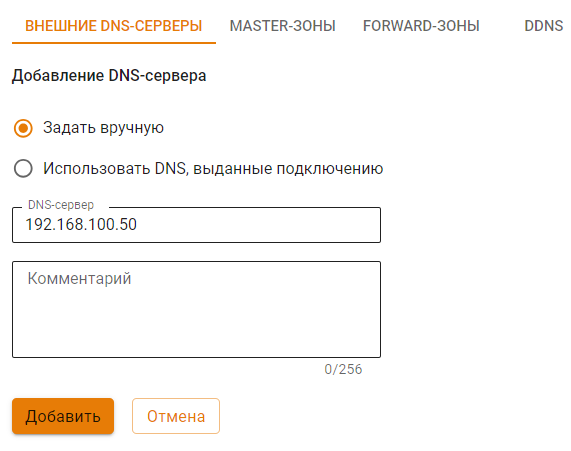

# ALD Pro


Название службы раздела **ALD Pro**: `ideco-ald-rest`; `ideco-ald-backend`. \
Список служб для других разделов доступен по [ссылке](../../server-management/terminal.md).


[ALD Pro](https://www.aldpro.ru/) предназначен для централизованного управления ресурсами под управлением ОС Astra Linux и может использоваться в организациях различного масштаба.

Руководства по эксплуатации ALD Pro доступны на [официальном сайте](https://www.aldpro.ru/docs/).


Cинхронизация с ALD Pro приостанавливается, если локальные пользователи Ideco UTM находятся в группах AD.
Для возобновления синхронизации вынесите локальных пользователей из групп ALD Pro. Автоматическая синхронизация произойдет через 15 минут.


## Ввод сервера в домен

1\. Перейдите на вкладку **Пользователи -> ALD Pro**.

2\. Нажмите на кнопку **Добавить**.

3\. Заполните следующие поля:
   * **Домен**: введите полное имя домена (не контроллера домена). Например: `mydomain.example`. Домен может содержать только латинские символы, цифры, подчеркивание, дефис и точку;
   * **IP-адрес DNS-сервера**: введите адрес сервера, обладающий ролью DNS-сервера в ALD Pro, доступный с локального интерфейса Ideco UTM;
   * **Имя сервера Ideco UTM**: введите имя сервера. Оно может содержать только буквенные символы (A-z), цифры (0-9), а также не может начинаться или заканчиваться на дефис. Максимальное количество символов - 15;
   * **Логин и пароль**: **эти данные не сохраняются** на сервере и используется один раз для присоединения к домену. Пользователь может не быть администратором домена, но должен обладать правами на присоединения компьютеров к домену.


Инструкции по развертыванию и управлению ресурсами через ALD Pro доступны на [официальном сайте](https://www.aldpro.ru/docs/).


## Импорт пользователей

ALD Pro поддерживает импорт двух типов групп:
* Группа пользователей - содержит несколько пользователей ALD. Может входить только в одно подразделение;
* Подразделение - содержит несколько групп пользователей ALD

Для импорта пользователей выполните действия:

1\. Перейдите в раздел **Сервисы -> DNS -> Внешние DNS-серверы** и добавьте сервер ALD:

2\. Перейдите в раздел **Пользователи -> Учетные записи** и создайте группу, в которую будут импортированы пользователи, нажав на .

3\. Перейдите на вкладку **ALD**, выберите домен, тип группы и нажмите **Сохранить**.

Импортированных пользователей можно использовать как объекты для создания правил например в **Файрволе**.


В дальнейшем пользователи будут автоматически синхронизироваться с ALD Pro каждые 15 минут.

Пользователь может быть импортирован только в одну группу Ideco UTM. Если он находится в нескольких группах ALD Pro, он попадет только в одну группу, которая была импортирована самой последней.


## Аутентификация пользователей 

ALD Pro поддерживает два типа входа в систему:
* вход по логину/паролю;
* вход с Kerberos.

Для настройки аутентификации выполните действия: 

1\. Перейдите в раздел **Пользователи -> Авторизация -> Основное**.

2\. Активируйте опцию **Веб-аутентификация -> SSO-аутентификация через Active Directory и ALD Pro** :

После заполнения поля *Доменное имя Ideco UTM* и сохранения настроек будет выдан Let’s Encrypt сертификат, и пользователь будет перенаправляться на окно авторизации, минуя страницу исключения безопасности:

