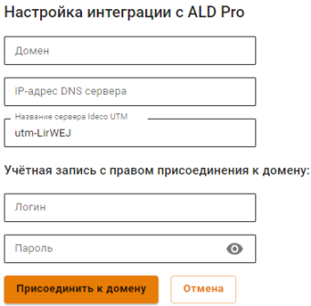

# ALD Pro


Название службы раздела **ALD Pro**: `ideco-ald-rest`; `ideco-ald-backend`. \
Список служб для других разделов доступен по [ссылке](../../server-management/terminal.md).


[ALD Pro](https://www.aldpro.ru/) предназначен для централизованного управления ресурсами под управлением ОС Astra Linux и может использоваться в организациях различного масштаба.

Руководства по эксплуатации ALD Pro доступны на [официальном сайте](https://www.aldpro.ru/docs/).


Доступен только функционал ввода в домен. Импорт пользователей заработает в ближайших версиях.


## Ввод сервера в домен

1. Перейдите на вкладку **Пользователи -> ALD Pro**.
2. Нажмите на кнопку **Добавить**.
3. Заполните следующие поля:
   * **Домен**: введите полное имя домена (не контроллера домена). Например: `mydomain.example`. Домен может содержать только латинские символы, цифры, подчеркивание, дефис и точку;
   * **IP-адрес DNS-сервера**: введите адрес сервера, обладающий ролью DNS-сервера в ALD Pro, доступный с локального интерфейса Ideco UTM;
   * **Имя сервера Ideco UTM**: введите имя сервера. Оно может содержать только буквенные символы (A-z), цифры (0-9), а также не может начинаться или заканчиваться на дефис. Максимальное количество символов - 15;
   * **Логин и пароль**: **эти данные не сохраняются** на сервере и используется один раз для присоединения к домену. Пользователь может не быть администратором домена, но должен обладать правами на присоединения компьютеров к домену.


Инструкции по развертыванию и управлению ресурсами через ALD Pro доступны на [официальном сайте](https://www.aldpro.ru/docs/).
