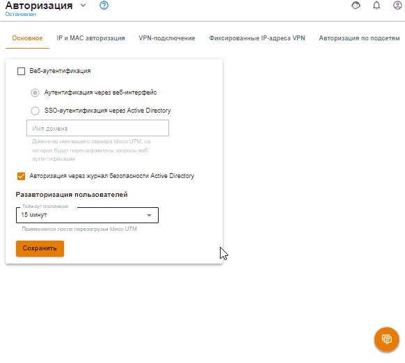

# Авторизация пользователей


Название службы раздела **Авторизация**: `ideco-auth-backend`. \
Список служб для других разделов доступен по [ссылке](/settings/server-management/terminal.md).


## Общая информация

Существует несколько способов авторизации, с которыми можно ознакомиться в текущем подразделе.

Все виды авторизации на Ideco UTM являются IP-based (работают на основе IP адреса хоста) и любая сессия авторизации привязана к IP адресу хоста, с которого она установлена. Под одной пользовательской учетной записью возможна одновременная авторизация до пяти устройств (динамическими способами авторизации, по веб, Kerberos/NTLM, логам безопасности контроллеров домена Active Directory, VPN).


Можно настроить автоматическую авторизацию пользователей при входе в систему. Подробнее можно прочитать в [статье](../../../recipes/popular-recipes/auto-authorization-linux.md).


Пользователь автоматически разавторизуется при неактивности (отсутствии соединений с сетью Интернет) в течение 15 минут (кроме подключений по VPN). При авторизации шестого устройства, будет разорвана самая старая сессия.


Стоит учитывать, что трафик может генерировать и сама операционная система (пример: телеметрия Windows) без участия пользователя. Из-за этого таймаут для пользователя будет постоянно сбрасываться и не сможет отрабатывать.


Измените время автоматической разавторизации с помощью настройки **Тайм-аут отключения**, перейдя в раздел **Пользователи -> Авторизация**:


Для применения нового тайм-аута отключения требуется перезагрузка Ideco UTM.


Также можно авторизовать пользователей, подключающихся по VPN по протоколам[ IPsec IKEv2](vpn-connection/ipsec-ikev2.md), [SSTP](vpn-connection/sstp.md), [L2TP IPsec](vpn-connection/l2tp-ipsec.md), [PPTP](vpn-connection/pptp.md) и [инструкцией по запуску PowerShell скриптов](vpn-connection/running-powershell-scripts.md).
